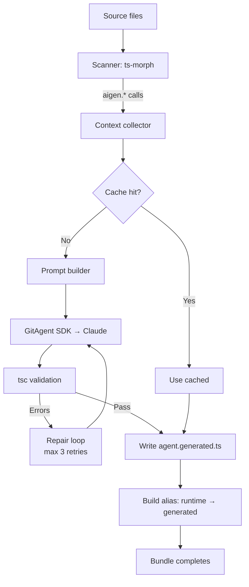

## How to Build a Build-Time TypeScript Function Generator with LLMs

In this tutorial, you'll build Aigen — a build-time code generator that lets you call functions that don't exist yet, and generates their implementations via an LLM during the build. The core philosophy: *write the flow, let the build generate the implementations.*

The full source is at [github.com/priyanshu360/aigen](https://github.com/priyanshu360/aigen).

### What to expect

```bash
$ npm install -g pnpm
$ pnpm install
$ cd examples/basic
$ npx vite build

# During build, Aigen:
# 1. Scans source files for aigen.*() calls
# 2. Sends each call site to Claude with context
# 3. Validates generated code with real tsc
# 4. Repairs if compilation fails
# 5. Writes src/agent.generated.ts
# 6. Aliases @pynhu/aigen-runtime imports → generated file
# 7. Bundle completes with real implementations
```

### What you'll learn

- Building a monorepo with pnpm workspaces (4 interdependent packages)
- Scanning TypeScript AST with ts-morph to find `aigen.*()` call sites
- Collecting context — nearby code, imports, argument types, assignment variables
- Building structured LLM prompts from call-site context
- Validating generated code with real `tsc` (not `transpileModule`)
- Implementing a repair loop that retries with LLM on compilation errors
- Caching with SHA-256 content-addressed keys
- Integrating with multiple build tools (Vite + esbuild)
- Aliasing module resolution at build time

### Prerequisites

- Node.js 18+
- pnpm (for monorepo workspace)
- A Claude API key (or any LLM provider via GitAgent SDK)
- TypeScript

### Project structure

```
aigen/
├── package.json                    # pnpm workspace root
├── pnpm-workspace.yaml
├── tsconfig.base.json
├── packages/
│   ├── pynhu-aigen-core/           # Engine: scanner, cache, prompt, LLM, repair, pipeline
│   │   └── src/
│   │       ├── index.ts            # Public API re-exports
│   │       ├── types.ts            # All type definitions
│   │       ├── scanner.ts          # AST scanner (ts-morph)
│   │       ├── context.ts          # Context collector (nearby code, imports)
│   │       ├── cache.ts            # SHA-256 cache
│   │       ├── prompt.ts           # Prompt builder
│   │       ├── gitagent-provider.ts  # LLM provider wrapper
│   │       ├── repair.ts           # tsc validation + repair
│   │       ├── pipeline.ts         # Pipeline orchestrator
│   │       └── config.ts           # Config resolver
│   ├── pynhu-aigen-vite/           # Vite plugin
│   │   └── src/index.ts
│   ├── pynhu-aigen-esbuild/        # esbuild plugin
│   │   └── src/index.ts
│   └── pynhu-aigen-runtime/        # Runtime stub → aliased to generated file
│       └── src/
│           ├── index.ts            # Re-exports from ./aigen.generated
│           └── aigen.generated.ts  # Stub fallback (empty)
├── examples/
│   └── basic/
│       ├── src/
│       │   ├── main.ts
│       │   ├── agent.generated.ts  # Output: generated implementations
│       │   └── shapes/
│       │       ├── circle.ts
│       │       ├── rect.ts
│       │       └── triangle.ts
│       ├── vite.config.ts
│       └── index.html
├── aigen-agent/                    # Separate git repo: prompts, rules, skills
│   ├── SOUL.md                     # Agent personality
│   ├── RULES.md                    # Generation constraints
│   ├── skills/
│   │   ├── utility-function-generation/
│   │   ├── type-inference/
│   │   └── compile-error-repair/
│   └── workflows/
│       └── generate-function.yaml
```

### Imports

**Core package (`pynhu-aigen-core`)**

| Package | Why |
|---------|-----|
| `ts-morph` | TypeScript AST wrapper — find `aigen.*()` calls, extract argument types, check imports |
| `typescript` | Peer dependency for ts-morph; also used for real `tsc` validation |
| `@open-gitagent/gitagent` | LLM provider — sends prompts to Claude with the agent's SOUL, RULES, and skills |

**Why these choices?**

- **ts-morph over raw TypeScript compiler API**: The raw `ts.createSourceFile` + `ts.forEachChild` pattern works for simple scans, but ts-morph gives us a higher-level API: `getDescendantsOfKind(SyntaxKind.CallExpression)`, `getArguments()`, `getType()`, `getSymbol()`. It handles source file management and type resolution. The trade-off: slower initial parse (ts-morph creates a full project, not just a single file), but for a build-step tool that's acceptable.

- **@open-gitagent/gitagent over direct OpenAI API**: The GitAgent SDK loads the agent's SOUL.md, RULES.md, and skill prompts automatically. Instead of hardcoding `system: "You are a TypeScript code generator"` in our source, the agent's personality and constraints live in `aigen-agent/` as markdown files that can be versioned, reviewed, and updated independently. This is critical because prompt engineering is iterative — you don't want to rebuild the plugin every time you tweak the generation rules.

- **esbuild + Vite plugins, not just one**: Both build tools share the same core pipeline. The plugin packages are thin wrappers — `aigenPlugin()` runs the pipeline in `buildStart` and sets a resolve alias. Supporting both means the tool works with Vite (most popular for frontend) and esbuild (fastest, used by many backend TS projects).

### How the pipeline works



### Step 1: The runtime stub

The user imports `aigen` from a runtime package. During the build, this import gets aliased to the generated file:

File: `packages/pynhu-aigen-runtime/src/index.ts`

```ts
export { aigen } from './aigen.generated'
```

File: `packages/pynhu-aigen-runtime/src/aigen.generated.ts`

```ts
export const aigen: Record<string, (...args: any[]) => any> = {} as any
```

This is a fallback stub — empty, but type-safe. During the build, the plugin:
1. Generates real implementations in `src/agent.generated.ts`
2. Aliases `@pynhu/aigen-runtime` → the user's `src/agent.generated.ts`
3. The bundle picks up the real functions

**Why a separate runtime package?** The user imports from a stable package name (`@pynhu/aigen-runtime`), not a relative path to a generated file. The build plugin handles the alias. This means:
- The user's code is clean: `import { aigen } from "@pynhu/aigen-runtime"`
- No special import paths
- The stub provides type-checking even before generation
- Switching between Vite and esbuild doesn't change the import

### Step 2: The scanner

The scanner uses ts-morph to find every `aigen.*(...)` call in the source files:

File: `packages/pynhu-aigen-core/src/scanner.ts`

```ts
import { Project, SyntaxKind, CallExpression } from 'ts-morph'

interface CallSite {
  functionName: string
  args: Argument[]
  hint?: string
  assignmentVarName?: string
  sourceFile: string
  lineNumber: number
}

interface Argument {
  name: string
  type: string
  value: string
}

function scanCallSites(rootDir: string): CallSite[] {
  const project = new Project()
  project.addSourceFilesAtPaths(`${rootDir}/src/**/*.ts`)

  const callSites: CallSite[] = []

  for (const sourceFile of project.getSourceFiles()) {
    const calls = sourceFile.getDescendantsOfKind(SyntaxKind.CallExpression)

    for (const call of calls) {
      const expr = call.getExpression()
      const exprText = expr.getText()

      if (!exprText.startsWith('aigen.') || exprText === 'aigen') continue

      const functionName = exprText.slice('aigen.'.length)
      const args = call.getArguments().map(arg => ({
        name: arg.getText(),
        type: arg.getType().getText(),
        value: arg.getText(),
      }))

      // Last argument can be a hint object { hint: "..." }
      const lastArg = call.getArguments()[call.getArguments().length - 1]
      const hint = lastArg?.getType().getProperty('hint')?.getValueDeclaration()
        ?.getInitializer()?.getLiteralValue()

      // Check if result is assigned to a variable
      const parent = call.getParentIfKind(SyntaxKind.BinaryExpression)
      const assignmentVarName = parent
        ? parent.getLeft().getText()
        : undefined

      callSites.push({
        functionName,
        args: hint ? args.slice(0, -1) : args,
        hint: hint ? String(hint) : undefined,
        assignmentVarName,
        sourceFile: sourceFile.getFilePath(),
        lineNumber: sourceFile.getLineNumberAtPos(call.getStart()),
      })
    }
  }

  return callSites
}
```

The scanner discovers every `aigen.someFunction(...)` call and extracts:
- **Function name** — `aigen.extract_emails_from_text(...)` → `extract_emails_from_text`
- **Arguments** — name, type, and literal value of each argument
- **Hint** — the last argument can be `{ hint: "..." }`, providing guidance to the LLM
- **Assignment variable** — if the result is assigned to a variable (`const emails = aigen.extract...`), that variable name hints at the expected return type
- **Source location** — file path and line number for error reporting

**Watch out for:** ts-morph needs a `tsconfig.json` to resolve types. If you create a `Project()` without one, it won't see type information. Always create the project with `{ tsConfigFilePath: 'tsconfig.json' }` or use `addSourceFilesAtPaths` before querying types.

### Step 3: Context collector

For each call site, the context collector grabs nearby code and imports so the LLM has enough information:

File: `packages/pynhu-aigen-core/src/context.ts`

```ts
import { Project, SourceFile } from 'ts-morph'

interface FunctionContext {
  nearbyCode: string
  imports: string[]
  parentFunctionName?: string
  parentFunctionCode?: string
}

function collectContext(sourceFile: SourceFile, lineNumber: number): FunctionContext {
  const lines = sourceFile.getText().split('\n')
  const start = Math.max(0, lineNumber - 15)
  const end = Math.min(lines.length, lineNumber + 15)

  // Find imports
  const imports = sourceFile.getImportDeclarations().map(i => i.getText())

  // Find parent function
  const callSite = sourceFile.getDescendantAtPos(
    sourceFile.getPositionAtLine(lineNumber)
  )
  const parentFunc = callSite?.getFirstAncestorByKind(SyntaxKind.FunctionDeclaration)
  const parentFunctionName = parentFunc?.getName()
  const parentFunctionCode = parentFunc?.getText()

  return {
    nearbyCode: lines.slice(start, end).join('\n'),
    imports,
    parentFunctionName,
    parentFunctionCode,
  }
}
```

**Why 15 lines of context?** The LLM needs enough surrounding code to understand the shape of nearby variables and function calls, but too much context increases token usage and can confuse the model with irrelevant code. 15 lines on each side is a heuristic that works well for utility-function-scale code.

**Watch out for:** The context doesn't include the full file. If the generated function references types defined at the top of the file (like interfaces or type aliases), the LLM won't see them. The imports list helps, but the "nearby code" slice might miss type definitions.

### Step 4: The cache

Generated code is cached using SHA-256 of `function_name + arg_types + hint`:

File: `packages/pynhu-aigen-core/src/cache.ts`

```ts
import crypto from 'node:crypto'
import fs from 'node:fs'
import path from 'node:path'

class CodeCache {
  private cachePath: string

  constructor(rootDir: string) {
    this.cachePath = path.join(rootDir, '.aigen', 'cache.json')
  }

  computeKey(name: string, argTypes: string[], hint?: string): string {
    const input = name + '|' + argTypes.join(',') + '|' + (hint ?? '')
    return crypto.createHash('sha256').update(input).digest('hex')
  }

  get(name: string, argTypes: string[], hint?: string): string | null {
    const key = this.computeKey(name, argTypes, hint)
    const cache = this.load()
    return cache[key] ?? null
  }

  set(name: string, argTypes: string[], hint: string | undefined, code: string) {
    const key = this.computeKey(name, argTypes, hint)
    const cache = this.load()
    cache[key] = code
    this.save(cache)
  }

  private load(): Record<string, string> {
    try {
      return JSON.parse(fs.readFileSync(this.cachePath, 'utf-8'))
    } catch {
      return {}
    }
  }

  private save(cache: Record<string, string>) {
    fs.mkdirSync(path.dirname(this.cachePath), { recursive: true })
    fs.writeFileSync(this.cachePath, JSON.stringify(cache, null, 2))
  }
}
```

**Why SHA-256 and not a timestamp-based cache?** Content-addressed caching means:
- Same args + same hint = same key = cache hit, regardless of when it was last generated
- Changing any argument type or the hint produces a new key
- No TTL or staleness issues — the cache is valid until the signature changes
- Deterministic builds — same inputs always produce the same outputs

**Watch out for:** The cache key doesn't include the nearby context or imports. If the context changes (e.g., a new type is imported that the function should use), the cached version is still returned. The cache is conservative — it assumes the function logic depends only on its explicit inputs (name + args + hint), not on the surrounding code.

### Step 5: The prompt builder

File: `packages/pynhu-aigen-core/src/prompt.ts`

```ts
function buildPrompt(context: {
  functionName: string
  args: Argument[]
  hint?: string
  assignmentVarName?: string
  parentFunctionName?: string
  nearbyCode: string
  imports: string[]
}): string {
  return `
Generate a TypeScript utility function based on the following call site.

FUNCTION NAME: ${context.functionName}
ARGUMENTS: ${context.args.map(a => `${a.name}: ${a.type}`).join(', ')}
${context.hint ? `HINT: ${context.hint}` : ''}
${context.assignmentVarName ? `ASSIGNED TO: ${context.assignmentVarName}` : ''}
${context.parentFunctionName ? `PARENT FUNCTION: ${context.parentFunctionName}` : ''}

AVAILABLE IMPORTS:
${context.imports.join('\n')}

NEARBY CODE:
${context.nearbyCode}

Generate an \`export function\` declaration with explicit TypeScript types.
The function should be pure (no side effects), handle edge cases, and include a JSDoc comment.
Return ONLY the function declaration inside a \`\`\`typescript code block.
`.trim()
}
```

The prompt includes:
- **Function name** — `extract_emails_from_text` names are descriptive; the LLM can infer intent
- **Arguments with types** — `body: string` tells the LLM what it's working with
- **Hint** — explicit guidance from the developer (e.g., `{ hint: "Expected format: user@example.com" }`)
- **Assignment variable** — `const emails = aigen.extract_emails_from_text(body)` tells the LLM the result should be an array of strings
- **Parent function** — helps the LLM understand the call site's broader context
- **Imports** — available types the function can use
- **Nearby code** — how the result is used

**Why not include the full file?** Token limits. Claude has a 200K context window, but every token costs. Including only the relevant slice keeps the generation fast and cheap. The prompt is typically 300-700 tokens.

### Step 6: LLM provider with GitAgent SDK

File: `packages/pynhu-aigen-core/src/gitagent-provider.ts`

```ts
import { query } from '@open-gitagent/gitagent'

async function generateWithAgent(prompt: string, agentDir: string): Promise<string> {
  const response = await query({
    agentDirectory: agentDir,  // Points to aigen-agent/ repo
    message: prompt,
    workflow: 'generate-function',
  })

  // Extract the typescript code block from the response
  const codeMatch = response.match(/```typescript\n([\s\S]*?)```/)
  if (!codeMatch) {
    throw new Error('LLM response did not contain a typescript code block')
  }

  return codeMatch[1].trim()
}
```

The `@open-gitagent/gitagent` SDK loads the agent configuration from `aigen-agent/`, which contains:
- **SOUL.md** — The agent's core principles: predictability, correctness, no side effects
- **RULES.md** — Generation constraints: `export function`, explicit types, pure functions, edge case handling, no `any`
- **Skills** (3 prompts):
  - `utility-function-generation` — Main generation prompt with worked examples
  - `type-inference` — Infers argument/return types from call-site context
  - `compile-error-repair` — Fixes tsc errors in generated code
- **Workflow** `generate-function.yaml` — Orchestrates: infer types → generate → validate → repair

**Why a separate agent repo?** The prompts in `aigen-agent/` are a separate git repository. This means:
- Prompt changes can be versioned, reviewed, and reverted independently of the plugin code
- Users can fork `aigen-agent/` and customize generation rules without modifying the plugin
- Multiple agent configurations can coexist (e.g., `aigen-agent-strict/`, `aigen-agent-creative/`)

### Step 7: tsc validation and repair

This is what separates Aigen from a naive LLM wrapper — the generated code is validated with real `tsc`:

File: `packages/pynhu-aigen-core/src/repair.ts`

```ts
import { execSync } from 'node:child_process'
import fs from 'node:fs'
import path from 'node:path'

const MAX_REPAIR_ATTEMPTS = 3

async function validateAndRepair(
  generatedCode: string,
  agentDir: string,
): Promise<string> {
  let currentCode = generatedCode
  const tmpDir = fs.mkdtempSync('aigen-repair-')

  try {
    for (let attempt = 0; attempt <= MAX_REPAIR_ATTEMPTS; attempt++) {
      // Write the generated code to a temp file
      const tmpFile = path.join(tmpDir, 'generated.ts')
      fs.writeFileSync(tmpFile, currentCode, 'utf-8')

      try {
        execSync('npx tsc --noEmit --strict generated.ts', {
          cwd: tmpDir,
          stdio: 'pipe',
        })
        return currentCode  // Compilation succeeded
      } catch (err) {
        if (attempt === MAX_REPAIR_ATTEMPTS) throw err

        const stderr = err.stderr?.toString() || 'Unknown error'
        const repairPrompt = `
The generated TypeScript code has compilation errors:

\`\`\`typescript
${currentCode}
\`\`\`

ERRORS:
${stderr}

Fix the errors and return ONLY the corrected code inside a \`\`\`typescript code block.
`.trim()

        const response = await query({
          agentDirectory: agentDir,
          message: repairPrompt,
          workflow: 'compile-error-repair',
        })

        const fixedMatch = response.match(/```typescript\n([\s\S]*?)```/)
        if (fixedMatch) {
          currentCode = fixedMatch[1].trim()
        }
      }
    }
  } finally {
    fs.rmSync(tmpDir, { recursive: true, force: true })
  }

  throw new Error('Failed to generate valid TypeScript after repair attempts')
}
```

**Why real `tsc` and not `transpileModule`?** `ts.transpileModule` only checks syntax — it doesn't resolve types, check imports, or catch type errors. Real `tsc` catches everything: missing exports, type mismatches, incorrect generics. This is the difference between "valid JavaScript" and "valid TypeScript."

**The repair loop:**
1. Generate code with LLM
2. Compile with `tsc`
3. If errors → send errors back to LLM with the code
4. LLM returns fixed code
5. Retry compile (up to 3 times)
6. If still fails → fail the build

This catches LLM hallucinations where the model generates code that references nonexistent types, uses wrong import paths, or has subtle type errors.

**Watch out for:** The repair loop creates a temp directory and runs `tsc` on each attempt. `tsc` is not fast — cold start takes 1-3 seconds. With 3 repair attempts, that's up to 9 seconds of compile time for a single stubborn function. The cache skips this entirely on subsequent builds.

### Step 8: The pipeline orchestrator

File: `packages/pynhu-aigen-core/src/pipeline.ts`

```ts
async function runPipeline(rootDir: string, agentDir: string) {
  const cache = new CodeCache(rootDir)
  const callSites = scanCallSites(rootDir)
  const grouped = groupByFunctionName(callSites)

  const generatedFunctions: string[] = []

  for (const [name, sites] of Object.entries(grouped)) {
    const argTypes = mergeArgTypes(sites.map(s => s.args))
    const hint = sites.find(s => s.hint)?.hint

    // Check cache
    const cached = cache.get(name, argTypes, hint)
    if (cached) {
      generatedFunctions.push(cached)
      continue
    }

    // Collect context from first call site
    const context = collectContext(sites[0])

    // Build prompt
    const prompt = buildPrompt({
      functionName: name,
      args: context.args,
      hint,
      assignmentVarName: context.assignmentVarName,
      nearbyCode: context.nearbyCode,
      imports: context.imports,
    })

    // Generate
    const code = await generateWithAgent(prompt, agentDir)

    // Validate and repair
    const validCode = await validateAndRepair(code, agentDir)

    // Cache
    cache.set(name, argTypes, hint, validCode)
    generatedFunctions.push(validCode)
  }

  // Write src/agent.generated.ts
  const output = [
    '// AUTO GENERATED – do not edit manually',
    '// Generated by @pynhu/aigen-core',
    '',
    ...generatedFunctions,
    '',
    `export const aigen = {`,
    ...Object.keys(grouped).map(n => `  ${n},`),
    `}`,
  ].join('\n')

  fs.writeFileSync(path.join(rootDir, 'src', 'agent.generated.ts'), output)
}
```

**Why group by function name?** The same `aigen.computeArea(shape, ...)` might be called with different argument patterns across files: `aigen.computeArea("circle", radius)` and `aigen.computeArea("rect", width, height)`. These are merged into ONE function with union types that handles all call patterns:

```ts
export function computeArea(shape: "circle" | "rect", ...args: number[]): number {
  if (shape === "circle") return Math.PI * args[0] ** 2
  if (shape === "rect") return args[0] * args[1]
  throw new Error(`Unknown shape: ${shape}`)
}
```

### Step 9: The Vite plugin

File: `packages/pynhu-aigen-vite/src/index.ts`

```ts
import { Plugin } from 'vite'
import { runPipeline } from '@pynhu/aigen-core'

interface AigenPluginOptions {
  agentDir: string
}

export function aigenPlugin(options: AigenPluginOptions): Plugin {
  return {
    name: '@pynhu/aigen-vite',
    enforce: 'pre',

    async buildStart() {
      await runPipeline(process.cwd(), options.agentDir)
    },

    resolveId(id) {
      if (id === '@pynhu/aigen-runtime') {
        return path.resolve(process.cwd(), 'src', 'agent.generated.ts')
      }
      return null
    },
  }
}
```

The plugin has two hooks:
1. **`buildStart`** — runs the pipeline before any files are transformed
2. **`resolveId`** — aliases `@pynhu/aigen-runtime` → `src/agent.generated.ts`

**Why `buildStart` and not `transform`?** The pipeline is an all-at-once operation: scan all files, generate all functions, write the output file. A `transform` hook would be called per-file and wouldn't know about call sites in other files. The `buildStart` hook runs once before any transforms, and the `resolveId` alias ensures imports point to the freshly generated file.

### Step 10: Using the plugin

File: `examples/basic/vite.config.ts`

```ts
import { defineConfig } from 'vite'
import { aigenPlugin } from '@pynhu/aigen-vite'

export default defineConfig({
  plugins: [
    aigenPlugin({
      agentDir: '../../aigen-agent',
    }),
  ],
})
```

File: `examples/basic/src/main.ts`

```ts
import { aigen } from '@pynhu/aigen-runtime'

const radius = 5
const area = aigen.computeArea("circle", radius)
console.log(`Area: ${area}`)
```

After the build, `src/agent.generated.ts` contains:

```ts
// AUTO GENERATED – do not edit manually

/**
 * Computes the area of a shape based on its type and dimensions.
 * Supports circle, rectangle, and triangle.
 */
export function computeArea(shape: "circle" | "rect" | "triangle", ...args: number[]): number {
  switch (shape) {
    case "circle": return Math.PI * args[0] ** 2
    case "rect": return args[0] * args[1]
    case "triangle": return 0.5 * args[0] * args[1]
    default: throw new Error(`Unknown shape: ${shape}`)
  }
}

export const aigen = {
  computeArea,
}
```

### Design decisions

| Decision | This project | Alternative | Why |
|----------|-------------|-------------|-----|
| **Call syntax** | `aigen.fnName(...)` | `@aigen` JSDoc comments | Natural TS syntax, no special comments, type inference from args |
| **LLM provider** | GitAgent SDK | Direct OpenAI/Anthropic API | Separates prompts from code, versioned agent repo |
| **Validation** | Real `tsc` | `transpileModule` | Catches type errors, not just syntax errors |
| **Caching** | SHA-256 content-addressed | Timestamp-based | Deterministic, no staleness |
| **Output** | Single `agent.generated.ts` | One file per function | Committed to source control, visible diff on changes |
| **Build integration** | buildStart + resolveId | transform hook | Needs full-file view for group-by-name merging |
| **Namespace** | `aigen` | `__generate__` prefix | Short, memorable, searchable |

### The agent repo

The `aigen-agent/` directory is a separate git repository that defines the LLM's behavior:

**SOUL.md** — Core principles:
- Predictability: consistent outputs for consistent inputs
- Correctness: generated code must compile and handle edge cases
- No side effects: functions are pure transformations
- Self-documenting names: prefer descriptive variable/function names

**RULES.md** — Generation constraints:
- `export function` declarations (not arrow functions or const assignments)
- Explicit TypeScript types on all parameters and return values
- Pure functions — no side effects, no I/O, no mutations
- Edge case handling: null/undefined checks, empty arrays, boundary values
- No `any` type — use `unknown` if the type is truly dynamic

**Skills:**
| Skill | Purpose |
|-------|---------|
| `utility-function-generation` | Main generation prompt with examples |
| `type-inference` | Infers argument/return types from call-site context |
| `compile-error-repair` | Fixes tsc errors with knowledge of common LLM mistakes |

### The generate-function workflow

```
1. infer-types → reads call-site context, determines arg/return types
2. generate-function → produces a first draft using utility-function-generation skill
3. validate → runs tsc on generated code
4. (if errors) repair → sends errors + code to compile-error-repair skill
5. (if still errors) goto 4 (max 3 times)
6. return valid code → pipeline writes to agent.generated.ts
```

### Feature comparison

| Feature | Implemented? | Notes |
|---------|-------------|-------|
| AST scanning for aigen calls | Yes | ts-morph, all .ts files |
| Argument type extraction | Yes | From ts-morph type checker |
| Hint support (last-arg object) | Yes | Stripped from runtime args |
| Assignment var name extraction | Yes | From BinaryExpression parent |
| Context collection (nearby code) | Yes | ±15 lines |
| Import collection | Yes | From SourceFile imports |
| SHA-256 caching | Yes | `.aigen/cache.json` |
| Multi-signature merging | Yes | Union types for same fn name |
| LLM generation | Yes | GitAgent SDK → Claude |
| tsc validation | Yes | Real tsc binary in temp dir |
| Repair loop | Yes | Up to 3 attempts |
| Vite plugin | Yes | buildStart + resolveId |
| esbuild plugin | Yes | Same pattern |
| Runtime stub | Yes | Empty fallback, aliased at build |
| Generated file commits | Yes | agent.generated.ts is committed |
| Streaming preview | No | Future: real-time in-editor preview |
| Multiple LLM providers | No | Currently Claude-only via GitAgent |

### Watch out for

1. **ts-morph project initialization is slow** — Creating a `Project` with source files can take 500ms-2s on large codebases. The pipeline runs once per build, so this is acceptable. If you need faster iteration, add watch mode that reuses the project instance.

2. **Cache misses regenerate everything** — If any argument type changes (even whitespace in a type name), the SHA-256 key changes and the function is regenerated. This is correct but can be surprising. The cache is stored in `.aigen/cache.json` — you can clear it with `rm -rf .aigen/`.

3. **The repair loop can fail silently** — If tsc errors can't be fixed after 3 attempts, the pipeline throws. The build fails with an error message containing the last tsc output. This is by design — better to fail the build than silently include broken code.

4. **Generated file is committed** — `src/agent.generated.ts` is committed to version control. This means: (a) diffs show exactly what changed between LLM calls, (b) CI can build without an API key (uses committed file), and (c) deleting the file triggers regeneration on next build. Don't add it to `.gitignore`.

5. **No LLM call during production deploy** — Since `agent.generated.ts` is committed, production deployments don't need API keys. The generated file is part of the source. Only developers doing `vite build` need the LLM provider.

6. **Argument value extraction is best-effort** — The scanner extracts the literal text of each argument. For simple literals (`42`, `"hello"`), this works. For complex expressions (`getUser().profile.email`), only the text is captured — the LLM has to infer the runtime type from context.

### Next steps

- Add streaming generation for real-time preview in the editor
- Support multiple LLM providers (OpenAI, Anthropic, local models via Ollama)
- Add a `--review` mode that shows diffs before applying generated code
- Implement watch-mode caching (reuse ts-morph project, incremental scanning)
- Support generating entire files, not just individual functions
- Add a `// @aigen:skip` comment to exclude specific call sites from generation

The full source is at [github.com/priyanshu360/aigen](https://github.com/priyanshu360/aigen).
