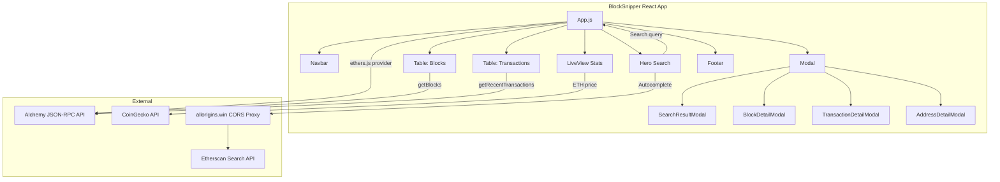

## How to Build BlockSnipper — An Ethereum Blockchain Explorer with React

In this tutorial, we'll build BlockSnipper — a real-time Ethereum blockchain explorer with live ETH pricing, block/transaction search with autocomplete, paginated data tables, and glassmorphism UI. By the end you'll have a production-ready dashboard that queries the Ethereum mainnet via Alchemy.

### What to expect

```bash
$ npm start

# Opens http://localhost:3000
# You'll see:
#   - Live ETH price from CoinGecko
#   - Latest block number
#   - Recent 100 blocks (paginated, 10 per page)
#   - Recent 100 transactions (paginated, 10 per page)
#   - Auto-refresh every 15 seconds
#   - Search bar with autocomplete from Etherscan
#   - Detail modals for blocks, transactions, and addresses
```

### What you'll learn

- Bootstrapping a React 17 app with Create React App and Tailwind CSS 3
- Connecting to Ethereum via ethers.js v6 with an Alchemy JSON-RPC provider
- Fetching blocks, transactions, balances, and transaction counts
- Building a unified search that detects block numbers, addresses (0x+40 hex), and transaction hashes (0x+64 hex)
- Implementing autocomplete via a CORS proxy (allorigins.win) to Etherscan's search API
- Building reusable components with pagination, modals, and detail views
- Styling with gradients, glassmorphism (`backdrop-blur-md`), and custom animations

### Prerequisites

- Node.js 16+
- An Alchemy API key ([free tier](https://www.alchemy.com/))
- Basic React and Ethereum knowledge

### Project structure

```
blockexplorer/
├── public/
│   └── index.html
├── src/
│   ├── components/
│   │   ├── Navbar.jsx           # Sticky top nav with logo + live indicator
│   │   ├── Hero.jsx             # Search bar with autocomplete dropdown
│   │   ├── LiveView.jsx         # Stats cards: ETH price, latest block, network
│   │   ├── Table.jsx            # Reusable paginated table for blocks/txs
│   │   ├── Modal.jsx            # Reusable modal wrapper
│   │   ├── DetailModals.jsx     # Block/Transaction/Address detail views
│   │   └── Footer.jsx           # Footer with branding + network status
│   ├── services/
│   │   └── api.js               # ethers.js + CoinGecko API layer
│   ├── App.js                   # Orchestrator: state, effects, layout
│   ├── index.js                 # ReactDOM.render entry point
│   └── index.css                # Tailwind directives + custom animations
├── .env                         # REACT_APP_ALCHEMY_API_KEY
├── package.json                 # React 17, ethers v6, tailwindcss 3
└── tailwind.config.js           # Josefin Sans font, Tailwind content paths
```

### Architecture



### Imports

**JavaScript (React)**

| Package | Why |
|---------|-----|
| `react@17`, `react-dom@17` | UI framework — we use the class-based `ReactDOM.render` API (pre-React 18) |
| `react-scripts@5` | Create React App build tool — zero-config Webpack, Babel, ESLint |
| `ethers@6` | Ethereum JSON-RPC provider — wraps Alchemy's API, formats ETH values |
| `tailwindcss@3` | Utility-first CSS — rapid prototyping with `backdrop-blur`, `bg-gradient-to-*`, animations |

**Why these choices?**

- **ethers.js v6 over ethers.js v5**: v6 uses native `bigint` (no more `BigNumber` chaining), `ethers.formatEther`/`formatUnits` are top-level exports, and `JsonRpcProvider` is the standard class. The API surface is cleaner. Trade-off: some breaking changes from v5 (e.g., `provider.getBlock(number, true)` now returns prefetched transactions differently; we pass `true` for `getBlockWithTransactions` behavior).

- **React 17 over React 18**: This project was scaffolded with Create React App (CRA). CRA pinned React 17 at the time of writing. React 17's `ReactDOM.render` still works fine. There's no Concurrent Mode usage here, so the upgrade isn't necessary. Trade-off: you miss out on `createRoot`, automatic batching, and `useId`.

- **Tailwind CSS 3 over styled-components**: Tailwind's `backdrop-blur-md` (glassmorphism), `bg-gradient-to-br`, and animation utilities let us build the entire UI without writing a single custom CSS file (beyond keyframes). Trade-off: JSX gets verbose with long className strings, but the consistency is worth it.

### Step 1: Project setup

Create a new React app with Create React App and install dependencies:

```bash
npx create-react-app blockexplorer
cd blockexplorer
npm install ethers@6 tailwindcss@3
npx tailwindcss init -p
```

Configure Tailwind in `tailwind.config.js`:

```js
/** @type {import('tailwindcss').Config} */
module.exports = {
  content: ["./src/**/*.{js,jsx,ts,tsx}"],
  theme: {
    extend: {
      fontFamily: {
        sans: ["Josefin Sans", "sans-serif"],
      },
    },
  },
  plugins: [],
};
```

Replace `src/index.css` with Tailwind directives plus custom keyframe animations:

```css
@import url('https://fonts.googleapis.com/css2?family=Inter:wght@300;400;500;600;700&display=swap');
@tailwind base;
@tailwind components;
@tailwind utilities;

@layer base {
  body {
    @apply font-sans;
    background-color: #f8fafc;
  }
}

@layer utilities {
  .animate-modal {
    animation: modalSlideIn 0.3s ease-out;
  }
  .animate-fadeIn {
    animation: fadeIn 0.5s ease-out;
  }
  .animate-slideUp {
    animation: slideUp 0.5s ease-out;
  }
}

@keyframes modalSlideIn {
  from { opacity: 0; transform: scale(0.95) translateY(20px); }
  to { opacity: 1; transform: scale(1) translateY(0); }
}

@keyframes fadeIn {
  from { opacity: 0; }
  to { opacity: 1; }
}

@keyframes slideUp {
  from { opacity: 0; transform: translateY(30px); }
  to { opacity: 1; transform: translateY(0); }
}
```

**Why `ReactDOM.render` instead of `createRoot`?** The actual codebase uses React 17's `ReactDOM.render(<App />, document.getElementById('root'))`. In React 18 you'd use `createRoot`. CRA 5 generated a React 17 template. If you're on React 18, you'd update `src/index.js` to use `createRoot` from `react-dom/client`.

**Watch out for**: Tailwind v3 requires the `content` array to point at your source files, or tree-shaking purges all classes. The `purge` option from v2 was renamed to `content` in v3.

Create a `.env` file in the project root:

```bash
REACT_APP_ALCHEMY_API_KEY=your-alchemy-api-key-here
```

The `REACT_APP_` prefix is mandatory — CRA only exposes environment variables starting with that prefix to client-side code. **Never commit this file to version control.**

### Step 2: API service layer

File: `src/services/api.js`

This module encapsulates all blockchain data fetching and the CoinGecko price API. The Alchemy provider is instantiated in `App.js` and passed down:

```js
import { ethers } from "ethers";

export const getEtherPrice = async () => {
  const response = await fetch(
    "https://api.coingecko.com/api/v3/simple/price?ids=ethereum&vs_currencies=usd"
  );
  const data = await response.json();
  return data.ethereum.usd;
};

export const getBlocks = async (provider, count = 5) => {
  const latest = await provider.getBlockNumber();
  const blockNumbers = Array.from({ length: count }, (_, i) => latest - i);
  return Promise.all(blockNumbers.map((n) => provider.getBlock(n)));
};

export const getBlock = async (provider, blockNumber) => {
  return provider.getBlock(blockNumber);
};

export const getTransaction = async (provider, txHash) => {
  return provider.getTransaction(txHash);
};

export const getBalance = async (provider, address) => {
  return provider.getBalance(address);
};

export const getTransactionCount = async (provider, address) => {
  return provider.getTransactionCount(address);
};

export const getRecentTransactions = async (provider, count = 100) => {
  const latestBlock = await provider.getBlockNumber();
  const allTxs = [];
  let blockOffset = 0;

  while (allTxs.length < count) {
    const blockNumber = latestBlock - blockOffset;
    try {
      const block = await provider.getBlock(blockNumber, true);
      if (block && block.transactions) {
        const txHashes = block.transactions.slice(0, count - allTxs.length);
        const txs = await Promise.all(
          txHashes.map((hash) => provider.getTransaction(hash))
        );
        txs.forEach((tx) => {
          if (tx) {
            allTxs.push({ ...tx, timestamp: block.timestamp });
          }
        });
      }
    } catch (e) {
      console.error("Error fetching block:", blockNumber, e);
    }
    blockOffset++;
    if (blockOffset > 50) break;
  }

  return allTxs.slice(0, count);
};
```

**Why pass the provider as a parameter instead of importing it?** The provider is instantiated once in `App.js` with the Alchemy API key. Passing it as a parameter keeps `api.js` pure — no global state, no module-level side effects, testable with a mock provider. Each function is a thin wrapper around an ethers.js method with no assumptions about the runtime environment.

**Why `provider.getBlock(blockNumber, true)`?** The second parameter tells ethers.js to prefetch all transaction objects for that block. Without it, `block.transactions` would be an array of hash strings instead of transaction objects. This is the ethers.js v6 equivalent of `getBlockWithTransactions`.

**`getRecentTransactions` implementation detail**: It iterates backwards from the latest block, collecting transaction objects until it reaches the requested count (up to 50 blocks deep as a safety bound). Each transaction is decorated with its block's `timestamp` so the UI can display relative time. The `slice(0, count - allTxs.length)` ensures we don't fetch more transactions than needed per block.

**CoinGecko edge case**: The free tier of CoinGecko's API has rate limits (~10-30 calls/minute). If you exceed them, the price card shows "N/A". There's no retry logic because the price refreshes on page load only.

### Step 3: Navbar component

File: `src/components/Navbar.jsx`

```jsx
function Navbar() {
  return (
    <nav className="sticky top-0 z-40 bg-gradient-to-r from-slate-900 via-slate-800 to-slate-900 shadow-lg">
      <div className="max-w-7xl mx-auto px-4 sm:px-6 lg:px-8">
        <div className="flex justify-between items-center h-16">
          <div className="flex items-center gap-2">
            <div className="w-10 h-10 bg-gradient-to-br from-indigo-500 to-purple-600 rounded-xl flex items-center justify-center">
              <svg className="w-6 h-6 text-white" fill="none" stroke="currentColor" viewBox="0 0 24 24">
                <path strokeLinecap="round" strokeLinejoin="round" strokeWidth={2} d="M19 11H5m14 0a2 2 0 012 2v6a2 2 0 01-2 2H5a2 2 0 01-2-2v-6a2 2 0 012-2m14 0V9a2 2 0 00-2-2M5 11V9a2 2 0 012-2m0 0V5a2 2 0 012-2h6a2 2 0 012 2v2M7 7h10" />
              </svg>
            </div>
            <h1 className="text-2xl font-bold bg-gradient-to-r from-indigo-400 to-purple-400 bg-clip-text text-transparent">
              BlockSnipper
            </h1>
          </div>
          <div className="flex items-center gap-3">
            <div className="flex items-center gap-2 px-3 py-1.5 bg-green-500/20 rounded-full border border-green-500/30">
              <span className="w-2 h-2 bg-green-500 rounded-full animate-pulse"></span>
              <span className="text-green-400 text-xs font-medium">Live</span>
            </div>
          </div>
        </div>
      </div>
    </nav>
  );
}

export default Navbar;
```

**Design choices**: The `sticky top-0 z-40` keeps the navbar fixed during scroll. The gradient background (`from-slate-900 via-slate-800 to-slate-900`) creates a subtle metallic effect. The "Live" badge uses `animate-pulse` on a green dot — Tailwind's built-in pulse animation makes it look like a real-time heartbeat indicator. The `bg-clip-text text-transparent` trick on the logo text creates a gradient-fill effect on text.

**Why hardcode the SVG instead of using an icon library?** The actual codebase uses a single inline SVG for the "blocks" icon (grid/chart icon from Heroicons). No external icon dependencies — keeps the bundle small. The icon is duplicated in the Footer with slightly different dimensions.

### Step 4: Hero with search and autocomplete

File: `src/components/Hero.jsx`

```jsx
import { useState, useEffect, useRef } from 'react';

function Hero({ onSearch }) {
  const [query, setQuery] = useState('');
  const [suggestions, setSuggestions] = useState([]);
  const [showSuggestions, setShowSuggestions] = useState(false);
  const [loadingSuggestions, setLoadingSuggestions] = useState(false);
  const searchRef = useRef(null);

  useEffect(() => {
    const fetchSuggestions = async () => {
      if (query.length < 2) {
        setSuggestions([]);
        return;
      }

      setLoadingSuggestions(true);
      try {
        const response = await fetch(
          `https://api.allorigins.win/raw?url=${encodeURIComponent(
            `https://etherscan.io/searchHandler?term=${encodeURIComponent(query)}&filterby=0`
          )}`
        );
        const data = await response.json();
        setSuggestions(data.slice(0, 8));
      } catch (error) {
        console.error('Error fetching suggestions:', error);
        setSuggestions([]);
      } finally {
        setLoadingSuggestions(false);
      }
    };

    const debounce = setTimeout(fetchSuggestions, 300);
    return () => clearTimeout(debounce);
  }, [query]);

  useEffect(() => {
    const handleClickOutside = (event) => {
      if (searchRef.current && !searchRef.current.contains(event.target)) {
        setShowSuggestions(false);
      }
    };
    document.addEventListener('mousedown', handleClickOutside);
    return () => document.removeEventListener('mousedown', handleClickOutside);
  }, []);

  const handleSubmit = (e) => {
    e.preventDefault();
    if (query && onSearch) onSearch(query);
    setShowSuggestions(false);
  };

  const handleSuggestionClick = (suggestion) => {
    const searchValue = suggestion.address || suggestion.title || query;
    setQuery(searchValue);
    setShowSuggestions(false);
    if (onSearch) onSearch(searchValue);
  };

  const getTypeColor = (group) => {
    if (group?.includes('Token')) return 'bg-purple-100 text-purple-700';
    if (group?.includes('NFT')) return 'bg-pink-100 text-pink-700';
    if (group?.includes('Address')) return 'bg-blue-100 text-blue-700';
    if (group?.includes('Block')) return 'bg-indigo-100 text-indigo-700';
    return 'bg-gray-100 text-gray-700';
  };

  return (
    <section className="relative py-20 overflow-hidden">
      <div className="absolute inset-0 bg-gradient-to-br from-indigo-900 via-purple-900 to-slate-900"></div>
      <div className="absolute inset-0 opacity-30">
        <div className="absolute top-20 left-10 w-72 h-72 bg-indigo-500 rounded-full filter blur-3xl"></div>
        <div className="absolute bottom-20 right-10 w-96 h-96 bg-purple-500 rounded-full filter blur-3xl"></div>
      </div>
      <div className="relative max-w-4xl mx-auto px-6 text-center">
        <h1 className="text-4xl sm:text-5xl lg:text-6xl font-bold text-white mb-6 tracking-tight">
          The Ethereum
          <span className="bg-gradient-to-r from-indigo-400 to-purple-400 bg-clip-text text-transparent">
            {" "}Blockchain Explorer
          </span>
        </h1>
        <p className="text-lg text-gray-300 mb-10 max-w-2xl mx-auto">
          Explore blocks, transactions, and addresses on the Ethereum mainnet
        </p>
        <form onSubmit={handleSubmit} className="max-w-2xl mx-auto" ref={searchRef}>
          <div className="relative">
            <div className="absolute inset-y-0 left-0 pl-4 flex items-center pointer-events-none">
              <svg className="w-5 h-5 text-gray-400" fill="none" stroke="currentColor" viewBox="0 0 24 24">
                <path strokeLinecap="round" strokeLinejoin="round" strokeWidth={2} d="M21 21l-6-6m2-5a7 7 0 11-14 0 7 7 0 0114 0z" />
              </svg>
            </div>
            <input
              type="text"
              placeholder="Search by Address, Transaction Hash, Block Number, or Token"
              className="w-full h-14 pl-12 pr-4 rounded-xl bg-white/10 backdrop-blur-md border border-white/20 text-white placeholder-gray-400 focus:outline-none focus:ring-2 focus:ring-indigo-500 focus:border-transparent transition-all"
              value={query}
              onChange={(e) => {
                setQuery(e.target.value);
                setShowSuggestions(true);
              }}
              onFocus={() => setShowSuggestions(true)}
            />
            <button
              type="submit"
              className="absolute right-2 top-2 h-10 px-6 bg-gradient-to-r from-indigo-600 to-purple-600 text-white font-semibold rounded-lg hover:from-indigo-500 hover:to-purple-500 transition-all"
            >
              Search
            </button>
          </div>

          {showSuggestions && query.length >= 2 && (
            <div className="absolute z-50 w-full mt-2 bg-white rounded-xl shadow-2xl border border-gray-100 overflow-hidden max-h-96 overflow-y-auto">
              {loadingSuggestions ? (
                <div className="p-4 text-center text-gray-500">Loading...</div>
              ) : suggestions.length > 0 ? (
                suggestions.map((suggestion, index) => (
                  <div
                    key={index}
                    onClick={() => handleSuggestionClick(suggestion)}
                    className="p-3 hover:bg-indigo-50 cursor-pointer flex items-center gap-3 border-b border-gray-50"
                  >
                    {suggestion.img ? (
                      
                    ) : (
                      <div className="w-8 h-8 rounded-full bg-gradient-to-br from-indigo-500 to-purple-500 flex items-center justify-center text-white text-xs font-bold">
                        {suggestion.title?.[0]?.toUpperCase() || '?'}
                      </div>
                    )}
                    <div className="flex-1 min-w-0">
                      <p className="font-medium text-gray-900 truncate">{suggestion.title}</p>
                      <p className="text-xs text-gray-500 font-mono truncate">{suggestion.address}</p>
                    </div>
                    <span className={`px-2 py-1 rounded-full text-xs font-medium ${getTypeColor(suggestion.group)}`}>
                      {suggestion.group?.replace(/\s*\(.*?\)\s*/g, '') || 'Address'}
                    </span>
                  </div>
                ))
              ) : (
                <div className="p-4 text-center text-gray-500">No results found</div>
              )}
            </div>
          )}
        </form>
        <div className="flex flex-wrap justify-center gap-3 mt-6">
          {['0x...', '0x...', '#12345678'].map((example, i) => (
            <span key={i} className="px-3 py-1 bg-white/10 rounded-full text-gray-300 text-sm">
              Example: {example}
            </span>
          ))}
        </div>
      </div>
    </section>
  );
}

export default Hero;
```

**The autocomplete architecture**: The component fetches suggestions from Etherscan's internal search endpoint (`/searchHandler?term=...`) via the `allorigins.win` CORS proxy. Etherscan's API doesn't set CORS headers, so direct browser requests are blocked. Allorigins.win acts as a reverse proxy — it fetches the URL server-side and returns the response with `Access-Control-Allow-Origin: *`.

**Why allorigins.win and not a custom proxy?** No backend to deploy. The allorigins.win proxy is free for low-volume use. Trade-off: it adds latency (the request goes to allorigins → Etherscan → back) and has rate limits. In production you'd proxy through your own backend or use Alchemy's built-in search.

**Debouncing**: The `useEffect` with `setTimeout(fetchSuggestions, 300)` delays the API call until 300ms after the user stops typing. The `return () => clearTimeout(debounce)` cleanup prevents stale requests — if the user types "0x123" and quickly backspaces to "0x1", the "0x123" fetch is cancelled.

**Click-outside handling**: The `useRef` and `mousedown` event listener close the suggestion dropdown when clicking anywhere outside the search form. The listener is added in `useEffect` and cleaned up on unmount — critical to prevent memory leaks if the component is unmounted while the dropdown is open.

**Why `suggestion.address || suggestion.title || query`?** Etherscan's search response objects have different shapes: some items have an `address` field (for addresses/contracts), others have a `title` field (for blocks/transactions/tokens). This fallback chain tries the most specific field first, then falls back to the current `query` if neither is present.

**`getTypeColor` detail**: The `group` field from Etherscan contains strings like "Address (EOA)", "Token (ERC-20)", "NFT (ERC-721)", "Block". The `replace(/\s*\(.*?\)\s*/g, '')` strips the parenthetical description, so "Address (EOA)" displays as just "Address". Each group gets a distinct color badge for visual scanning.

### Step 5: LiveView stats cards

File: `src/components/LiveView.jsx`

```jsx
function LiveView({ etherPrice, transactions, loading }) {
  return (
    <section className="relative -mt-8 mb-8">
      <div className="max-w-6xl mx-auto px-4">
        <div className="grid grid-cols-1 sm:grid-cols-3 gap-4">
          <div className="bg-gradient-to-br from-indigo-600 to-indigo-700 rounded-xl p-5 text-white shadow-lg">
            <div className="flex items-center gap-2 mb-1">
              <svg className="w-5 h-5" fill="currentColor" viewBox="0 0 24 24">
                <path d="M12 2C6.48 2 2 6.48 2 12s4.48 10 10 10 10-4.48 10-10S17.52 2 12 2zm0 18c-4.41 0-8-3.59-8-8s3.59-8 8-8 8 3.59 8 8-3.59 8-8 8zm.31-8.86c-1.77-.45-2.34-.94-2.34-1.67 0-.84.79-1.43 2.1-1.43 1.38 0 1.9.66 1.94 1.64h1.71c-.05-1.34-.87-2.57-2.49-2.97V5H10.9v1.69c-1.51.32-2.72 1.3-2.72 2.81 0 1.79 1.49 2.69 3.66 3.21 1.95.46 2.34 1.15 2.34 1.87 0 .53-.39 1.39-2.1 1.39-1.6 0-2.23-.72-2.32-1.64H8.04c.1 1.7 1.36 2.66 2.86 2.97V19h2.34v-1.67c1.52-.29 2.72-1.16 2.73-2.77-.01-2.2-1.9-2.96-3.66-3.42z"/>
              </svg>
              <p className="text-indigo-100 text-sm font-medium">ETH Price</p>
            </div>
            {loading ? (
              <span className="text-indigo-200">Loading...</span>
            ) : (
              <div>
                <p className="text-3xl font-bold">
                  {etherPrice ? `$${etherPrice.toLocaleString()}` : 'N/A'}
                </p>
              </div>
            )}
          </div>

          <div className="bg-gradient-to-br from-emerald-500 to-emerald-600 rounded-xl p-5 text-white shadow-lg">
            <div className="flex items-center gap-2 mb-1">
              <svg className="w-5 h-5" fill="currentColor" viewBox="0 0 24 24">
                <path d="M19 3H5c-1.1 0-2 .9-2 2v14c0 1.1.9 2 2 2h14c1.1 0 2-.9 2-2V5c0-1.1-.9-2-2-2zm-7 14H6v-2h6v2zm4-4H6v-2h10v2zm0-4H6V7h10v2z"/>
              </svg>
              <p className="text-emerald-100 text-sm font-medium">Latest Block</p>
            </div>
            {loading ? (
              <span className="text-emerald-200">Loading...</span>
            ) : (
              <p className="text-3xl font-bold">
                #{transactions ? transactions.toLocaleString() : 'N/A'}
              </p>
            )}
          </div>

          <div className="bg-gradient-to-br from-violet-500 to-violet-600 rounded-xl p-5 text-white shadow-lg">
            <div className="flex items-center gap-2 mb-1">
              <svg className="w-5 h-5" fill="currentColor" viewBox="0 0 24 24">
                <path d="M12 2C6.48 2 2 6.48 2 12s4.48 10 10 10 10-4.48 10-10S17.52 2 12 2zm-1 17.93c-3.95-.49-7-3.85-7-7.93 0-.62.08-1.21.21-1.79L9 15v1c0 1.1.9 2 2 2v1.93zm6.9-2.54c-.26-.81-1-1.39-1.9-1.39h-1v-3c0-.55-.45-1-1-1H8v-2h2c.55 0 1-.45 1-1V7h2c1.1 0 2-.9 2-2v-.41c2.93 1.19 5 4.06 5 7.41 0 2.08-.8 3.97-2.1 5.39z"/>
              </svg>
              <p className="text-violet-100 text-sm font-medium">Network</p>
            </div>
            {loading ? (
              <span className="text-violet-200">Loading...</span>
            ) : (
              <div>
                <p className="text-3xl font-bold">Ethereum</p>
                <p className="text-violet-200 text-sm">Mainnet</p>
              </div>
            )}
          </div>
        </div>
      </div>
    </section>
  );
}

export default LiveView;
```

**Why `-mt-8`?** The hero section has `py-20` padding. The `-mt-8` negative margin pulls the LiveView cards upward so they overlap the hero's bottom edge. This creates a "floating cards" visual effect — the cards appear to hover over the gradient hero background.

**Loading state**: Each card conditionally renders "Loading..." placeholders while the data hasn't arrived. The `loading` prop is controlled by `App.js` — set to `true` during the initial `fetchData` call and `false` afterward.

**Watch out for**: The `priceChange` state is declared with `useState` but never updated — the CoinGecko API calls only fetch the current price (no historical comparison). The `priceChange` variable exists in the source but the ternary (`priceChange >= 0 ? ...`) is dead code. If you want price change, you'd need to store the previous price in a ref and diff on each update.

### Step 6: Table with pagination

File: `src/components/Table.jsx`

```jsx
import { useState } from "react";
import { ethers } from "ethers";

function Table({ data, onRowClick, type = 'blocks', itemsPerPage = 5 }) {
  const [currentPage, setCurrentPage] = useState(1);

  const truncate = (str, startChars = 6, endChars = 4) => {
    if (!str) return '';
    if (str.length <= startChars + endChars) return str;
    return `${str.slice(0, startChars)}...${str.slice(-endChars)}`;
  };

  const timeAgo = (timestamp) => {
    if (!timestamp) return 'Unknown';
    const seconds = Math.floor(Date.now() / 1000 - timestamp);
    if (seconds < 0) return 'Just now';
    if (seconds < 60) return `${seconds}s ago`;
    if (seconds < 3600) return `${Math.floor(seconds / 60)}m ago`;
    if (seconds < 86400) return `${Math.floor(seconds / 3600)}h ago`;
    return `${Math.floor(seconds / 86400)}d ago`;
  };

  const totalPages = Math.ceil(data.length / itemsPerPage);
  const startIndex = (currentPage - 1) * itemsPerPage;
  const currentData = data.slice(startIndex, startIndex + itemsPerPage);

  const Row = ({ item, itemType }) => {
    const isTx = itemType === 'transactions';
    const timestamp = item.timestamp;
    const clickKey = isTx ? item.hash : item.number;
    const value = isTx
      ? (parseFloat(item.value) || 0)
      : (item.gasUsed
          ? parseFloat(ethers.formatEther(item.gasUsed))
          : 0);

    return (
      <div
        onClick={() => onRowClick && onRowClick(clickKey)}
        className="group p-4 border-b border-gray-100 hover:bg-gradient-to-r hover:from-indigo-50 hover:to-purple-50 cursor-pointer transition-all duration-200 hover:shadow-md"
      >
        <div className="flex justify-between items-center">
          <div className="flex items-center gap-3">
            <span className="text-xl font-bold text-indigo-600 group-hover:text-indigo-700">
              #{isTx ? item.blockNumber : item.number?.toLocaleString()}
            </span>
            <span className={`px-2 py-0.5 rounded-full text-xs font-medium ${isTx ? 'bg-emerald-100 text-emerald-700' : 'bg-purple-100 text-purple-700'}`}>
              {isTx ? 'Tx' : 'Block'}
            </span>
          </div>
          <span className="text-gray-400 text-sm">{timeAgo(timestamp)}</span>
        </div>
        <div className="flex justify-between items-center mt-3">
          <div className="min-w-0 flex-1">
            <span className="text-gray-400 text-xs uppercase tracking-wide">{isTx ? 'Hash' : 'Miner'}</span>
            <p className="font-mono text-gray-700 truncate mt-0.5">
              {isTx ? truncate(item.hash, 8, 8) : truncate(item.miner, 8, 6)}
            </p>
          </div>
          <div className="text-center px-4">
            <span className="text-gray-400 text-xs uppercase tracking-wide">{isTx ? 'From' : 'Txns'}</span>
            <p className="font-semibold text-gray-700 mt-0.5">
              {isTx ? truncate(item.from, 6, 4) : item.transactions?.length || 0}
            </p>
          </div>
          <div className="text-right min-w-0">
            <span className="text-gray-400 text-xs uppercase tracking-wide">{isTx ? 'To' : 'Gas'}</span>
            <p className="font-semibold text-gray-700 mt-0.5">
              {isTx ? truncate(item.to, 6, 4) : `${value.toFixed(4)} ETH`}
            </p>
          </div>
        </div>
      </div>
    );
  };

  const cardColor = type === 'transactions'
    ? 'from-emerald-500 to-teal-600'
    : 'from-violet-500 to-purple-600';

  return (
    <section className="mt-6">
      <div className="flex justify-between items-center mb-4">
        <div className="flex items-center gap-3">
          <div className={`w-1 h-8 bg-gradient-to-b ${cardColor} rounded-full`}></div>
          <h2 className="text-xl font-bold text-gray-800">
            {type === 'transactions' ? 'Latest Transactions' : 'Latest Blocks'}
          </h2>
        </div>
        <span className="text-sm text-gray-500 bg-gray-100 px-3 py-1 rounded-full">
          {data.length} {data.length === 1 ? 'item' : 'items'}
        </span>
      </div>
      <div className="bg-white rounded-xl shadow-lg overflow-hidden border border-gray-100">
        {currentData.map((item, index) => (
          <Row key={index} item={item} itemType={type} />
        ))}
      </div>
      {totalPages > 1 && (
        <div className="flex justify-center items-center gap-2 mt-6">
          <button
            onClick={() => setCurrentPage((p) => Math.max(1, p - 1))}
            disabled={currentPage === 1}
            className="px-4 py-2 text-sm font-medium text-gray-600 bg-white border border-gray-200 rounded-lg hover:bg-gray-50 hover:border-indigo-300 disabled:opacity-50 disabled:cursor-not-allowed transition-all duration-200 shadow-sm"
          >
            ← Prev
          </button>
          <div className="flex gap-1">
            {[...Array(Math.min(5, totalPages))].map((_, i) => {
              const page = i + 1;
              return (
                <button
                  key={page}
                  onClick={() => setCurrentPage(page)}
                  className={`w-10 h-10 text-sm font-medium rounded-lg transition-all duration-200 ${
                    currentPage === page
                      ? 'bg-indigo-600 text-white shadow-md'
                      : 'text-gray-600 bg-white border border-gray-200 hover:border-indigo-300'
                  }`}
                >
                  {page}
                </button>
              );
            })}
            {totalPages > 5 && (
              <span className="flex items-center text-gray-400">...</span>
            )}
          </div>
          <button
            onClick={() => setCurrentPage((p) => Math.min(totalPages, p + 1))}
            disabled={currentPage === totalPages}
            className="px-4 py-2 text-sm font-medium text-gray-600 bg-white border border-gray-200 rounded-lg hover:bg-gray-50 hover:border-indigo-300 disabled:opacity-50 disabled:cursor-not-allowed transition-all duration-200 shadow-sm"
          >
            Next →
          </button>
        </div>
      )}
    </section>
  );
}

export default Table;
```

**Why a single Table for both blocks and transactions?** The `type` prop (`'blocks'` | `'transactions'`) switches column labels, badge colors, and click handlers. The `Row` component renders different data for each type — block number vs. transaction block number, miner vs. hash, transaction count vs. from/to addresses. Duplicating this into `BlocksTable` and `TransactionsTable` would be ~200 lines of repetition.

**The `truncate` function**: Shows the first N characters and last M characters with `...` in between. Addresses/hashes are long (40-64 hex chars), so we truncate to `6...4` by default. The transactions table uses `8...8` for hashes (more context) and `6...4` for from/to addresses.

**Pagination with `Math.min(5, totalPages)`**: The pagination bar shows at most 5 page buttons. If there are more than 5 pages, an ellipsis (`...`) is shown. This keeps the UI clean — 100 items at 10 per page = 10 pages, but only 5 buttons are visible.

**Why `itemsPerPage = 10` in App.js but a default of `5` in the component?** The default parameter value (`5`) is never used — `App.js` always passes `itemsPerPage={10}`. The default exists so the component works standalone during testing. The actual 10-per-page setting was chosen as a balance between scanability and scroll length.

### Step 7: Modal and DetailModals

File: `src/components/Modal.jsx`

```jsx
function Modal({ isOpen, onClose, title, children }) {
  if (!isOpen) return null;

  return (
    <div className="fixed inset-0 z-50 flex items-center justify-center p-4">
      <div
        className="absolute inset-0 bg-black/60 backdrop-blur-sm"
        onClick={onClose}
      ></div>
      <div className="relative bg-white rounded-2xl shadow-2xl w-full max-w-2xl max-h-[90vh] overflow-hidden animate-modal">
        <div className="flex items-center justify-between px-6 py-4 bg-gradient-to-r from-indigo-600 to-purple-600">
          <h2 className="text-xl font-bold text-white">{title}</h2>
          <button
            onClick={onClose}
            className="w-8 h-8 flex items-center justify-center rounded-full bg-white/20 text-white hover:bg-white/30 transition-colors"
          >
            <svg className="w-5 h-5" fill="none" stroke="currentColor" viewBox="0 0 24 24">
              <path strokeLinecap="round" strokeLinejoin="round" strokeWidth={2} d="M6 18L18 6M6 6l12 12" />
            </svg>
          </button>
        </div>
        <div className="p-6 overflow-y-auto max-h-[calc(90vh-80px)]">
          {children}
        </div>
      </div>
    </div>
  );
}

export default Modal;
```

File: `src/components/DetailModals.jsx`

```jsx
import { ethers } from "ethers";

export function SearchResultModal({ searchResult, searchLoading }) {
  if (searchLoading) {
    return <div className="text-center py-8">Loading...</div>;
  }

  if (!searchResult) return null;

  if (searchResult.type === 'block') {
    return (
      <div className="space-y-4">
        <div className="grid grid-cols-2 gap-4">
          <div>
            <p className="font-semibold text-gray-600 text-sm">Block Number</p>
            <p className="text-xl font-bold text-indigo-600">#{searchResult.data.number}</p>
          </div>
          <div>
            <p className="font-semibold text-gray-600 text-sm">Timestamp</p>
            <p>{new Date(searchResult.data.timestamp * 1000).toLocaleString()}</p>
          </div>
        </div>
        <div>
          <p className="font-semibold text-gray-600 text-sm">Hash</p>
          <p className="font-mono text-sm break-all bg-gray-50 p-2 rounded">{searchResult.data.hash}</p>
        </div>
        <div>
          <p className="font-semibold text-gray-600 text-sm">Miner</p>
          <p className="font-mono text-sm break-all">{searchResult.data.miner}</p>
        </div>
        <div className="grid grid-cols-2 gap-4">
          <div>
            <p className="font-semibold text-gray-600 text-sm">Transactions</p>
            <p className="font-medium">{searchResult.data.transactions.length}</p>
          </div>
          <div>
            <p className="font-semibold text-gray-600 text-sm">Gas Used</p>
            <p className="font-medium">{searchResult.data.gasUsed.toString()}</p>
          </div>
        </div>
      </div>
    );
  }

  if (searchResult.type === 'address') {
    return (
      <div className="space-y-4">
        <div>
          <p className="font-semibold text-gray-600 text-sm">Address</p>
          <p className="font-mono text-sm break-all bg-gray-50 p-2 rounded">{searchResult.data.address}</p>
        </div>
        <div className="grid grid-cols-2 gap-4">
          <div>
            <p className="font-semibold text-gray-600 text-sm">Balance</p>
            <p className="text-2xl font-bold text-indigo-600">{ethers.formatEther(searchResult.data.balance)} ETH</p>
          </div>
          <div>
            <p className="font-semibold text-gray-600 text-sm">Transaction Count</p>
            <p className="text-2xl font-bold">{searchResult.data.txCount}</p>
          </div>
        </div>
      </div>
    );
  }

  if (searchResult.type === 'transaction') {
    return (
      <div className="space-y-4">
        <div>
          <p className="font-semibold text-gray-600 text-sm">Hash</p>
          <p className="font-mono text-xs break-all bg-gray-50 p-2 rounded">{searchResult.data.hash}</p>
        </div>
        <div className="grid grid-cols-1 sm:grid-cols-2 gap-4">
          <div>
            <p className="font-semibold text-gray-600 text-sm">From</p>
            <p className="font-mono text-sm break-all text-indigo-600">{searchResult.data.from}</p>
          </div>
          <div>
            <p className="font-semibold text-gray-600 text-sm">To</p>
            <p className="font-mono text-sm break-all text-indigo-600">{searchResult.data.to}</p>
          </div>
        </div>
        <div className="grid grid-cols-2 gap-4">
          <div>
            <p className="font-semibold text-gray-600 text-sm">Value</p>
            <p className="text-xl font-bold">{ethers.formatEther(searchResult.data.value)} ETH</p>
          </div>
          <div>
            <p className="font-semibold text-gray-600 text-sm">Gas Price</p>
            <p className="font-medium">{ethers.formatUnits(searchResult.data.gasPrice, 'gwei')} Gwei</p>
          </div>
        </div>
        <div className="grid grid-cols-2 gap-4">
          <div>
            <p className="font-semibold text-gray-600 text-sm">Block Number</p>
            <p className="text-indigo-600 font-bold">#{searchResult.data.blockNumber}</p>
          </div>
          <div>
            <p className="font-semibold text-gray-600 text-sm">Nonce</p>
            <p className="font-medium">{searchResult.data.nonce}</p>
          </div>
        </div>
      </div>
    );
  }

  return null;
}

export function BlockDetailModal({ block }) {
  if (!block) return null;

  return (
    <div className="grid grid-cols-1 sm:grid-cols-2 gap-4">
      <div>
        <p className="font-semibold text-gray-600 text-sm">Hash</p>
        <p className="font-mono text-sm break-all">{block.hash}</p>
      </div>
      <div>
        <p className="font-semibold text-gray-600 text-sm">Parent Hash</p>
        <p className="font-mono text-sm break-all">{block.parentHash}</p>
      </div>
      <div>
        <p className="font-semibold text-gray-600 text-sm">Miner</p>
        <p className="font-mono text-sm break-all">{block.miner}</p>
      </div>
      <div>
        <p className="font-semibold text-gray-600 text-sm">Timestamp</p>
        <p>{new Date(block.timestamp * 1000).toLocaleString()}</p>
      </div>
      <div>
        <p className="font-semibold text-gray-600 text-sm">Gas Used</p>
        <p>{block.gasUsed?.toString()}</p>
      </div>
      <div>
        <p className="font-semibold text-gray-600 text-sm">Gas Limit</p>
        <p>{block.gasLimit?.toString()}</p>
      </div>
    </div>
  );
}

export function TransactionDetailModal({ transaction }) {
  if (!transaction) return null;

  return (
    <div className="space-y-4">
      <div>
        <p className="font-semibold text-gray-600 text-sm">Hash</p>
        <p className="font-mono text-sm break-all">{transaction.hash}</p>
      </div>
      <div className="grid grid-cols-1 sm:grid-cols-2 gap-4">
        <div>
          <p className="font-semibold text-gray-600 text-sm">From</p>
          <p className="font-mono text-sm break-all text-indigo-600">{transaction.from}</p>
        </div>
        <div>
          <p className="font-semibold text-gray-600 text-sm">To</p>
          <p className="font-mono text-sm break-all text-indigo-600">{transaction.to}</p>
        </div>
      </div>
      <div className="grid grid-cols-1 sm:grid-cols-2 gap-4">
        <div>
          <p className="font-semibold text-gray-600 text-sm">Value</p>
          <p className="text-xl font-bold">{ethers.formatEther(transaction.value)} ETH</p>
        </div>
        <div>
          <p className="font-semibold text-gray-600 text-sm">Gas Price</p>
          <p className="font-medium">{ethers.formatUnits(transaction.gasPrice, 'gwei')} Gwei</p>
        </div>
      </div>
      <div className="grid grid-cols-1 sm:grid-cols-2 gap-4">
        <div>
          <p className="font-semibold text-gray-600 text-sm">Block Number</p>
          <p className="text-indigo-600 font-medium">#{transaction.blockNumber}</p>
        </div>
        <div>
          <p className="font-semibold text-gray-600 text-sm">Transaction Index</p>
          <p>{transaction.index}</p>
        </div>
      </div>
      <div className="grid grid-cols-1 sm:grid-cols-2 gap-4">
        <div>
          <p className="font-semibold text-gray-600 text-sm">Gas Limit</p>
          <p>{transaction.gasLimit?.toString()}</p>
        </div>
        <div>
          <p className="font-semibold text-gray-600 text-sm">Nonce</p>
          <p>{transaction.nonce}</p>
        </div>
      </div>
      <div>
        <p className="font-semibold text-gray-600 text-sm">Input Data</p>
        <p className="font-mono text-xs bg-gray-100 p-2 rounded break-all">
          {transaction.data === '0x' ? '(No data)' : transaction.data}
        </p>
      </div>
    </div>
  );
}

export function AddressDetailModal({ address }) {
  if (!address) return null;

  return (
    <div className="space-y-4">
      <div>
        <p className="font-semibold text-gray-600 text-sm">Address</p>
        <p className="font-mono text-sm break-all bg-gray-50 p-2 rounded">{address.address}</p>
      </div>
      <div className="grid grid-cols-1 sm:grid-cols-2 gap-4">
        <div>
          <p className="font-semibold text-gray-600 text-sm">Balance</p>
          <p className="text-2xl font-bold">{ethers.formatEther(address.balance)} ETH</p>
        </div>
        <div>
          <p className="font-semibold text-gray-600 text-sm">Transaction Count</p>
          <p className="text-2xl font-bold">{address.txCount}</p>
        </div>
      </div>
    </div>
  );
}
```

**Why separate `SearchResultModal` from `BlockDetailModal`/`TransactionDetailModal`?** They serve different entry points. `SearchResultModal` renders inside the search results popover — it handles the `searchResult.type` dispatch and a loading state. `BlockDetailModal`/`TransactionDetailModal` render when clicking a row in the tables. The schema is the same (block hash, miner, gas, etc.) but the context differs: search results come from a query, table details come from the live data feed.

**The Modal pattern**: A single `Modal` wrapper handles backdrop blur, close-on-backdrop-click, header gradient, scrollable body, and the `animate-modal` entrance animation. All four modal instances in `App.js` use the same component with different children and `isOpen` conditions.

**Why `ethers.formatEther` and `ethers.formatUnits`?** Ethereum values are stored in wei (10^18 wei = 1 ETH). `formatEther(wei)` converts to a human-readable ETH string. `formatUnits(gasPrice, 'gwei')` converts wei-denominated gas prices to Gwei (10^9 wei = 1 Gwei), which is the standard unit for gas prices.

### Step 8: App.js orchestrator

File: `src/App.js`

```jsx
import { useEffect, useState } from 'react';
import { ethers } from "ethers";
import Navbar from './components/Navbar';
import Hero from './components/Hero';
import LiveView from './components/LiveView';
import Table from './components/Table';
import Modal from './components/Modal';
import Footer from './components/Footer';
import { SearchResultModal, BlockDetailModal, TransactionDetailModal, AddressDetailModal } from './components/DetailModals';
import { getEtherPrice, getBlocks, getBlock, getTransaction, getBalance, getTransactionCount, getRecentTransactions } from './services/api';

const provider = new ethers.JsonRpcProvider(
  `https://eth-mainnet.g.alchemy.com/v2/${process.env.REACT_APP_ALCHEMY_API_KEY}`
);

function App() {
  const [blockNumber, setBlockNumber] = useState();
  const [etherPrice, setEtherPrice] = useState();
  const [transactionsCount, setTransactionsCount] = useState();
  const [loading, setLoading] = useState(true);
  const [blocks, setBlocks] = useState([]);
  const [recentTransactions, setRecentTransactions] = useState([]);
  const [searchResult, setSearchResult] = useState(null);
  const [searchLoading, setSearchLoading] = useState(false);
  const [searchError, setSearchError] = useState(null);
  const [selectedBlock, setSelectedBlock] = useState(null);
  const [selectedTransaction, setSelectedTransaction] = useState(null);
  const [selectedAddress, setSelectedAddress] = useState(null);
  const [lastUpdated, setLastUpdated] = useState(null);

  useEffect(() => {
    async function fetchData() {
      setLoading(true);
      try {
        const blocksData = await getBlocks(provider, 100);
        setBlocks(blocksData);

        const etherPrice = await getEtherPrice();
        setEtherPrice(etherPrice);

        const blockNumber = await provider.getBlockNumber();
        setTransactionsCount(blockNumber);

        const txs = await getRecentTransactions(provider, 100);
        const formattedTxs = txs.map(tx => ({
          ...tx,
          value: ethers.formatEther(tx.value)
        }));
        setRecentTransactions(formattedTxs);
      } catch (error) {
        console.error('Error fetching data:', error);
      } finally {
        setLoading(false);
      }
    }

    fetchData();
  }, []);

  const refreshBlocks = async () => {
    try {
      const [blocksData, txs] = await Promise.all([
        getBlocks(provider, 100),
        getRecentTransactions(provider, 100)
      ]);
      setBlocks(blocksData);
      const formattedTxs = txs.map(tx => ({
        ...tx,
        value: ethers.formatEther(tx.value)
      }));
      setRecentTransactions(formattedTxs);
      setLastUpdated(new Date());
    } catch (error) {
      console.error('Error refreshing blocks:', error);
    }
  };

  useEffect(() => {
    const interval = setInterval(refreshBlocks, 15000);
    return () => clearInterval(interval);
  }, []);

  const handleSearch = async (query) => {
    if (!query.trim()) return;

    setSearchLoading(true);
    setSearchError(null);
    setSearchResult(null);

    try {
      const trimmed = query.trim();

      if (/^\d+$/.test(trimmed)) {
        const block = await getBlock(provider, parseInt(trimmed));
        if (block) {
          setSearchResult({ type: 'block', data: block });
        } else {
          setSearchError('Block not found');
        }
      } else if (/^0x[a-fA-F0-9]{40}$/.test(trimmed)) {
        const balance = await getBalance(provider, trimmed);
        const txCount = await getTransactionCount(provider, trimmed);
        setSearchResult({ type: 'address', data: { address: trimmed, balance: balance.toString(), txCount } });
      } else if (/^0x[a-fA-F0-9]{64}$/.test(trimmed)) {
        const tx = await getTransaction(provider, trimmed);
        if (tx) {
          setSearchResult({ type: 'transaction', data: tx });
        } else {
          setSearchError('Transaction not found');
        }
      } else {
        setSearchError('Invalid search format. Enter a block number, address (0x...), or transaction hash');
      }
    } catch (error) {
      console.error('Search error:', error);
      setSearchError('Error performing search');
    }

    setSearchLoading(false);
  };

  const viewBlock = async (blockNumber) => {
    setSearchLoading(true);
    try {
      const block = await getBlock(provider, blockNumber);
      if (block) {
        setSelectedBlock(block);
        setSearchResult(null);
      }
    } catch (error) {
      console.error('Error fetching block:', error);
    }
    setSearchLoading(false);
  };

  const clearSelection = () => {
    setSelectedBlock(null);
    setSelectedTransaction(null);
    setSelectedAddress(null);
    setSearchResult(null);
  };

  const viewTransaction = async (txHash) => {
    setSearchLoading(true);
    try {
      const tx = await getTransaction(provider, txHash);
      if (tx) {
        setSelectedTransaction(tx);
        setSelectedBlock(null);
        setSelectedAddress(null);
        setSearchResult(null);
      }
    } catch (error) {
      console.error('Error fetching transaction:', error);
    }
    setSearchLoading(false);
  };

  const viewAddress = async (address) => {
    setSearchLoading(true);
    try {
      const balance = await getBalance(provider, address);
      const txCount = await getTransactionCount(provider, address);

      setSelectedAddress({ address, balance, txCount, history: [] });
      setSelectedBlock(null);
      setSelectedTransaction(null);
      setSearchResult(null);
    } catch (error) {
      console.error('Error fetching address:', error);
    }
    setSearchLoading(false);
  };

  return (
    <>
      <Navbar />
      <Hero onSearch={handleSearch} />

      <Modal isOpen={!!searchError} onClose={() => setSearchError(null)} title="Search Error">
        <div className="text-center py-4">
          <p className="text-red-600">{searchError}</p>
        </div>
      </Modal>

      <Modal isOpen={!!searchResult} onClose={() => setSearchResult(null)} title={`${searchResult?.type || 'Search'} Result`}>
        <SearchResultModal searchResult={searchResult} searchLoading={searchLoading} />
      </Modal>

      <Modal isOpen={!!selectedBlock} onClose={clearSelection} title={`Block #${selectedBlock?.number}`}>
        <BlockDetailModal block={selectedBlock} />
      </Modal>

      <Modal isOpen={!!selectedTransaction} onClose={clearSelection} title="Transaction Details">
        <TransactionDetailModal transaction={selectedTransaction} />
      </Modal>

      <Modal isOpen={!!selectedAddress} onClose={clearSelection} title="Address Details">
        <AddressDetailModal address={selectedAddress} />
      </Modal>

      <LiveView etherPrice={etherPrice} transactions={transactionsCount} loading={loading} />
      <section className="max-w-5xl mx-auto mt-12 px-4">
        <div className="flex justify-between items-center mb-4">
          <h2 className="text-2xl font-bold text-gray-800">Recent Blocks</h2>
          <div className="flex items-center gap-4">
            {lastUpdated && (
              <span className="text-sm text-gray-500">
                Updated: {lastUpdated.toLocaleTimeString()}
              </span>
            )}
            <button
              onClick={refreshBlocks}
              className="px-3 py-1 bg-indigo-600 text-white text-sm rounded hover:bg-indigo-700"
            >
              Refresh
            </button>
          </div>
        </div>
        <div className="grid grid-cols-1 lg:grid-cols-2 gap-6">
          <Table data={blocks} onRowClick={viewBlock} type="blocks" itemsPerPage={10} />
          <Table data={recentTransactions} onRowClick={viewTransaction} type="transactions" itemsPerPage={10} />
        </div>
      </section>
      <Footer />
    </>
  );
}

export default App;
```

**The provider is module-scoped**: `const provider = new ethers.JsonRpcProvider(...)` is outside the component, so it's created once when the module loads. Inside the component, every function references this shared instance. This is fine for a single-page app, but in SSR or testing you'd want it injected.

**`Promise.all` in `refreshBlocks`**: Both `getBlocks` and `getRecentTransactions` are fired concurrently — they're independent API calls. `Promise.all` rejects if either fails, so the error catch handles both. The `lastUpdated` timestamp is set after both succeed, so the "Updated: 3:45:12 PM" text only appears after a successful refresh.

**Search regex breakdown**:
- `/^\d+$/` — pure digits: treat as block number
- `/^0x[a-fA-F0-9]{40}$/` — `0x` followed by exactly 40 hex chars: address/contract
- `/^0x[a-fA-F0-9]{64}$/` — `0x` followed by exactly 64 hex chars: transaction hash

The order matters: check block number first (simplest), then address, then transaction. If none match, show an error.

**Why `viewBlock`, `viewTransaction`, `viewAddress` are separate from `handleSearch`?** The search handler auto-detects type from the query format. The `view*` functions are called when clicking rows in the tables — the type is already known (block rows call `viewBlock`, tx rows call `viewTransaction`). They also clear all other modal state (`setSelectedBlock(null)`, etc.) to prevent stale modals from stacking.

### Step 9: Auto-refresh logic

The auto-refresh is a simple `setInterval` inside a `useEffect`:

```jsx
useEffect(() => {
  const interval = setInterval(refreshBlocks, 15000);
  return () => clearInterval(interval);
}, []);
```

**Why 15 seconds?** Alchemy's free tier allows ~330 requests/second for compute units. Each refresh fetches 100 blocks, ~100 transactions, and the latest block number. At 15-second intervals, that's roughly 13 requests/minute, well within the free tier (~330M compute units/month). A shorter interval (5s) would consume more credits but feel more "live." A longer interval (30s+) would feel stale.

**Why no dependency array value (`[]`)?** The effect should mount once and never re-subscribe. If `refreshBlocks` were in the dependency array, the interval would clear and re-create on every render, causing erratic timing. The empty array means "run once on mount, clean up on unmount."

**Why `refreshBlocks` doesn't re-fetch the ETH price?** The price changes slowly (seconds to minutes), so it's fetched once at page load. Block and transaction data changes every ~12 seconds (Ethereum's block time), so those refresh on the interval. If you wanted real-time price updates, you'd add a CoinGecko call to `refreshBlocks` or use a WebSocket price feed.

### Feature comparison

| Feature | BlockSnipper | Etherscan | Notes |
|---------|-------------|-----------|-------|
| Live ETH price | ✅ CoinGecko | ✅ | BlockSnipper only fetches on load |
| Latest block number | ✅ | ✅ | Refreshes every 15s |
| Recent blocks | ✅ (100, paginated) | ✅ | Pagination: 10/page |
| Recent transactions | ✅ (100, paginated) | ✅ | Includes timestamp decoration |
| Block detail modal | ✅ | ✅ (page) | Modal vs. full page |
| Transaction detail modal | ✅ | ✅ (page) | Shows input data |
| Address lookup | ✅ (balance + tx count) | ✅ (full history) | No tx history in BlockSnipper |
| Search | ✅ Unified + autocomplete | ✅ | Autocomplete proxied through allorigins |
| Auto-refresh | ✅ 15s interval | ✅ Auto | |
| ENS resolution | ❌ | ✅ | Not implemented |
| Token transfers | ❌ | ✅ | Not implemented |
| Internal transactions | ❌ | ✅ | Not implemented |
| Multi-network | ❌ | ✅ | Mainnet only |
| Contract verification | ❌ | ✅ | N/A |
| Dark/light mode | ❌ | ✅ | Light mode only |
| WebSocket real-time | ❌ | ✅ | Uses polling |

### Next steps

- **Add ENS resolution**: Use `provider.resolveName(address)` and `provider.lookupAddress(ensName)` to display ENS names alongside hex addresses
- **Token transfer tracking**: Query Alchemy's `alchemy.core.getAssetTransfers()` for ERC-20/ERC-721 transfer history on address pages
- **Transaction history for addresses**: Extend `viewAddress` to fetch recent transactions for the address via `alchemy.core.getAssetTransfers()`
- **Multi-network support**: Allow switching between Mainnet, Sepolia, Goerli, Polygon by selecting different Alchemy URLs
- **Dark mode**: Add a `useDarkMode` hook with Tailwind's `dark:` variant support
- **Replace allorigins.win with your own proxy**: Set up a simple Node.js/Express proxy for the Etherscan search API to avoid third-party dependency
- **WebSocket for live blocks**: Use ethers.js `WebSocketProvider` instead of polling `setInterval` — pushes new blocks as they're mined instead of polling every 15s

The full source is at [github.com/priyanshu360/blockexplorer](https://github.com/priyanshu360/blockexplorer).
