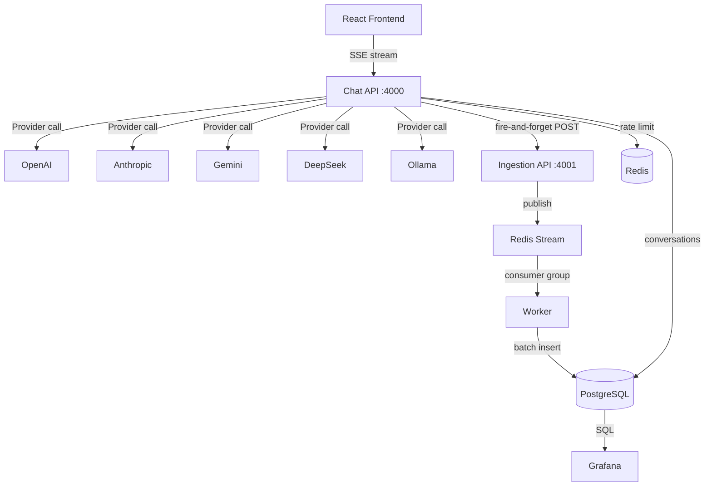

## How to Build a Multi-Provider LLM Chat Platform with Async Observability in Go

In this tutorial, you'll build a production-grade LLM chat platform with multiple AI providers, streaming responses, and async inference logging — all running in Docker Compose with pre-provisioned Grafana dashboards. The key architectural insight: **logging never blocks the chat hot path**.

The full source is at [github.com/priyanshu360/chatbot-llm](https://github.com/priyanshu360/chatbot-llm).

### What to expect

```bash
$ docker compose up -d
# Spins up 7 services: postgres, redis, chat-api, ingestion-api, worker, frontend, grafana

$ curl -X POST http://localhost:4000/api/chat \
  -H "Content-Type: application/json" \
  -d '{"model":"gpt-4o","messages":[{"role":"user","content":"Hello"}]}'
# → SSE stream: {"content":"Hello!"}  ...  data: [DONE]

$ curl http://localhost:4000/api/conversations
# → [{"id":"...","title":"Chat with GPT-4o","status":"active"}]
```

### What you'll learn

- Abstracting 5 LLM providers behind a common interface (OpenAI, Anthropic, Gemini, Ollama, DeepSeek)
- SSE streaming with cancellation support via `AbortController`
- Fire-and-forget inference logging via Redis Streams (never blocks the chat response)
- Dead letter queue for malformed payloads (zero data loss)
- PII redaction with regex (applied at source before logging)
- Rate limiting with Redis (shared token bucket across pod replicas)
- PostgreSQL schema for conversations, messages, and inference logs
- Pre-provisioned Grafana dashboards for LLM observability
- Multi-service Docker Compose with chat, ingestion, and worker services

### Prerequisites

- Go 1.22+
- Docker and Docker Compose
- API keys for at least one LLM provider

### Project structure

```
chatbot-llm/
├── pkg/
│   └── types.go              # Shared types: InferenceLog, ChatRequest, SSEEvent, etc.
├── services/
│   ├── chat-api/              # HTTP server, SSE streaming, provider orchestration
│   │   ├── cmd/server/main.go
│   │   └── internal/
│   │       ├── repo/          # PostgreSQL conversation/message CRUD
│   │       ├── service/       # Chat logic, conversation management, context window
│   │       │   └── llm/
│   │       │       ├── client.go       # Common Provider interface
│   │       │       ├── logger.go       # BufferedLogger (async dispatch to ingestion API)
│   │       │       ├── redact.go       # PII redaction (email, phone, credit card, IP)
│   │       │       └── providers/
│   │       │           ├── provider.go # Provider interface
│   │       │           ├── openai.go
│   │       │           ├── anthropic.go
│   │       │           ├── gemini.go
│   │       │           ├── ollama.go
│   │       │           └── deepseek.go
│   │       ├── transport/
│   │       │   ├── handler/   # HTTP handlers: chat, conversations, messages, providers
│   │       │   └── middleware/ # CORS, logging, rate limiting, panic recovery
│   │       └── util/
│   ├── ingestion-api/         # Receives inference logs, publishes to Redis Streams
│   │   ├── cmd/
│   │   │   ├── server/main.go
│   │   │   └── worker/main.go
│   │   └── internal/
│   │       ├── repo/          # DLQ writes, inference_log batch inserts, Redis Stream ops
│   │       ├── service/       # Ingest validation + dispatch
│   │       ├── transport/     # HTTP handler for POST /ingest
│   │       └── validation/    # InferenceLog schema validation
│   ├── db/
│   │   └── migrations/
│   │       └── 001_init.sql   # 4 tables: conversations, messages, inference_logs, ingestion_dlq
├── frontend/                  # React 19 + TypeScript + Vite + Tailwind
│   └── src/
│       ├── components/        # ChatInput, ChatWindow, ProviderPicker, Sidebar
│       ├── hooks/             # useChatStream, useConversations
│       ├── lib/               # API client, Zod schemas
│       └── stores/            # Zustand chat store
└── infra/
    ├── docker-compose.yml     # 7 services
    ├── docker/                # Dockerfiles + nginx config
    ├── k8s/                   # Kustomize manifests
    └── grafana/               # Pre-provisioned dashboards + datasource
```

### Imports

**Chat API (`services/chat-api/go.mod`)**

| Package | Why |
|---------|-----|
| `github.com/go-chi/chi/v5` | HTTP router — middleware chaining, URL params |
| `github.com/jackc/pgx/v5` | PostgreSQL driver (pgx5, connection pooling) |
| `github.com/redis/go-redis/v9` | Redis client for rate limiting + logging buffer |
| `github.com/google/generative-ai-go` | Gemini official Go SDK |
| `github.com/anthropics/anthropic-sdk-go` | Anthropic official Go SDK |
| `github.com/segmentio/kafka-go` | Kafka protocol support (used for Redis Streams-like pattern) |

**Why these choices?**

- **chi router over standard `http.ServeMux`**: The Go 1.22 `http.ServeMux` supports method-based routing (`GET /path`) and path parameters (`/path/{id}`), but chi adds middleware chaining, sub-routers, and URL parameter extraction (`chi.URLParam(r, "id")`). For a service with CORS, logging, rate limiting, and recovery middleware, chi's `r.Use()` pattern is cleaner.

- **pgx over database/sql**: pgx is the de facto standard PostgreSQL driver for Go. It supports `COPY` for bulk inserts (used by the worker for batch inference log writes), `LISTEN/NOTIFY`, and native PostgreSQL types like `UUID` and `JSONB`. The `pgxpool` connection pool handles automatic reconnection.

- **Separate ingestion service**: Inference logging (token count, latency, model choice) is fire-and-forget. The Chat API POSTs to the Ingestion API and immediately returns the SSE stream to the user. The Ingestion API validates the payload, publishes to Redis Streams, and a separate Worker batch-inserts to PostgreSQL. This ensures LLM latency is never impacted by logging.

### System architecture



### Step 1: The Provider interface

File: `services/chat-api/internal/service/llm/providers/provider.go`

```go
type Provider interface {
    Name() string
    Chat(ctx context.Context, req ChatRequest) (*ChatResponse, error)
    ChatStream(ctx context.Context, req ChatRequest) (<-chan StreamEvent, error)
}

type ChatRequest struct {
    Model       string    `json:"model"`
    Messages    []Message `json:"messages"`
    Temperature float64   `json:"temperature,omitempty"`
    MaxTokens   int       `json:"max_tokens,omitempty"`
}

type StreamEvent struct {
    Content string
    Done    bool
    Error   error
}
```

Every provider implements this interface. The `ChatStream` method returns a channel that emits tokens one at a time, with a final `Done: true` event.

**Why a channel for streaming and not a callback?** Channels compose well with Go's `select` statement — you can add a timeout, cancellation, or merge multiple streams. A callback would need the same machinery but with more boilerplate.

### Step 2: OpenAI provider implementation

File: `services/chat-api/internal/service/llm/providers/openai.go`

```go
func (p *OpenAIProvider) ChatStream(ctx context.Context, req ChatRequest) (<-chan StreamEvent, error) {
    body := map[string]any{
        "model":    req.Model,
        "messages": req.Messages,
        "stream":   true,
    }
    payload, _ := json.Marshal(body)

    httpReq, _ := http.NewRequestWithContext(ctx, "POST",
        "https://api.openai.com/v1/chat/completions", bytes.NewReader(payload))
    httpReq.Header.Set("Authorization", "Bearer "+p.apiKey)
    httpReq.Header.Set("Content-Type", "application/json")

    resp, err := http.DefaultClient.Do(httpReq)
    if err != nil {
        return nil, err
    }

    events := make(chan StreamEvent)
    go func() {
        defer close(events)
        defer resp.Body.Close()
        scanner := bufio.NewScanner(resp.Body)

        for scanner.Scan() {
            line := scanner.Text()
            if !strings.HasPrefix(line, "data: ") {
                continue
            }
            data := strings.TrimPrefix(line, "data: ")
            if data == "[DONE]" {
                events <- StreamEvent{Done: true}
                return
            }

            var chunk struct {
                Choices []struct {
                    Delta struct {
                        Content string `json:"content"`
                    } `json:"delta"`
                } `json:"choices"`
            }
            json.Unmarshal([]byte(data), &chunk)
            for _, choice := range chunk.Choices {
                events <- StreamEvent{Content: choice.Delta.Content}
            }
        }
    }()
    return events, nil
}
```

The Anthropic, Gemini, Ollama, and DeepSeek providers follow the same pattern but each has different API endpoints, auth headers, and chunk formats. For example, Anthropic uses `x-api-key` header and a `content_block_delta` event format, while Gemini uses a bidirectional streaming gRPC-like HTTP API.

**Watch out for:** OpenAI SSE events are prefixed with `data: `, but Anthropic uses a different SSE format with `event:` and `data:` lines. The provider implementations must normalize these differences into the common `StreamEvent` struct.

### Step 3: Context window management

File: `services/chat-api/internal/service/chat.go`

```go
const contextWindowReserve = 0.20 // Reserve 20% for the response

var modelContextWindows = map[string]int{
    "gpt-4o":        128000,
    "claude-sonnet-4-20250514": 200000,
    "gemini-2.0-flash-exp": 1048576,
    // ... more models
}

func truncateMessages(messages []Message, model string) []Message {
    window, ok := modelContextWindows[model]
    if !ok {
        window = 4096 // conservative default
    }
    maxTokens := int(float64(window) * (1 - contextWindowReserve))

    var total int
    var keep []Message

    // Count from newest to oldest, keep what fits
    for i := len(messages) - 1; i >= 0; i-- {
        tokens := estimateTokens(messages[i].Content)
        if total + tokens > maxTokens && len(keep) > 0 {
            break
        }
        total += tokens
        keep = append([]Message{messages[i]}, keep...)
    }
    return keep
}
```

**Why truncate from the oldest?** The most recent messages are the most relevant for context. LLMs tend to focus more on recent content (the "lost in the middle" phenomenon). By trimming from the oldest, we keep the conversation coherent while fitting within the model's context window.

**Watch out for:** Token estimation is approximate — `len(content) / 4` is a common heuristic, but it's inaccurate for code, non-English text, or heavily punctuated content. Use a proper tokenizer (like `tiktoken` for OpenAI) for production.

### Step 4: PII redaction

File: `services/chat-api/internal/service/llm/redact.go`

```go
var piiPatterns = []struct {
    name    string
    pattern *regexp.Regexp
    replace string
}{
    {"email", regexp.MustCompile(`\b[\w.+-]+@[\w-]+\.[\w.-]+\b`), "[EMAIL REDACTED]"},
    {"phone", regexp.MustCompile(`\b\+?\d[\d\s.-]{7,15}\d\b`), "[PHONE REDACTED]"},
    {"credit_card", regexp.MustCompile(`\b\d{4}[- ]?\d{4}[- ]?\d{4}[- ]?\d{4}\b`), "[CC REDACTED]"},
    {"ip", regexp.MustCompile(`\b\d{1,3}\.\d{1,3}\.\d{1,3}\.\d{1,3}\b`), "[IP REDACTED]"},
    {"aadhaar", regexp.MustCompile(`\b\d{4}\s?\d{4}\s?\d{4}\b`), "[AADHAAR REDACTED]"},
}

func RedactPII(input string) string {
    result := input
    for _, p := range piiPatterns {
        result = p.pattern.ReplaceAllString(result, p.replace)
    }
    return result
}
```

PII redaction is applied at the source — on the message content before it's sent to the Ingestion API. This means:
- The raw content is never stored or logged
- The redacted version is what appears in `inference_logs.content_preview`
- The `messages` table has both `content` (original, for chat display) and `content_redacted` (for logging/audit)

**Why regex and not an ML-based PII detector?** Speed and zero dependencies. Regex runs in microseconds, even on long messages. ML-based detectors take 50-200ms per call and require a model download. For a real-time chat application, regex is the right choice — trade off some recall for latency.

**Watch out for:** Regex-based PII detection has false positives. A commit hash like `abc1234@def5678` triggers the email pattern. The Aadhaar pattern can match any 12 consecutive digits. The key is to err on the side of over-redaction for logging — better to redact something that isn't PII than to leak something that is.

### Step 5: Async logging with BufferedLogger

File: `services/chat-api/internal/service/llm/logger.go`

```go
type BufferedLogger struct {
    buffer    []InferenceLog
    mu        sync.Mutex
    maxSize   int
    flushTick *time.Ticker
    ttl       time.Duration
    lastFlush time.Time
}

func NewBufferedLogger(maxSize int, flushInterval time.Duration, ttl time.Duration) *BufferedLogger {
    bl := &BufferedLogger{
        buffer:    make([]InferenceLog, 0, maxSize),
        maxSize:   maxSize,
        flushTick: time.NewTicker(flushInterval),
        ttl:       ttl,
        lastFlush: time.Now(),
    }
    go bl.flushLoop()
    return bl
}

func (bl *BufferedLogger) Log(ctx context.Context, logEntry InferenceLog) {
    bl.mu.Lock()
    bl.buffer = append(bl.buffer, logEntry)

    shouldFlush := len(bl.buffer) >= bl.maxSize ||
        time.Since(bl.lastFlush) >= bl.ttl

    if shouldFlush {
        batch := bl.buffer
        bl.buffer = make([]InferenceLog, 0, bl.maxSize)
        bl.lastFlush = time.Now()
        bl.mu.Unlock()
        bl.sendBatch(ctx, batch)
    } else {
        bl.mu.Unlock()
    }
}

func (bl *BufferedLogger) flushLoop() {
    for range bl.flushTick.C {
        bl.mu.Lock()
        if len(bl.buffer) > 0 {
            batch := bl.buffer
            bl.buffer = make([]InferenceLog, 0, bl.maxSize)
            bl.lastFlush = time.Now()
            bl.mu.Unlock()
            bl.sendBatch(context.Background(), batch)
        } else {
            bl.mu.Unlock()
        }
    }
}
```

The `BufferedLogger` collects inference logs in memory and flushes them to the Ingestion API in batches. Three conditions trigger a flush:
1. **Buffer full** (max 100 entries) — prevents unbounded memory growth
2. **Flush tick** (every 5 seconds) — ensures logs don't sit in the buffer too long
3. **TTL exceeded** (5 minutes since last flush) — safety net if the ticker misfires

**Why buffer at all?** Batching reduces HTTP overhead. 100 logs in one POST is cheaper than 100 individual POSTs. The Ingestion API and Worker are designed for batch processing — Redis Streams with `XREADGROUP COUNT 500` and PostgreSQL `COPY` for bulk inserts.

**Watch out for:** The buffer is in-memory. If the Chat API crashes between flushes, up to 100 inference logs are lost. For a production system, add a local file fallback or use a persistent queue. For this project, the trade-off is accepted — inference logs are observability data, not business-critical.

### Step 6: Rate limiting with Redis

File: `services/chat-api/internal/transport/middleware/ratelimit.go`

```go
func RateLimitMiddleware(rdb *redis.Client) func(http.Handler) http.Handler {
    const limit = 20          // requests per second
    const window = 1 * time.Second

    return func(next http.Handler) http.Handler {
        return http.HandlerFunc(func(w http.ResponseWriter, r *http.Request) {
            ip := r.RemoteAddr

            count, err := rdb.Incr(r.Context(), "ratelimit:"+ip).Result()
            if err != nil {
                http.Error(w, "rate limit error", 500)
                return
            }

            if count == 1 {
                rdb.Expire(r.Context(), "ratelimit:"+ip, window)
            }

            if count > limit {
                w.Header().Set("Retry-After", "1")
                http.Error(w, "rate limit exceeded", 429)
                return
            }

            next.ServeHTTP(w, r)
        })
    }
}
```

Uses a simple Redis `INCR` + `EXPIRE` pattern — a token bucket with 1-second window. Each request increments the counter, and the key expires after 1 second (resetting the counter). The response is `429 Too Many Requests` when the limit is exceeded.

**Why Redis and not in-memory?** When the Chat API scales to multiple replicas, in-memory rate limits are per-pod — a client can do 20 req/s per pod. With Redis, the counter is shared across all replicas, enforcing the global limit. The trade-off is an extra network hop per request (~1ms), which is negligible compared to LLM latency (~seconds).

**Why INCR + EXPIRE and not a Lua script?** For a 1-second window, INCR + EXPIRE is atomic enough — the race condition (two requests between INCR and EXPIRE) is harmless at this granularity. A Lua script would be more correct but adds complexity. The actual codebase includes a Lua script (`ratelimit.lua`) as well — the INCR approach is used at the middleware level.

### Step 7: The Ingestion pipeline

File: `services/ingestion-api/internal/service/ingest.go`

```
POST /ingest  →  Ingestion API validates payload
                      ↓
              Publishes to Redis Stream "inference:logs"
                      ↓
              Worker reads via XREADGROUP (consumer: inference-workers)
                      ↓
              Batch of 500 or flush every 2 seconds
                      ↓
              Validates each log, batch-inserts into inference_logs table
                      ↓
              XACK on success (no ACK = redelivery)
```

The Worker uses a consumer group for at-least-once delivery. Messages that fail validation go to the `ingestion_dlq` table:

File: `services/ingestion-api/internal/repo/dlq.go`

```go
func (r *DLQRepo) Insert(ctx context.Context, raw []byte, errMsg string) error {
    _, err := r.db.Exec(ctx,
        `INSERT INTO ingestion_dlq (raw, error_msg) VALUES ($1, $2)`,
        raw, errMsg)
    return err
}
```

**Why a separate DLQ table and not a Redis Stream?** Malformed payloads can't be parsed — they'd break the Redis Stream consumer. The DLQ stores the raw JSONB payload alongside the validation error, so operators can inspect and replay. This is a dead letter queue in the traditional messaging sense.

### Step 8: Database schema

File: `services/db/migrations/001_init.sql`

```sql
CREATE EXTENSION IF NOT EXISTS pgcrypto;

CREATE TABLE conversations (
    id          UUID PRIMARY KEY DEFAULT gen_random_uuid(),
    user_id     UUID NOT NULL,
    title       TEXT,
    status      TEXT NOT NULL DEFAULT 'active'
                CHECK (status IN ('active', 'cancelled')),
    created_at  TIMESTAMPTZ DEFAULT NOW()
);

CREATE TABLE messages (
    id                UUID PRIMARY KEY DEFAULT gen_random_uuid(),
    conversation_id   UUID NOT NULL REFERENCES conversations(id),
    role              TEXT NOT NULL,
    content           TEXT NOT NULL,
    content_redacted  TEXT NOT NULL,
    created_at        TIMESTAMPTZ DEFAULT NOW()
);

CREATE TABLE inference_logs (
    id                BIGSERIAL PRIMARY KEY,
    model             TEXT NOT NULL,
    provider          TEXT NOT NULL,
    latency_ms        INT NOT NULL,
    prompt_tokens     INT NOT NULL,
    completion_tokens INT NOT NULL,
    total_tokens      INT GENERATED ALWAYS AS (prompt_tokens + completion_tokens) STORED,
    content_preview   TEXT,
    created_at        TIMESTAMPTZ DEFAULT NOW()
);

CREATE TABLE ingestion_dlq (
    id          BIGSERIAL PRIMARY KEY,
    raw         JSONB NOT NULL,
    error_msg   TEXT NOT NULL,
    created_at  TIMESTAMPTZ DEFAULT NOW()
);
```

Key design decisions:
- **`content_redacted`** is separate from `content` — the full message is stored for chat display, while the redacted version is used for logging and analytics
- **`total_tokens` is a generated column** — computed automatically from `prompt_tokens + completion_tokens`, cannot be out of sync
- **`status` with CHECK constraint** — prevents invalid conversation states at the database level
- **`ingestion_dlq` has no FK constraints** — malformed payloads might not reference valid conversations, so we store them raw

### Step 9: SSE streaming handler

File: `services/chat-api/internal/transport/handler/chat.go`

```go
func (h *ChatHandler) StreamChat(w http.ResponseWriter, r *http.Request) {
    var req ChatRequest
    json.NewDecoder(r.Body).Decode(&req)

    provider, _ := h.factory.GetProvider(req.Model)

    w.Header().Set("Content-Type", "text/event-stream")
    w.Header().Set("Cache-Control", "no-cache")
    w.Header().Set("Connection", "keep-alive")

    flusher, _ := w.(http.Flusher)
    ctx := r.Context()

    events, _ := provider.ChatStream(ctx, req)

    for {
        select {
        case event, ok := <-events:
            if !ok {
                return
            }
            if event.Done {
                fmt.Fprintf(w, "data: [DONE]\n\n")
                flusher.Flush()
                return
            }
            data, _ := json.Marshal(map[string]string{"content": event.Content})
            fmt.Fprintf(w, "data: %s\n\n", data)
            flusher.Flush()

        case <-ctx.Done():
            // Client disconnected — stop streaming
            return
        }
    }
}
```

The SSE handler writes each token as a `data: {...}` line, followed by `data: [DONE]` when complete. The `context.Context` cancellation (triggered by the client disconnecting) stops the stream cleanly.

**Why SSE and not WebSockets?** SSE is simpler — one-directional server→client, works over HTTP/1.1, auto-reconnects via `EventSource` API. WebSockets add complexity (bidirectional, frame handling, reconnection logic) that isn't needed for a chat application where the client only sends one request and the server streams the response.

### Step 10: Frontend SSE consumption

File: `frontend/src/hooks/useChatStream.ts`

```ts
async function streamChat(model: string, messages: Message[], onToken: (token: string) => void) {
    const response = await fetch('/api/chat', {
        method: 'POST',
        headers: { 'Content-Type': 'application/json' },
        body: JSON.stringify({ model, messages }),
    })

    const reader = response.body!.getReader()
    const decoder = new TextDecoder()
    let buffer = ''

    while (true) {
        const { done, value } = await reader.read()
        if (done) break

        buffer += decoder.decode(value, { stream: true })
        const lines = buffer.split('\n')
        buffer = lines.pop() || ''

        for (const line of lines) {
            if (line.startsWith('data: ')) {
                const data = line.slice(6)
                if (data === '[DONE]') return
                const parsed = JSON.parse(data)
                onToken(parsed.content)
            }
        }
    }
}
```

The frontend reads the response body as a stream, splits on `\n`, parses `data:` lines, and appends each token to the message display. The `AbortController` API allows cancelling the stream mid-response.

### Design decisions

| Decision | This project | Alternative | Why |
|----------|-------------|-------------|-----|
| **Logging pattern** | Async fire-and-forget via Redis Streams | Synchronous DB insert per LLM call | Never blocks the chat hot path |
| **PII handling** | Regex at source, dual storage (raw + redacted) | ML-based detection, single storage | Speed vs recall trade-off |
| **Rate limiting** | Redis INCR + EXPIRE | In-memory counters, sliding window | Shared across replicas |
| **Worker batch** | 500 messages or 2s flush | Per-message insert | Throughput — COPY is 10x faster |
| **DLQ** | Separate JSONB table | Redis Stream DLQ | Preserves malformed payloads |
| **Provider SDK** | In-process HTTP calls | Sidecar proxy (e.g., LiteLLM) | Zero network hop, simpler debugging |
| **Context window** | Truncate oldest messages | Summarize, RAG, sliding window | Simple, predictable behavior |

### Feature comparison

| Concern | Covered? | Notes |
|---------|----------|-------|
| Multi-provider abstraction | Yes | 5 providers via common interface |
| SSE streaming | Yes | With cancellation via ctx.Done |
| Conversation CRUD | Yes | Create, list, get, delete |
| Message persistence | Yes | With redacted copy for logging |
| Context window management | Yes | Truncate oldest, reserve 20% |
| PII redaction | Yes | Email, phone, CC, IP, Aadhaar |
| Async inference logging | Yes | BufferedLogger → Ingestion API → Worker |
| Dead letter queue | Yes | Malformed payloads stored as JSONB |
| Rate limiting | Yes | 20 req/s per IP via Redis |
| Grafana dashboards | Yes | Pre-provisioned: latency, throughput, errors, tokens |
| Kubernetes deployment | Yes | Kustomize: HPA, PDB, StatefulSet, Ingress |
| Docker Compose | Yes | 7 services, one command |
| Frontend streaming | Yes | React + Zustand + TanStack Query |
| Provider-specific auth | Yes | Each provider handles its own auth header |
| Token usage tracking | Yes | total_tokens is a GENERATED column |

### Watch out for

1. **Redis Stream consumer group offset** — If the worker restarts, it resumes from the last XACK'd message. Unacknowledged messages are redelivered after `XREADGROUP`'s idle timeout. This guarantees at-least-once delivery but can cause duplicate inserts if the worker crashes between processing and ACKing. The `inference_logs` table has no unique constraint on (model, timestamp, content_preview) — deduplication is handled by the application layer.

2. **Context window estimation is approximate** — The `estimateTokens` function uses `len(content) / 4` which is accurate for English text but off by 2-3x for code. If the estimation is too aggressive, the LLM might receive a truncated prompt; if too conservative, the response might get cut off. Production systems should use model-specific tokenizers.

3. **PII redaction happens before logging, not before LLM call** — The LLM provider receives the raw (unredacted) message. PII is only stripped from the inference log. This is intentional — redacting input to the LLM would degrade response quality for legitimate use cases. But it means PII is sent to third-party API providers. Ensure your data processing agreement covers this.

4. **BufferedLogger can lose up to 100 logs on crash** — The in-memory buffer is not persisted. For production, add a local file-based spillover or use a persistent queue like NATS. The current approach prioritizes simplicity and performance over durability.

5. **No streaming response in inference_logs** — The `content_preview` column captures the first N characters of the response, but if streaming is interrupted, the preview might be incomplete. The `inference_logs` entries are created from the final `processMessage` call, not from partial streams.

### Next steps

- Add streaming-aware inference logging that captures partial responses
- Implement automated DLQ replay with exponential backoff
- Add per-user rate limiting (keyed by JWT subject instead of IP)
- Support tool/function calling across all providers
- Add multi-modal input (images + text) for supported providers
- Implement conversation summarization for long-running chats

The full source is at [github.com/priyanshu360/chatbot-llm](https://github.com/priyanshu360/chatbot-llm).
