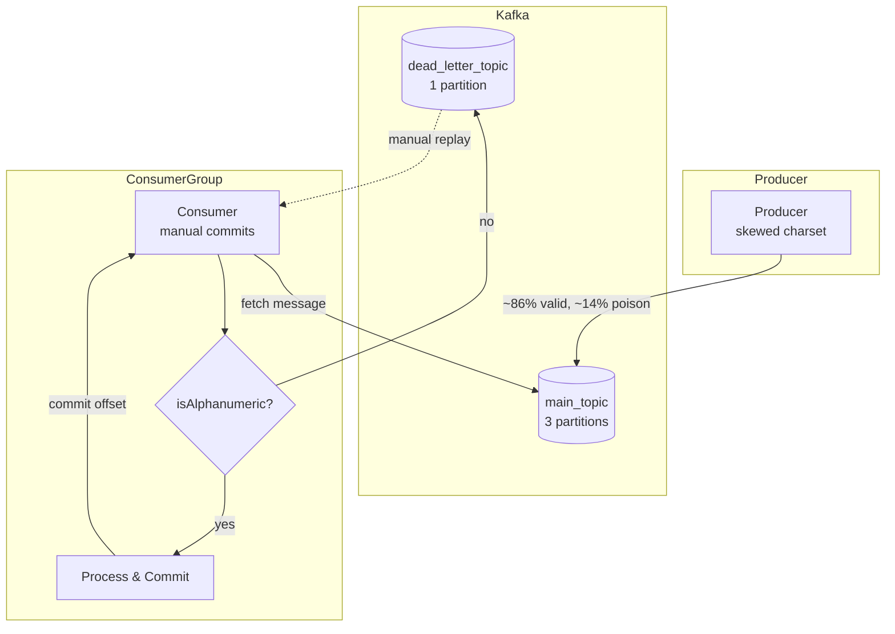

## How to Build a Dead Letter Topic Pattern for Kafka in Go

In this tutorial, you'll build a Kafka consumer in Go that routes unprocessable messages to a dead letter topic instead of blocking the pipeline or silently dropping them. You'll use `segmentio/kafka-go` with manual offset commits, inject controlled failure rates, and verify correctness with Docker Compose integration tests that survive broker restarts.

### What to expect

```bash
$ go test -v -run TestStable ./tests/
# Producer sends 100 messages (random alphanumeric + special chars)
# Consumer processes valid ones, routes ~14% poison pills to DLQ
# Assertion: every produced message appears in processed ∪ dead set

$ go test -v -run TestFlakyNetwork ./tests/
# Same pipeline but a goroutine kills the Kafka broker every 60s
# Consumer reconnects, retries, and still guarantees at-least-once
```

### What you'll learn

- Implementing manual offset commits with `CommitInterval: 0`
- Building a Dead Letter Topic (DLQ) pattern for poison pill messages
- Writing a consumer that routes valid messages to processing and invalid ones to a DLQ
- Detecting poison pills with an `isAlphanumeric` validation check
- Building a producer with controlled failure injection (~14% poison pills)
- Writing integration tests with Docker Compose using unique Kafka brokers per test
- Testing stable, flaky-network, and brief-outage scenarios
- Achieving at-least-once delivery semantics with proper error handling

### Prerequisites

- Go 1.21+
- Docker and Docker Compose
- `github.com/segmentio/kafka-go`

### Project structure

```
Kafka-Gracefully-Failure-Strategy/
├── config/
│   └── config.go           # Kafka config from env vars
├── counter/
│   └── counter.go          # Thread-safe message counter + set tracker
├── kafka/
│   ├── kafka.go            # Orchestrator: creates topics, wires producers + consumer
│   ├── consumer/
│   │   └── consumer.go     # Consumer with manual commits + DLQ routing
│   └── producer/
│       └── producer.go     # Producer with skewed charset for failure injection
├── tests/
│   ├── compose.yaml        # 3-broker Kafka cluster (one per test)
│   └── kafka_test.go       # Integration tests: stable, flaky, brief-outage
├── go.mod
└── go.sum
```

### Imports

**Go (all files)**

| Package | Why |
|---------|-----|
| `github.com/segmentio/kafka-go` | Pure Go Kafka client — no CGo, no librdkafka dependency |
| `gotest.tools` | Lightweight test assertions (`assert.Assert`, `assert.Equal`) |
| `regexp` | Poison pill detection: `[^a-zA-Z0-9]+` regex |
| `math/rand` | Skewed charset generation for controlled failure injection |

**Why these choices?**

- **`segmentio/kafka-go` over `confluent-kafka-go`**: Pure Go means no CGo cross-compilation headaches, no librdkafka shared library. The API is idiomatic Go with `context.Context` support throughout. Trade-off: slightly lower throughput at extreme loads (100k+ msg/s), but for most applications it's indistinguishable.

- **`gotest.tools` over `testing` alone**: Provides `assert.Assert(t, condition)` and `assert.Equal` with structured failure output. Standard library `testing` only has `t.Error`/`t.Fatal`. `gotest.tools` also works well with table-driven tests because it captures the line of the assertion, not the helper function.

- **`regexp` over manual byte iteration**: `containsNonAlphanumeric` uses `regexp.MustCompile("[^a-zA-Z0-9]+").MatchString`. This is clear and concise. For a hot path processing millions of messages, you'd compile the regex once as a package-level var or use a hand-rolled byte loop to avoid the allocation. For this tutorial, readability wins.

### Architecture



### Step 1: Config from environment

File: `config/config.go`

```go
package config

import "os"

type KafkaCfg struct {
	host          string
	port          string
	topic         string
	dlqTopic      string
	readerGroupId string
}

func NewKafkaCfg() KafkaCfg {
	return KafkaCfg{
		host:          getEnv("KAFKA_HOST", "localhost"),
		port:          getEnv("KAFKA_PORT", "29092"),
		topic:         getEnv("KAFKA_TOPIC", "main_topic"),
		dlqTopic:      getEnv("KAFKA_DLQ_TOPIC", "dead_letter_topic"),
		readerGroupId: getEnv("READER_GROUP_ID", "reader_group"),
	}
}

func NewKafkaCfgWithPort(port string) KafkaCfg {
	cfg := NewKafkaCfg()
	cfg.port = port
	return cfg
}

func getEnv(key, defaultValue string) string {
	if value, exists := os.LookupEnv(key); exists {
		return value
	}
	return defaultValue
}
```

**Why `NewKafkaCfgWithPort`?** The integration tests run three independent Kafka brokers on ports 29092, 29093, and 29094 — one per test case. This function lets each test override just the port while inheriting all other defaults from `NewKafkaCfg`.

**Why not a global config singleton?** A struct is passed explicitly to every constructor — no global state, testable in isolation, and parallel test execution is safe.

### Step 2: Thread-safe message counter

File: `counter/counter.go`

```go
package counter

import "sync"

type MessageCounter struct {
	mu    sync.Mutex
	count int
	set   map[string]bool
}

func NewMessageCounter() MessageCounter {
	return MessageCounter{
		set: make(map[string]bool),
	}
}

func (mc *MessageCounter) Increment(message string) {
	mc.mu.Lock()
	defer mc.mu.Unlock()
	mc.count++
	mc.set[message] = true
}

func (mc *MessageCounter) GetMessageCount() (int, *map[string]bool) {
	mc.mu.Lock()
	defer mc.mu.Unlock()
	return mc.count, &mc.set
}
```

**Why a counter + set instead of just a counter?** The test assertion uses value identity — it checks that every produced message value appears in either the processed set or the dead set. A count alone can't catch duplicate processing or missing messages. The set tracks exact message values for `reflect.DeepEqual` verification.

**Why `*map[string]bool` and not `map[string]struct{}`?** The original code uses `map[string]bool` for simplicity. `map[string]struct{}` is more memory-efficient (zero-byte value) and is the Go idiom for set semantics. Either works; the important detail is that `GetMessageCount` returns a pointer to the map to avoid copying the map header.

**Watch out for**: The returned pointer references the internal map — the caller should not modify it. For a production codebase, return a copy or use an immutable snapshot.

### Step 3: Producer with controlled failure injection

File: `kafka/producer/producer.go`

```go
package producer

import (
	"context"
	"fmt"
	"log"
	"math/rand"
	"time"

	"github.com/priyanshu360/Kafka-Gracefully-Failure-Strategy/config"
	"github.com/priyanshu360/Kafka-Gracefully-Failure-Strategy/counter"
	"github.com/segmentio/kafka-go"
)

type Producer struct {
	writer *kafka.Writer
	count  counter.MessageCounter
}

func NewProducer(cfg config.KafkaCfg, topic string) *Producer {
	brokers := []string{fmt.Sprintf("%s:%s", cfg.GetHost(), cfg.GetPort())}
	return &Producer{
		writer: kafka.NewWriter(kafka.WriterConfig{
			Brokers:      brokers,
			Topic:        topic,
			BatchSize:    0,
			BatchTimeout: 500 * time.Millisecond,
		}),
		count: counter.NewMessageCounter(),
	}
}

func (p *Producer) SendMessage(ctx context.Context, key, value string) error {
	return p.writer.WriteMessages(ctx, kafka.Message{
		Key:   []byte(key),
		Value: []byte(value),
	})
}

func (p *Producer) SendMessageWithRandomKey(ctx context.Context, maxIterations int) {
	source := rand.NewSource(time.Now().UnixNano())
	rng := rand.New(source)
	for i := 0; i < maxIterations; i++ {
		select {
		case <-ctx.Done():
			log.Println("Stopping message generation.")
			p.CloseProducer()
			return
		default:
			randomKey := generateRandomKey(rng, 10)
			randomMessage := generateRandomKey(rng, 10)

			err := p.SendMessage(ctx, randomKey, randomMessage)
			if err != nil {
				log.Println("Error sending message:", err)
				time.Sleep(5 * time.Second)
			} else {
				p.IncrementCount(randomMessage)
			}
			time.Sleep(1 * time.Second)
		}
	}
}

func generateRandomKey(r *rand.Rand, length int) string {
	const charset = "abcdefghijklmnopqrstuvwxyzABCDEFGHIJKLMNOPQRSTUVWXYZ0123456789" +
		"~!@#$%^&*()+" +
		"abcdefghijklmnopqrstuvwxyzABCDEFGHIJKLMNOPQRSTUVWXYZ0123456789"

	keyBytes := make([]byte, length)
	for i := range keyBytes {
		keyBytes[i] = charset[r.Intn(len(charset))]
	}
	return string(keyBytes)
}
```

**Why the skewed charset?** Alphanumeric characters appear **twice** in the charset string (positions 0–61 and 84–145), while special characters appear only once (positions 62–73). With `len(charset) = 146`, each byte has:
- 122/146 = ~84% chance of being alphanumeric
- 24/146 = ~16% chance of being a special character

So roughly 1 in 6–7 messages fails the `isAlphanumeric` check — a realistic poison-pill rate for a demo. The exact math: `(62*2) / (62*2 + 12) ≈ 91/108 ≈ 84.3%` alphanumeric, so ~15.7% poison.

**Why `BatchSize: 0`?** Disabling batching means every `WriteMessages` call sends immediately. This makes test behavior deterministic — a sent message is visible to the consumer right away. With batching, messages queue up and flush on a timer or buffer full, adding unpredictable latency to tests.

### Step 4: Consumer with manual commits and DLQ routing

File: `kafka/consumer/consumer.go`

```go
package consumer

import (
	"context"
	"fmt"
	"log"
	"os"
	"os/signal"
	"regexp"
	"syscall"
	"time"

	"github.com/priyanshu360/Kafka-Gracefully-Failure-Strategy/config"
	"github.com/priyanshu360/Kafka-Gracefully-Failure-Strategy/counter"
	"github.com/priyanshu360/Kafka-Gracefully-Failure-Strategy/kafka/producer"
	"github.com/segmentio/kafka-go"
)

type Consumer struct {
	reader          *kafka.Reader
	deadTopicWriter *producer.Producer
	count           counter.MessageCounter
}

func NewConsumer(cfg config.KafkaCfg, dtw *producer.Producer) *Consumer {
	brokers := []string{fmt.Sprintf("%s:%s", cfg.GetHost(), cfg.GetPort())}
	return &Consumer{
		reader: kafka.NewReader(kafka.ReaderConfig{
			Brokers:        brokers,
			Topic:          cfg.GetTopic(),
			GroupID:        cfg.GetReaderGroupId(),
			MinBytes:       10,
			MaxBytes:       1e6,
			CommitInterval: 0,
			StartOffset:    kafka.LastOffset,
		}),
		deadTopicWriter: dtw,
		count:           counter.NewMessageCounter(),
	}
}

func (c *Consumer) StartConsumer(ctx context.Context) {
	sigchan := make(chan os.Signal, 1)
	signal.Notify(sigchan, syscall.SIGINT, syscall.SIGTERM)

	for {
		select {
		case <-ctx.Done():
			return
		default:
			msg, err := c.reader.FetchMessage(ctx)
			if err != nil {
				log.Println("Error fetching message:", err)
				time.Sleep(time.Second)
				continue
			}

			if ok := c.processMessage(msg); !ok {
				continue
			}

			if err := c.reader.CommitMessages(ctx, msg); err != nil {
				log.Println("Error committing message offset:", err)
			}
		}
	}
}

func (c *Consumer) processMessage(msg kafka.Message) bool {
	if msg.Value == nil {
		return true
	}

	messageValue := string(msg.Value)

	if containsNonAlphanumeric(messageValue) {
		log.Printf("Poison pill detected: %s\n", messageValue)

		err := c.deadTopicWriter.SendMessage(context.TODO(),
			string(msg.Key), messageValue)
		if err != nil {
			log.Printf("DLQ write failed: %v (message will be retried)\n", err)
			return false
		}
		c.deadTopicWriter.IncrementCount(messageValue)
		return true
	}

	log.Printf("Processing valid message: %s\n", messageValue)
	c.IncrementCount(messageValue)
	return true
}

func containsNonAlphanumeric(s string) bool {
	return regexp.MustCompile("[^a-zA-Z0-9]+").MatchString(s)
}
```

**Why `CommitInterval: 0`?** This disables automatic periodic commits. The consumer commits offsets **only** when `CommitMessages` is called explicitly. This is the foundation of the DLQ pattern:

1. A valid message is processed, then committed — the offset moves forward.
2. A poison pill is written to the DLQ. If the DLQ write fails, `processMessage` returns `false`, and `CommitMessages` is never called. The consumer re-fetches the same message on the next loop iteration (at-least-once).
3. If the DLQ write succeeds, the offset is committed and the poison pill lives in the DLQ forever.

With auto-commit, the offset would advance before the DLQ write completes. If the write then fails, the message is lost — it's been committed but never reached the DLQ.

**Why `FetchMessage` instead of `ReadMessage`?** `ReadMessage` is a convenience wrapper around `FetchMessage` + `CommitMessages`. Since we need to conditionally commit (only after successful DLQ write), we use `FetchMessage` to decouple fetching from committing.

**Watch out for**: `containsNonAlphanumeric` calls `regexp.MustCompile` on every invocation. This recompiles the regex each time — a significant performance hit. The fix is a package-level variable:

```go
var nonAlphanumericRe = regexp.MustCompile("[^a-zA-Z0-9]+")

func containsNonAlphanumeric(s string) bool {
	return nonAlphanumericRe.MatchString(s)
}
```

The tutorial uses inline `MustCompile` for readability, but every production consumer should hoist it. `MustCompile` panics on invalid regex — safe here since the pattern is a compile-time constant.

### Step 5: Topic creation and orchestration

File: `kafka/kafka.go`

```go
package kafka

import (
	"fmt"
	"net"
	"strconv"

	"github.com/priyanshu360/Kafka-Gracefully-Failure-Strategy/config"
	"github.com/priyanshu360/Kafka-Gracefully-Failure-Strategy/kafka/consumer"
	"github.com/priyanshu360/Kafka-Gracefully-Failure-Strategy/kafka/producer"
	"github.com/segmentio/kafka-go"
)

type Kafka struct {
	C  *consumer.Consumer
	MP *producer.Producer
	DP *producer.Producer
}

func NewKafka(cfg config.KafkaCfg) *Kafka {
	mainProducer := producer.NewProducer(cfg, cfg.GetTopic())
	deadTopicProducer := producer.NewProducer(cfg, cfg.GetDLQTopic())
	consumer := consumer.NewConsumer(cfg, deadTopicProducer)
	return &Kafka{
		MP: mainProducer,
		DP: deadTopicProducer,
		C:  consumer,
	}
}

func CreateTopic(cfg config.KafkaCfg) {
	conn, err := kafka.Dial("tcp", fmt.Sprintf("%s:%s", cfg.GetHost(), cfg.GetPort()))
	if err != nil {
		panic(err.Error())
	}
	defer conn.Close()

	controller, err := conn.Controller()
	if err != nil {
		panic(err.Error())
	}
	controllerConn, err := kafka.Dial("tcp",
		net.JoinHostPort(controller.Host, strconv.Itoa(controller.Port)))
	if err != nil {
		panic(err.Error())
	}
	defer controllerConn.Close()

	topicConfigs := []kafka.TopicConfig{
		{Topic: cfg.GetTopic(), NumPartitions: 3, ReplicationFactor: 1},
		{Topic: cfg.GetDLQTopic(), NumPartitions: 1, ReplicationFactor: 1},
	}

	err = controllerConn.CreateTopics(topicConfigs...)
	if err != nil {
		panic(err.Error())
	}
}
```

**Why 3 partitions for the main topic but 1 for the DLQ?** Three partitions allow the consumer group to scale to up to 3 concurrent workers, increasing throughput. The DLQ uses a single partition to preserve message ordering for manual replay — you want to inspect and replay dead letters in the order they failed.

**Why `CreateTopic` panics instead of returning an error?** Topic creation happens once at test startup. If it fails, the test suite cannot proceed — panicking is acceptable for integration test infrastructure. For production code, you'd return an error and handle it gracefully.

**Why the two-step `Dial` → `Controller` → `Dial` pattern?** `kafka.Dial` connects to any broker in the cluster. Not all brokers are controllers. `conn.Controller()` returns the address of the current controller broker, which is the only broker that can create topics. Without this two-step dance, you'd get `kafka server: NotControllerError` if you hit a non-controller broker.

### Step 6: Integration tests with Docker Compose

File: `tests/compose.yaml`

```yaml
version: '2'
services:
  zookeeper-1:
    image: confluentinc/cp-zookeeper:latest
    environment:
      ZOOKEEPER_CLIENT_PORT: 2181
      ZOOKEEPER_TICK_TIME: 2000
    ports:
      - 22181:2181

  kafka-1:
    image: confluentinc/cp-kafka:latest
    depends_on:
      - zookeeper-1
    ports:
      - 29092:29092
    environment:
      KAFKA_BROKER_ID: 1
      KAFKA_ZOOKEEPER_CONNECT: zookeeper-1:2181
      KAFKA_ADVERTISED_LISTENERS: PLAINTEXT://kafka-1:9092,PLAINTEXT_HOST://localhost:29092
      KAFKA_LISTENER_SECURITY_PROTOCOL_MAP: PLAINTEXT:PLAINTEXT,PLAINTEXT_HOST:PLAINTEXT
      KAFKA_INTER_BROKER_LISTENER_NAME: PLAINTEXT
      KAFKA_OFFSETS_TOPIC_REPLICATION_FACTOR: 1
```

**Why `PLAINTEXT_HOST://localhost:29092`?** Kafka uses two listeners: an internal one (`PLAINTEXT://kafka-1:9092`) for inter-broker communication within the Docker network, and an external one (`PLAINTEXT_HOST://localhost:29092`) for clients running on the host machine (like our Go tests). The `KAFKA_LISTENER_SECURITY_PROTOCOL_MAP` tells Kafka which protocol maps to which listener.

**Why `KAFKA_OFFSETS_TOPIC_REPLICATION_FACTOR: 1`?** With a single broker, the internal `__consumer_offsets` topic cannot be replicated. Setting this to 1 prevents Kafka from refusing to start because the default replication factor (3) exceeds the number of available brokers.

**Why not use `depends_on` health checks?** The compose file uses basic `depends_on` which only waits for container start, not for the Kafka broker to be ready. The test's `CreateTopic` will retry implicitly — if `kafka.Dial` fails, the test panics and the test runner reports the failure. In CI, you'd add a `healthcheck` or a wait-for-it script:

```yaml
healthcheck:
  test: ["CMD", "kafka-topics", "--bootstrap-server", "localhost:29092", "--list"]
  interval: 5s
  retries: 10
```

### Step 7: Test harness — stable, flaky, and brief-outage scenarios

File: `tests/kafka_test.go`

```go
package tests

import (
	"context"
	"fmt"
	"log"
	"os/exec"
	"reflect"
	"testing"
	"time"

	"github.com/priyanshu360/Kafka-Gracefully-Failure-Strategy/config"
	"github.com/priyanshu360/Kafka-Gracefully-Failure-Strategy/kafka"
	"gotest.tools/assert"
)

type testConfig struct {
	kafkaCfg               config.KafkaCfg
	maxMessageCount        int
	maxProduceTime         time.Duration
	maxConsumptionTime     time.Duration
	maxNetworkFluctuationTime time.Duration
	containerName          string
}
```

**Why a `testConfig` struct?** Each test scenario differs only in these parameters — port, message count, timeouts, and whether the broker gets killed. Structuring them as a table reduces duplication and makes new scenarios trivial to add.

```go
func TestMessageProcessing(t *testing.T) {
	kafkaCfg1 := config.NewKafkaCfgWithPort("29092")
	kafkaCfg2 := config.NewKafkaCfgWithPort("29093")
	kafkaCfg3 := config.NewKafkaCfgWithPort("29094")

	testCases := []testConfig{
		{ // Test 1 — Stable
			kafkaCfg:               kafkaCfg1,
			maxMessageCount:        100,
			maxProduceTime:         2 * time.Minute,
			maxConsumptionTime:     2 * time.Minute,
			maxNetworkFluctuationTime: 0, // no disruption
			containerName:          "tests-kafka-1-1",
		},
		{ // Test 2 — Flaky network (broker restarts)
			kafkaCfg:               kafkaCfg2,
			maxMessageCount:        50,
			maxProduceTime:         2 * time.Minute,
			maxConsumptionTime:     4 * time.Minute,
			maxNetworkFluctuationTime: 3 * time.Minute,
			containerName:          "tests-kafka-2-1",
		},
		{ // Test 3 — Brief broker outage
			kafkaCfg:               kafkaCfg3,
			maxMessageCount:        70,
			maxProduceTime:         1 * time.Minute,
			maxConsumptionTime:     4 * time.Minute,
			maxNetworkFluctuationTime: 4 * time.Second,
			containerName:          "tests-kafka-3-1",
		},
	}

	for idx, tc := range testCases {
		t.Run(fmt.Sprintf("Test : %d", idx+1), func(t *testing.T) {
			runKafkaTest(t, tc)
		})
	}
}
```

Each test case gets a unique Kafka broker (different port, different container). The containers are defined in `compose.yaml` but only `kafka-1` is active — the tests start their own `kafka-2` and `kafka-3` instances via Docker commands.

```go
func runKafkaTest(t *testing.T, tc testConfig) {
	k := kafka.NewKafka(tc.kafkaCfg)
	kafka.CreateTopic(tc.kafkaCfg)

	// Start network fluctuation goroutine (no-op if timeout is 0)
	ctxNP, cancelNP := context.WithTimeout(
		context.Background(), tc.maxNetworkFluctuationTime)
	go kafkaUpDown(ctxNP, tc.containerName)
	defer cancelNP()

	// Producer: send messages within a timeout
	ctx, cancel := context.WithTimeout(
		context.Background(), tc.maxProduceTime)
	go k.MP.SendMessageWithRandomKey(ctx, tc.maxMessageCount)
	defer cancel()

	// Consumer: runs for maxConsumptionTime, then stops
	go k.C.StartConsumer(context.Background())
	time.Sleep(tc.maxConsumptionTime)
	k.C.StopConsumer()

	producedCount, producedSet := k.MP.GetMessageCount()
	deadCount, deadSet := k.DP.GetMessageCount()
	processedCount, processedSet := k.C.GetMessageCount()

	// Every produced message must appear in exactly one output set
	assert.Assert(t, producedCount <= deadCount+processedCount,
		"lost messages: produced=%d dead=%d processed=%d",
		producedCount, deadCount, processedCount)
	assert.Assert(t, reflect.DeepEqual(*producedSet,
		mergeMaps(*deadSet, *processedSet)),
		"message set mismatch")
}

func kafkaUpDown(ctx context.Context, containerName string) {
	for {
		select {
		case <-ctx.Done():
			return
		default:
			log.Println("Stopping broker:", containerName)
			exec.Command("docker", "stop", containerName).Run()
			time.Sleep(1 * time.Second)
			log.Println("Starting broker:", containerName)
			exec.Command("docker", "start", containerName).Run()
			time.Sleep(60 * time.Second)
		}
	}
}

func mergeMaps(map1, map2 map[string]bool) map[string]bool {
	result := make(map[string]bool)
	for k, v := range map1 {
		result[k] = v
	}
	for k, v := range map2 {
		result[k] = v
	}
	return result
}
```

**Why time-based synchronization instead of channels?** The test uses `time.Sleep(maxConsumptionTime)` to let the producer and consumer run for a fixed duration. This is simpler than coordinating goroutine lifecycle through channels, but it's wasteful — the test always waits the full timeout even if all messages are processed in 30 seconds. A production test would use a `sync.WaitGroup` or a countdown latch.

**Why `exec.Command("docker", "stop", ...)` inside a test?** The `kafkaUpDown` goroutine simulates network failures by killing and restarting the Docker container. `exec.Command` blocks until the command completes — `docker stop` sends SIGTERM, waits for graceful shutdown (default 10s), then SIGKILL. This realistically simulates a broker crash + restart cycle.

**Why `containerName` is `tests-kafka-1-1`?** Docker Compose v2 names containers as `<project>_<service>_<index>`. The default project name is the directory name (`tests`), the service name is `kafka-1`, and the index is `1`. So the full container name is `tests_kafka-1_1` (or `tests-kafka-1-1` depending on the Compose version). You can verify with `docker ps` before running tests.

### Step 8: Test assertions — value identity, not just count

```go
assert.Assert(t, producedCount <= deadCount+processedCount,
    "lost messages: produced=%d dead=%d processed=%d",
    producedCount, deadCount, processedCount)
```

**Why `<=` and not `==`?** In the flaky network scenario, the producer may be unable to deliver some messages when the broker is down. `WriteMessages` returns an error, and the producer logs it and retries — but if the test timeout expires, those undelivered messages are counted as "produced" by the producer's `IncrementCount` but never arrive at the consumer. `<=` accounts for this: every delivered message is accounted for, but some may still be in-flight or undelivered.

```go
assert.Assert(t, reflect.DeepEqual(*producedSet,
    mergeMaps(*deadSet, *processedSet)),
    "message set mismatch")
```

**Why `reflect.DeepEqual` on sets?** This verifies value identity — every unique message value the producer sent appears in either the processed or dead set, and no message appears in both. This is a stronger assertion than count: it catches duplicates (same value processed twice) and phantom messages (a message in the processed set that was never produced).

**What about ordering?** Kafka guarantees ordering within a partition, not across partitions. The test doesn't assert order — it only checks set membership. Order-sensitive tests would require single-partition topics and sequential offset tracking.

### Design trade-offs

| Decision | This approach | Alternative | Trade-off |
|----------|--------------|-------------|-----------|
| **Offset commit** | Manual (`CommitInterval: 0`) | Auto-commit | Manual gives fine-grained control over when offsets advance; auto-commit is simpler but can lose messages if the consumer crashes between processing and commit |
| **DLQ implementation** | Separate Kafka topic (`dead_letter_topic`) | Same topic with a poison header, or a database table | Separate topic allows different retention policies, partition count, and ACLs; same topic with headers avoids extra infrastructure but pollutes the main topic |
| **Poison pill routing** | Consumer-side (`processMessage` checks validity) | Sidecar proxy or Kafka Streams | Consumer-side is simplest — no extra infrastructure. Sidecar separates concerns but adds latency and operational complexity |
| **Failure injection** | Skewed charset in producer | Dedicated poison-pill producer, or header-based fault injection | Skewed charset produces realistic data without separate orchestration; dedicated producer gives finer control over failure rate |
| **DLQ partition count** | 1 partition | Same as main topic (3 partitions) | 1 partition preserves replay ordering; same partition count allows parallel replay but may reorder messages |
| **Test synchronization** | `time.Sleep` (fixed duration) | `sync.WaitGroup`, context cancellation, or channel-based signaling | Sleep is simpler but wastes time; channel-based is precise but more complex |
| **Network failure sim** | `docker stop` / `docker start` via `exec.Command` | Toxiproxy, iptables, or service mesh | Docker stop/start simulates hard crashes (process death); Toxiproxy simulates latency and packet loss without killing the process |

### At-least-once delivery semantics

The entire design guarantees **at-least-once** delivery:

1. **Producer retries**: `WriteMessages` returns an error on failure. The producer logs it, sleeps 5 seconds, and continues to the next message. The failed message is not counted as produced.

2. **Consumer re-fetches**: If `FetchMessage` fails (broker down), the consumer sleeps 1 second and retries. The message is still in the Kafka log — the offset was never committed.

3. **DLQ write failure**: If the DLQ producer fails, `processMessage` returns `false`, and `CommitMessages` is never called. The consumer stays on the same offset and retries indefinitely.

4. **Consumer crash recovery**: When the consumer restarts, it resumes from the last committed offset. Uncommitted messages (those that were fetched but not processed) are re-delivered.

This means a message can be processed **more than once** — the valid-processing path commits, then the consumer could crash before the application acknowledges the message downstream. In practice, downstream processors should be idempotent (e.g., upsert instead of insert).

### At-most-once vs at-least-once vs exactly-once

| Semantics | Behavior | How to achieve | DLQ impact |
|-----------|----------|----------------|------------|
| **At-most-once** | Message delivered 0 or 1 times | Commit before processing | Poison pills may not reach DLQ (offset committed before DLQ write) |
| **At-least-once** | Message delivered at least once | Process then commit | Poison pills always reach DLQ or cause re-delivery (this tutorial) |
| **Exactly-once** | Message delivered exactly once | Idempotent producer + transactional API | Requires Kafka's EOS (idempotence + transactions), not available in all configurations |

### Next steps

- **Automated DLQ replay with backoff**: Write a replay consumer that reads from the DLQ, re-processes with exponential backoff (1s, 2s, 4s, ... max 5min), and re-commits or dead-letters again after N retries.
- **Track retry counts in headers**: Add a `retry_count` header to DLQ messages. The replay consumer increments it and sets a max-retry ceiling (e.g., 5) to prevent infinite retry loops.
- **DLQ admin dashboard**: Build a minimal web UI that lists dead-letter messages, shows their headers, and provides a "Replay" button. Use the same `segmentio/kafka-go` consumer but without auto-commit to preview messages without removing them.
- **Add health checks to Compose**: Replace `depends_on` with a health check that waits for Kafka's `kafka-topics --list` to succeed, preventing the race between broker startup and topic creation.
- **Metrics and alerting**: Export `processed_total`, `dead_letter_total`, and `consumer_lag` as Prometheus counters. Alert when `dead_letter_total` spikes — it may indicate a systemic issue upstream.

The full source is at [github.com/priyanshu360/Kafka-Gracefully-Failure-Strategy](https://github.com/priyanshu360/Kafka-Gracefully-Failure-Strategy).
