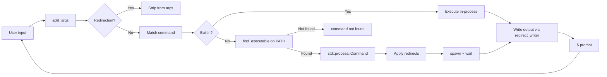

## How to Build a POSIX Shell in Rust

In this tutorial, you'll build a POSIX-compliant shell in Rust — the kind of project that makes you understand exactly how your terminal works. It supports external program execution, built-in commands, I/O redirection, tab completion, and quoting with single/double quotes and escape characters.

The full source is at [github.com/priyanshu360/shell-rust](https://github.com/priyanshu360/shell-rust) (part of the CodeCrafters "Build Your Own Shell" challenge).

### What to expect

```bash
$ cargo run
$ pwd
/home/user/projects/shell-rust
$ echo "hello world" > test.txt
$ cat < test.txt
hello world
$ type ls
ls is /usr/bin/ls
$ type echo
echo is a shell builtin
$ exit
```

### What you'll learn

- Tokenizing command-line input with proper quote/escape handling
- Parsing I/O redirection tokens (`>`, `>>`, `2>`, `2>>`)
- Looking up executables on `$PATH`
- Spawning and managing child processes
- Implementing tab completion — both in interactive mode and piped input
- Distinguishing between built-in commands and external programs

### Prerequisites

- Rust 1.70+
- Linux or macOS (the shell uses Unix process APIs via `std::process::Command`)

### Project structure

```
codecrafters-shell-rust/
├── src/
│   ├── main.rs          # Entry point — creates and runs the Repl
│   ├── repl.rs          # REPL loop, parsing, command execution (367 lines)
│   ├── command.rs       # Command enum, Redirect, ParsedCommand types
│   ├── parser.rs        # Tokenization with quote/escape handling
│   └── completer.rs     # Tab completion via rustyline + pipe mode
├── Cargo.toml
└── Cargo.lock
```

### Imports

**Cargo.toml dependencies**

| Crate | Version | Why |
|-------|---------|-----|
| `rustyline` | 15.0 | Readline-style line editing — history, cursor movement, tab completion |
| `anyhow` | 1.0.68 | Flexible error handling with context |
| `thiserror` | 1.0.38 | Derive `Error` macro for custom error enums |
| `bytes` | 1.3.0 | Low-level buffer management |

**Why these choices?**

- **rustyline over a hand-rolled input loop**: Writing a production-quality line editor (cursor movement, history, UTF-8 handling, kill-ring) is a project in itself. rustyline gives us all of that for free, wrapping the GNU Readline library conventions in a Rust-idiomatic API. The trade-off: you don't control the full input path, and adding custom keybindings requires implementing rustyline's `Helper` trait. For a learning shell, it's the right call.

### Step 1: Module layout

File: `src/main.rs`

```rust
mod command;
mod completer;
mod parser;
mod repl;

use repl::Repl;

fn main() {
    let mut repl = Repl::new();
    repl.run();
}
```

The entry point declares four modules and hands control to the REPL. Each module has a single responsibility — `command.rs` defines types, `parser.rs` tokenizes input, `completer.rs` handles tab completion, and `repl.rs` ties everything together.

### Step 2: Defining commands

File: `src/command.rs`

```rust
use std::path::PathBuf;

pub enum Command {
    Exit,
    Echo(Vec<String>),
    Type(String),
    Cd(PathBuf),
    External { program: String, args: Vec<String> },
    Pwd,
    Empty,
}

pub struct Redirect {
    pub path: PathBuf,
    pub append: bool,
}

pub struct ParsedCommand {
    pub command: Command,
    pub redirect: Option<Redirect>,
    pub redirect_stderr: Option<Redirect>,
}
```

The `Command` enum represents every possible thing the shell can do. Notice what's NOT here: there's no `Pipeline` variant, no `fork`, no `exec`. This shell doesn't implement pipes — each command is a single process. The `Redirect` struct captures where stdout and stderr should go (or `None` for the terminal).

**Why an enum instead of trait objects?** The set of commands is fixed and small. An enum gives us exhaustiveness checking in the match — the compiler will warn us if we forget to handle a variant. Trait objects would be over-engineering for seven variants.

### Step 3: Tokenizing input

File: `src/parser.rs`

```rust
use std::fs;
use std::io::{self, Write};

pub fn split_args(input: &str) -> Vec<String> {
    let mut args = Vec::new();
    let mut current = String::new();
    let mut in_single_quote = false;
    let mut in_double_quote = false;
    let mut chars = input.chars().peekable();

    while let Some(ch) = chars.next() {
        match ch {
            '\'' if !in_double_quote => in_single_quote = !in_single_quote,
            '"' if !in_single_quote => in_double_quote = !in_double_quote,
            '\\' if !in_single_quote => {
                if let Some(&next) = chars.peek() {
                    current.push(next);
                    chars.next();
                }
            }
            ch if !in_single_quote && !in_double_quote && ch.is_whitespace() => {
                if !current.is_empty() {
                    args.push(current);
                    current = String::new();
                }
            }
            _ => current.push(ch),
        }
    }
    if !current.is_empty() {
        args.push(current);
    }
    args
}
```

This is the heart of the parser — a character-by-character tokenizer that respects quoting rules. Let's trace through an example: `echo "hello   world" 'it\'s fine'`

| Character | State | What happens |
|-----------|-------|-------------|
| `e`, `c`, `h`, `o` | plain | Appended to `current` |
| ` ` (space) | plain | `"echo"` pushed to args, `current` reset |
| `"` | plain | `in_double_quote = true` |
| ` `, ` `, ` ` | double-quote | Appended to `current` (whitespace preserved!) |
| `w`, `o`, `r`, `l`, `d` | double-quote | Appended to `current` |
| `"` | double-quote | `in_double_quote = false` |
| ` ` (space) | plain | `"hello   world"` pushed to args (3 spaces preserved) |
| `'` | plain | `in_single_quote = true` |
| `\` | single-quote | Appended to `current` (backslash treated literally!) |
| `'` | single-quote | `in_single_quote = false` |
| `s`, ` `, `f`, ... | plain | Appended to `current` |

Result: `["echo", "hello   world", "it\\'s fine"]`

**Key design decisions in the tokenizer:**

- **Single quotes disable ALL special handling**, including backslash. Inside `'...'`, every character is literal. This matches POSIX shell behavior.
- **Double quotes preserve whitespace** but still process backslash escapes. The backslash only escapes the next character — it doesn't add special meanings like `\n` → newline.
- **Backslash outside quotes** escapes the next character, whatever it is. This is how you include a literal space in an argument: `echo hello\ world` produces `["echo", "hello world"]`.

#### Redirect writer helper

```rust
pub fn redirect_writer(redirect: Option<Redirect>) -> Box<dyn Write> {
    match redirect {
        Some(r) if r.append => Box::new(
            fs::OpenOptions::new().create(true).append(true).open(&r.path).unwrap(),
        ),
        Some(r) => Box::new(fs::File::create(&r.path).unwrap()),
        None => Box::new(io::stdout()),
    }
}
```

Returns a `Box<dyn Write>` — either a file handle or stdout. Builtins (echo, pwd, type) use this to write their output. External commands handle redirection through `std::process::Command`'s `stdout()` and `stderr()` methods.

### Step 4: Tab completion

File: `src/completer.rs`

The completer has two responsibilities: finding candidate completions and managing the tab-press interaction.

#### Finding candidates

```rust
pub fn find_completions(partial: &str) -> Vec<String> {
    let mut candidates = BTreeSet::new();

    // Match builtins
    for &cmd in BUILTINS {
        if cmd.starts_with(partial) && partial.len() < cmd.len() {
            candidates.insert(cmd.to_string());
        }
    }

    // Match executables on PATH
    if let Ok(path_var) = env::var("PATH") {
        for dir in env::split_paths(&path_var) {
            if let Ok(entries) = fs::read_dir(dir) {
                for entry in entries.flatten() {
                    let name = entry.file_name();
                    let name_str = name.to_string_lossy();
                    if !name_str.starts_with(partial) || name_str.len() <= partial.len() {
                        continue;
                    }
                    if let Ok(meta) = entry.metadata()
                        && meta.is_file()
                        && meta.permissions().mode() & 0o111 != 0
                    {
                        candidates.insert(name_str.to_string());
                    }
                }
            }
        }
    }

    candidates.into_iter().collect()
}
```

The function searches both builtins (`echo`, `exit`) and executables on `$PATH`. It skips entries that don't start with the partial input or are the exact same length (completing to itself is pointless).

**Why check executable bits?** Without the `0o111` permission check, every file in `$PATH` directories would appear as a completion candidate, including non-executables like READMEs and config files. The shell should only complete to things it can actually run.

#### Interaction logic

The `ShellCompleter` struct implements rustyline's `Completer` trait:

```rust
impl Completer for ShellCompleter {
    fn complete(&self, line: &str, pos: usize, _ctx: &Context<'_>) -> Result<(usize, Vec<Pair>), ReadlineError> {
        let partial = line[..pos].trim();
        let candidates = find_completions(partial);

        if candidates.is_empty() {
            return Ok((0, vec![]));
        }

        if candidates.len() == 1 {
            // Single match: auto-complete with trailing space
            return Ok((0, vec![Pair {
                display: candidates[0].clone(),
                replacement: format!("{} ", candidates[0]),
            }]));
        }

        let lcp = longest_common_prefix(&candidates);
        if lcp.len() > partial.len() {
            // Multiple matches with common prefix — complete to prefix
            return Ok((0, vec![Pair {
                display: lcp.clone(),
                replacement: lcp,
            }]));
        }

        // First tab with no narrowing: ring bell
        // Second tab: list all candidates (handled via tab_count tracking)
        // ...
    }
}
```

The tab interaction in pipe mode (non-interactive) duplicates this logic manually, tracking `tab_partial` and `tab_count` in the `Repl` struct. When stdin is piped (e.g., `echo "ls" | ./shell`), rustyline can't be used, so the shell falls back to raw `read_line` with its own completion state machine.

### Step 5: The REPL

File: `src/repl.rs` — the largest file at 367 lines. Let's break it down.

#### Mode dispatch

```rust
pub fn run(&mut self) {
    if io::stdin().is_terminal() {
        // Interactive mode: use rustyline for rich line editing
        let config = Config::builder()
            .completion_type(CompletionType::List)
            .build();
        if let Ok(mut rl) = Editor::with_config(config) {
            rl.set_helper(Some(ShellCompleter::default()));
            while self.running {
                match rl.readline("$ ") {
                    Ok(line) => {
                        let parsed = self.parse(line.trim());
                        self.execute(parsed);
                    }
                    Err(ReadlineError::Interrupted) | Err(ReadlineError::Eof) => break,
                    Err(err) => { eprintln!("{}", err); break; }
                }
            }
        }
    } else {
        // Non-interactive (pipe) mode
        self.run_pipe();
    }
}
```

The shell detects whether stdin is a terminal. If yes, it uses rustyline with its rich completion, history, and line editing. If stdin is piped, it falls back to a simpler line-by-line reader.

**Why two modes?** rustyline doesn't work well in non-interactive mode — it expects a TTY for cursor movement signals. When you run `echo "ls\necho hi" | ./shell`, each line should be processed in sequence without rustyline getting confused about the terminal state.

#### Parsing

```rust
fn parse(&self, input: &str) -> ParsedCommand {
    let parts = split_args(input);

    if parts.is_empty() {
        return ParsedCommand {
            command: Command::Empty,
            redirect: None,
            redirect_stderr: None,
        };
    }

    let mut redirect = None;
    let mut redirect_stderr = None;
    let mut clean = Vec::new();
    let mut i = 0;

    while i < parts.len() {
        let token = &parts[i];

        if (token == ">" || token == "1>") && i + 1 < parts.len() {
            redirect = Some(Redirect { path: PathBuf::from(&parts[i + 1]), append: false });
            i += 2;
            continue;
        }
        if (token == ">>" || token == "1>>") && i + 1 < parts.len() {
            redirect = Some(Redirect { path: PathBuf::from(&parts[i + 1]), append: true });
            i += 2;
            continue;
        }
        if token == "2>" && i + 1 < parts.len() {
            redirect_stderr = Some(Redirect { path: PathBuf::from(&parts[i + 1]), append: false });
            i += 2;
            continue;
        }
        if token == "2>>" && i + 1 < parts.len() {
            redirect_stderr = Some(Redirect { path: PathBuf::from(&parts[i + 1]), append: true });
            i += 2;
            continue;
        }

        clean.push(parts[i].clone());
        i += 1;
    }
    // ... convert clean[0] to Command variant
}
```

Redirection tokens are stripped during parsing, so execution logic is cleaner. Each `ParsedCommand` carries the command plus optional stdout and stderr redirects.

**Why parse redirections during tokenization and not as a separate pass?** Two reasons: (1) The grammar is simple enough that a single pass keeps the code easy to follow. (2) Separating redirection parsing would require re-scanning the token list, which is wasted work. A more complex shell (with pipes, subshells, heredocs) would benefit from a proper AST.

#### Execution — builtins

The full `execute` method from the actual codebase handles each command variant:

```rust
fn execute(&mut self, parsed: ParsedCommand) {
    let ParsedCommand { command, redirect, redirect_stderr } = parsed;

    // Pre-create stderr redirect files (needed for builtins)
    if let Some(ref r) = redirect_stderr {
        if r.append {
            let _ = fs::OpenOptions::new().create(true).append(true).open(&r.path);
        } else {
            let _ = fs::File::create(&r.path);
        }
    }

    match command {
        Command::Exit => { self.running = false; }

        Command::Echo(args) => {
            let mut out = redirect_writer(redirect);
            writeln!(out, "{}", args.join(" ")).unwrap();
        }

        Command::Type(cmd) => {
            let mut out = redirect_writer(redirect);
            self.type_command(&cmd, &mut out);
        }

        Command::Pwd => {
            let mut out = redirect_writer(redirect);
            match env::current_dir() {
                Ok(path) => writeln!(out, "{}", path.display()).unwrap(),
                Err(err) => eprintln!("Error getting current directory: {}", err),
            }
        }

        Command::Cd(path) => self.cd_command(path),

        Command::External { program, args } => {
            self.run_external(&program, &args, redirect, redirect_stderr)
        }

        Command::Empty => {}
    }
}
```

**Key design details:**

1. **Builtins run in-process** — no fork needed. Echo, pwd, type, and cd execute directly in the shell's process. This is what makes them "builtins" — they can modify the shell's state (like `cd` changing the working directory) or produce output without spawning a child.

2. **Pre-creating stderr redirect files** — The code creates the stderr redirect file before running any command. This matters because builtins use `redirect_writer` for stdout but write errors via `eprintln!()` — they need the stderr file to exist beforehand. Without this, `cd nonexistent 2> err.log` would crash when trying to write to a file that's opened lazily.

3. **`Command::Cd` delegates to `cd_command`** — a separate method that handles `~` expansion (more on this below).

**Why `std::process::Command` and not raw `fork`/`exec`?** A 2015-era shell tutorial would use `libc::fork()` + `libc::execvp()` because Rust's standard library didn't have ergonomic process spawning. Today, `std::process::Command` wraps the same syscalls with proper error handling and cross-platform support. You get signal handling, pipe setup, and file descriptor redirection for free:

```rust
fn run_external(&self, program: &str, args: &[String],
                redirect: Option<Redirect>, redirect_stderr: Option<Redirect>) {
    if self.find_executable(program).is_some() {
        let mut cmd = ProcessCommand::new(program);
        cmd.args(args);

        if let Some(r) = redirect {
            if r.append {
                cmd.stdout(fs::OpenOptions::new().create(true)
                    .append(true).open(&r.path).unwrap());
            } else {
                cmd.stdout(fs::File::create(&r.path).unwrap());
            }
        }
        if let Some(ref r) = redirect_stderr {
            // same pattern for stderr
        }

        let result = cmd.status();
        if let Err(err) = result {
            eprintln!("{}", err);
        }
    } else {
        eprintln!("{}: command not found", program);
    }
}
```

**What we'd gain from raw fork/exec:** Full control over file descriptors between fork and exec (essential for implementing pipes), ability to set process groups for job control, and deeper understanding of Unix process model. The `nix` crate provides safe wrappers: `unistd::fork()`, `unistd::execvp()`, `unistd::pipe()`.

**Watch out for:** `std::process::Command::status()` waits for the child to finish. If you need to run a command in the background (like `firefox &`), use `.spawn()` instead and store the `Child` handle. The shell just calls `.status()` and blocks — no job control.

#### cd and ~ expansion

```rust
fn cd_command(&mut self, path: PathBuf) {
    let expanded = if path == Path::new("~") || path.starts_with("~/") {
        match env::var("HOME") {
            Ok(home) => {
                let rest = path.strip_prefix("~").unwrap_or(Path::new(""));
                PathBuf::from(home).join(rest)
            }
            Err(_) => path.clone(),
        }
    } else {
        path.clone()
    };

    if expanded.is_dir() {
        if let Err(_err) = env::set_current_dir(&expanded) {
            eprintln!("cd: {}: No such file or directory", path.display());
        }
    } else {
        eprintln!("cd: {}: No such file or directory", path.display());
    }
}
```

**Why `~` expansion is in `cd` and not in the tokenizer:** The tilde is only special at the start of an argument to `cd`. In other contexts like `echo ~`, the `~` should be literal. Some shells (bash) expand `~` in all arguments, but that requires a post-tokenization expansion pass. For this shell, keeping it in `cd` is pragmatic.

**Watch out for:** The `~` expansion only handles `~` and `~/...`. It doesn't handle `~user` (another user's home directory) — that would require reading `/etc/passwd` or using `pwd.getpwnam`. The `strip_prefix("~")` call uses `unwrap_or(Path::new(""))` so `cd ~` becomes `cd ""` which resolves to the home directory itself, while `cd ~/projects` becomes `cd projects` relative to home.

**Watch out for:** Two separate `eprintln!` calls for the "No such file or directory" error — one for when the path isn't a directory, one for when `set_current_dir` fails. This duplicates the error message but catches two different failure modes: a nonexistent path and a path that exists but isn't a directory (e.g., `cd /etc/passwd`).

### How the type builtin works

```rust
fn type_command(&self, cmd: &str, out: &mut dyn Write) {
    match cmd {
        "echo" | "exit" | "type" | "pwd" | "cd" => {
            writeln!(out, "{} is a shell builtin", cmd).unwrap();
        }
        _ => {
            if let Some(path) = self.find_executable(cmd) {
                writeln!(out, "{} is {}", cmd, path.display()).unwrap();
            } else {
                writeln!(out, "{}: not found", cmd).unwrap();
            }
        }
    }
}

fn find_executable(&self, cmd: &str) -> Option<PathBuf> {
    let path_var = env::var("PATH").ok()?;
    for dir in env::split_paths(&path_var) {
        let full_path = dir.join(cmd);
        if !full_path.exists() || !full_path.is_file() { continue; }
        let metadata = fs::metadata(&full_path).ok()?;
        let mode = metadata.permissions().mode();
        if mode & 0o111 != 0 {
            return Some(full_path);
        }
    }
    None
}
```

The `type` builtin tells you whether a command is a shell builtin or an external executable, and if external, where it lives on disk. This is a debugging tool — when `ls` behaves unexpectedly, `type ls` tells you which `ls` you're actually running (maybe there's an alias or a different one earlier on `$PATH`).

### The data flow



### Testing your shell

```bash
# Basic builtins
$ echo hello world
hello world
$ pwd
/home/user/projects/shell-rust
$ cd /tmp && pwd
/tmp

# External commands
$ ls -la
$ python3 --version

# Redirection
$ echo "hello file" > test.txt
$ cat < test.txt
hello file
$ echo "more data" >> test.txt
$ cat test.txt
hello file
more data
$ ls nonexistent 2> error.log
$ cat error.log

# The type builtin
$ type echo
echo is a shell builtin
$ type ls
ls is /usr/bin/ls
$ type nonexistent
nonexistent: not found

# Quoting edge cases
$ echo 'single  quoted  string'
single  quoted  string
$ echo "double  quoted  string"
double  quoted  string
$ echo escaped\ space
escaped space
```

### Design decisions

| Decision | This shell | Alternative | Why we chose this |
|----------|-----------|-------------|-------------------|
| **Line editing** | rustyline crate | Hand-rolled readline, `termion` + `std::io::Stdin` | Production-quality input handling for free |
| **Process spawning** | `std::process::Command` | `nix::unistd::fork` + `execvp` | Safer, portable, built-in I/O redirection |
| **Tokenization** | Hand-written char-by-char | `nom` / `winnow` parser combinators | Simple grammar, easier to debug |
| **Completion** | rustyline trait in TTY, manual in pipe | Same logic for both paths | rustyline doesn't work in non-TTY |
| **Error handling** | `.unwrap()` with Fatal on failure | Proper error propagation with `anyhow` | REPL context — failure is fatal anyway |
| **Redirection** | Parsed during tokenization | Separate AST pass | Single pass is sufficient for simple grammar |

### Feature comparison

What the shell implements and what it doesn't:

| Concern | Covered? | Notes |
|---------|----------|-------|
| External command execution | Yes | PATH lookup with executable bit check |
| Built-in commands (echo, exit, type, pwd, cd) | Yes | |
| I/O redirection (>, >>, 2>, 2>>) | Yes | |
| Single quote quoting | Yes | Everything literal inside |
| Double quote quoting | Yes | Backslash escapes processed |
| Backslash escaping | Yes | Outside and inside double quotes |
| Tab completion (interactive) | Yes | rustyline Completer trait |
| Tab completion (pipe mode) | Yes | Manual state machine in Repl |
| cd ~ expansion | Yes | Home directory, but not ~user |
| Pipes | No | Needs fork/exec with pipe() |
| Job control (bg, fg, jobs) | No | Needs process groups + tcsetpgrp |
| Command history persistence | No | rustyline supports it, not wired |
| Variable expansion ($HOME) | No | Needs post-tokenization pass |
| Aliases | No | Needs alias table + expansion |
| Wildcard globbing (*.txt) | No | Needs filesystem scan during parse |
| Signal handling (Ctrl-C) | No | rustyline handles SIGINT gracefully |

### Watch out for

These are the pitfalls the actual codebase has — learn from them:

1. **bcrypt truncation analogy** — Wait, this isn't bcrypt. The shell equivalent: `std::process::Command::new("ls -la")` won't work. The first argument is the program name, not the full command string. Arguments must be passed separately via `.arg()` or `.args()`. This is a common Rust gotcha for people coming from Python (`subprocess.run("ls -la", shell=True)`) or C (`system("ls -la")`).

2. **PATH lookup order matters** — The shell iterates `$PATH` in order and returns the first match. If `/usr/local/bin` comes before `/usr/bin` in your PATH and has a different `ls`, `type ls` shows `/usr/local/bin/ls`. The `BTreeSet` in completion sorts alphabetically, so completion might show a different first candidate than what would actually execute.

3. **No `$SHELL` fallback** — If `$HOME` is unset (unusual but possible in minimal containers), `cd ~` falls through to the raw path `~` which doesn't exist, printing "No such file or directory." A real shell would either fall back to `/` or the current directory.

4. **Tab completion scans all PATH directories** — On a system with many entries in `$PATH` or slow filesystems (NFS mounts in PATH), the completion might feel sluggish. The `rustyline` completer doesn't cache — every tab press rescans. Adding a cache with a TTL would be a good optimization.

5. **External commands pass through, builtins don't** — `echo` is always the builtin, never `/bin/echo`. This matches POSIX behavior but can surprise users who expect `echo` to support flags like `-e` or `-n` (the builtin doesn't parse flags — it prints them literally).

### Next steps

- Add pipe support using `std::process::Command`'s `stdin()`/`stdout()` piping — much easier than raw fork/exec
- Implement command history persistence via rustyline's `load_history`/`save_history`
- Add `$VAR` expansion by scanning tokens after tokenization
- Support here-documents (`<<EOF ... EOF`)
- Add job control signals (SIGTSTP for Ctrl-Z, SIGCONT for `fg`)

The full source is at [github.com/priyanshu360/shell-rust](https://github.com/priyanshu360/shell-rust).
