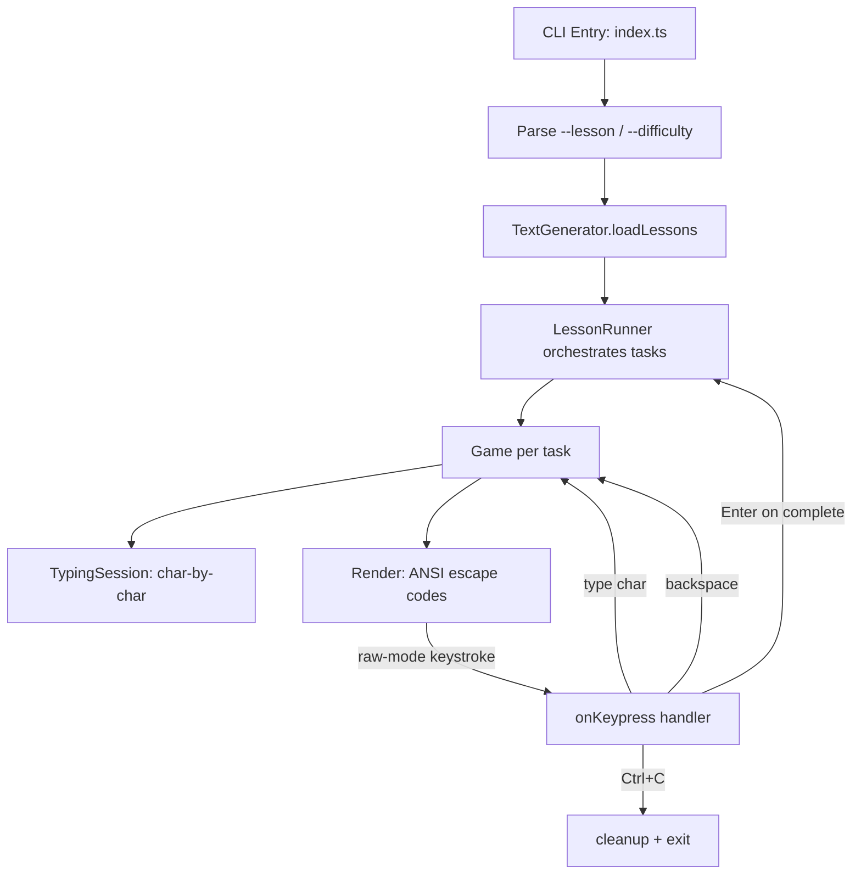

## How to Build a Terminal Typing Tutor for TypeScript

In this tutorial, you'll build Speedcode — a terminal typing tutor that teaches TypeScript by having you type real code with inline explanations. Think monkeytype for learning, not just speed.

### What to expect

```bash
$ npm run dev -- --lesson interfaces

# ── terminal clears ──
Interfaces
  Task 1/7
  [easy]

Declare the shape of an object

‗interface defines a contract for object shapes
interface User {
  id: number;   ‗every user needs a unique id
  name: string;
  email: string;
}

Characters: 0/186
```

Every keystroke is rendered in real time — green for correct, red background for mistakes, an inverted block cursor shows your position.

### What you'll learn

- Building a raw-mode terminal UI with ANSI escape codes (zero dependencies)
- Implementing a keystroke-driven game loop with character-by-character comparison
- Creating progressive lesson content with inline pedagogy
- Calculating typing speed (WPM), accuracy, and mistake count

### Prerequisites

- Node.js 18+
- `tsx` (TypeScript executor)
- No external runtime dependencies

### Project structure

```
speedcode/
├── package.json              # scripts: dev, build, start
├── tsconfig.json             # strict, nodenext, esnext
├── src/
│   ├── index.ts              # Entry point: CLI args, raw-mode, render loop
│   ├── types.ts              # GameState enum, Difficulty enum, Task/Lesson/Score types
│   ├── generator.ts          # TextGenerator — loads and searches JSON lessons
│   ├── lesson.ts             # LessonRunner — orchestrates task progression
│   ├── game.ts               # Game engine — start/type/backspace/end, score tracking
│   ├── session.ts            # TypingSession — char-by-char comparison
│   └── lessons/
│       ├── variables.json    # 6 tasks — annotations, unions, aliases, literals
│       ├── interfaces.json   # 7 tasks — optional, readonly, extends, index sig
│       ├── functions.json    # 6 tasks — params, return, arrow, rest
│       ├── arrays.json       # 6 tasks — map, filter, reduce, find, for-of
│       ├── classes.json      # 7 tasks — constructor, access modifiers, extends
│       ├── async.json        # 6 tasks — promises, async/await, error handling
│       ├── generics.json     # 6 tasks — constraints, generic class, mapped types
│       └── utility-types.json # 6 tasks — Partial, Pick, Omit, Record, ReturnType
```

### Imports

| module | exports | purpose |
|--------|---------|---------|
| `node:process` | `process.stdin`, `process.stdout` | raw-mode input, ANSI output |
| `node:fs` | `readFileSync`, `readdirSync` | load JSON lesson files |
| `node:path` | `join` | cross-platform path construction |

**Zero external runtime dependencies.** The only dev dependencies are `typescript`, `tsx`, and `@types/node`.

### Architecture



### Step 1: Types and enums

File: `src/types.ts`

```typescript
export enum GameState {
  NOT_STARTED,
  IN_PROGRESS,
  COMPLETED,
}

export enum Difficulty {
  EASY = 'easy',
  MEDIUM = 'medium',
  HARD = 'hard',
}

export interface Task {
  id: number;
  title: string;
  description: string;
  code: string;
}

export interface Lesson {
  id: number;
  title: string;
  difficulty: Difficulty;
  tasks: Task[];
}

export class Score {
  constructor(
    public readonly wpm: number,
    public readonly accuracy: number
  ) { }

  toString(): string {
    return `${this.wpm.toFixed(1)} WPM, ${this.accuracy.toFixed(1)}% accuracy`;
  }
}
```

The `GameState` enum drives the three-phase lifecycle of each task. The `Difficulty` enum acts as both a type and a string value — it serializes directly to JSON and can be compared with CLI string arguments. `Score` is a value-object with a formatted `toString()` that the render function uses directly.

### Step 2: Lesson format

Each lesson is a JSON file in `src/lessons/`. The inline comments are the pedagogical trick — by making the explanation part of the text to type, the user is forced to read it.

```json
{
  "id": 2,
  "title": "Interfaces",
  "difficulty": "easy",
  "tasks": [
    {
      "id": 1,
      "title": "Define an Interface",
      "description": "Declare the shape of an object",
      "code": "// interface defines a contract for object shapes\ninterface User {\n  id: number;\n  name: string;\n  email: string;\n}"
    }
  ]
}
```

There are 8 lessons covering the full TypeScript surface area. Each has 6–7 tasks at three difficulty levels: easy (variables, interfaces, functions, arrays), medium (classes, async), hard (generics, utility types).

### Step 3: TextGenerator — loading lessons

File: `src/generator.ts`

```typescript
import { readFileSync, readdirSync } from 'node:fs';
import { join } from 'node:path';
import { Difficulty } from './types.js';
import type { Lesson } from './types.js';

export class TextGenerator {
  private lessons: Lesson[] = [];

  constructor(dirPath: string) {
    const files = readdirSync(dirPath).filter(f => f.endsWith('.json'));
    for (const file of files) {
      const data = readFileSync(join(dirPath, file), 'utf-8');
      const lesson = JSON.parse(data) as Lesson;
      this.lessons.push(lesson);
    }
  }

  getLessonByTitle(title: string): Lesson | undefined {
    const lower = title.toLowerCase();
    const exact = this.lessons.find(l => l.title.toLowerCase() === lower);
    if (exact) return exact;
    const starts = this.lessons.find(l => l.title.toLowerCase().startsWith(lower));
    if (starts) return starts;
    return this.lessons.find(l => l.title.toLowerCase().includes(lower));
  }

  getRandomLesson(difficulty?: Difficulty): Lesson | undefined {
    const filtered = difficulty
      ? this.lessons.filter(l => l.difficulty === difficulty)
      : this.lessons;
    if (filtered.length === 0) return undefined;
    return filtered[Math.floor(Math.random() * filtered.length)]!;
  }
}
```

**Why `readdirSync` and not `readdir`?** The generator is called once at startup — there's no benefit to async for a synchronous initialization step. The entire setup (read files, parse JSON) completes before the first render.

**Why three-stage matching?** `getLessonByTitle` tries exact match first, then starts-with, then includes. This means `--lesson async` matches "Async JavaScript" without typing the full name.

### Step 4: TypingSession — character comparison

File: `src/session.ts`

```typescript
export class TypingSession {
  typedText: string = "";
  targetText: string;

  constructor(text: string) {
    this.targetText = text;
  }

  addCharacter(ch: string): void {
    if (this.isComplete()) return;
    this.typedText += ch;
  }

  removeCharacter(): void {
    if (this.typedText.length === 0) return;
    this.typedText = this.typedText.slice(0, -1);
  }

  isComplete(): boolean {
    return this.typedText.length === this.targetText.length;
  }

  getMistakeCount(): number {
    let mistakes = 0;
    for (let i = 0; i < this.typedText.length; i++) {
      if (this.typedText[i] !== this.targetText[i]) {
        mistakes++;
      }
    }
    return mistakes;
  }

  getAccuracy(): number {
    if (this.typedText.length === 0) return 100;
    const correct = this.typedText.length - this.getMistakeCount();
    return (correct / this.typedText.length) * 100;
  }
}
```

**Character-indexed accuracy**: Every character at position `i` is compared against the target at position `i`. If you type `identiTy` instead of `identitY`, every character from position 6 onwards is wrong until you backspace and correct. This is more precise than word-level comparison.

**Why a separate class?** The session is purely about string comparison — it has no concept of timing, game state, or rendering. Separating it from `Game` makes both classes testable in isolation.

### Step 5: Game engine

File: `src/game.ts`

```typescript
import { GameState, Score } from './types.js';
import { TypingSession } from './session.js';

export class Game {
  private startTime: number = 0;
  private endTime: number = 0;
  readonly session: TypingSession;
  state: GameState;

  constructor(text: string) {
    this.session = new TypingSession(text);
    this.state = GameState.NOT_STARTED;
  }

  start(): void {
    if (this.state !== GameState.NOT_STARTED) throw new Error("Game already started");
    this.startTime = Date.now();
    this.state = GameState.IN_PROGRESS;
  }

  end(): void {
    if (this.state !== GameState.IN_PROGRESS) throw new Error("Game is not in progress");
    this.endTime = Date.now();
    this.state = GameState.COMPLETED;
  }

  type(ch: string): void {
    if (this.state !== GameState.IN_PROGRESS) throw new Error("Game is not in progress");
    this.session.addCharacter(ch);
    if (this.session.isComplete()) this.end();
  }

  backspace(): void {
    if (this.state !== GameState.IN_PROGRESS) throw new Error("Game is not in progress");
    this.session.removeCharacter();
  }

  calculateWPM(): number {
    if (this.state !== GameState.COMPLETED) throw new Error("Game is not completed");
    const timeInMinutes = (this.endTime - this.startTime) / (1000 * 60);
    if (timeInMinutes <= 0) return 0;
    return (this.session.typedText.length / 5) / timeInMinutes;
  }

  calculateAccuracy(): number {
    return this.session.getAccuracy();
  }

  getScore(): Score {
    return new Score(this.calculateWPM(), this.calculateAccuracy());
  }
}
```

**WPM formula**: `(chars / 5) / minutes` — the standard "five characters = one word" convention. The timer starts when the user types the first character (not when the task loads), so idle reading time isn't counted.

**Guarded state transitions**: `start()`, `end()`, `type()`, and `backspace()` all assert the current state. Calling `type()` after completion throws — this catches bugs early and makes the control flow explicit.

### Step 6: LessonRunner — task orchestration

File: `src/lesson.ts`

```typescript
import { Game } from './game.js';
import { GameState, Score } from './types.js';
import type { Lesson, Task } from './types.js';

export class LessonRunner {
  private tasks: Task[];
  private currentTaskIndex: number = 0;
  private currentGame: Game | null = null;
  private taskScores: Score[] = [];

  constructor(public readonly lesson: Lesson) {
    this.tasks = lesson.tasks;
  }

  get currentTask(): Task | undefined {
    return this.tasks[this.currentTaskIndex];
  }

  get game(): Game {
    if (!this.currentGame) throw new Error('No active game');
    return this.currentGame;
  }

  get isLessonComplete(): boolean {
    return this.currentTaskIndex >= this.tasks.length;
  }

  get progress(): string {
    return `Task ${this.currentTaskIndex + 1}/${this.tasks.length}`;
  }

  get lessonScore(): Score | null {
    if (this.taskScores.length === 0) return null;
    const avgWpm = this.taskScores.reduce((s, sc) => s + sc.wpm, 0) / this.taskScores.length;
    const avgAcc = this.taskScores.reduce((s, sc) => s + sc.accuracy, 0) / this.taskScores.length;
    return new Score(avgWpm, avgAcc);
  }

  startCurrentTask(): void {
    const task = this.currentTask;
    if (!task) throw new Error('No current task');
    this.currentGame = new Game(task.code);
    this.currentGame.start();
  }

  finishCurrentTask(): void {
    if (this.currentGame && this.currentGame.state === GameState.COMPLETED) {
      this.taskScores.push(this.currentGame.getScore());
    }
  }

  advance(): boolean {
    this.finishCurrentTask();
    this.currentTaskIndex++;
    if (this.isLessonComplete) return false;
    this.startCurrentTask();
    return true;
  }
}
```

**Why `finishCurrentTask` + `advance` instead of one method?** Separating them allows the render function to show a "task complete" screen with the score before advancing. The caller calls `advance()` only when the user presses Enter.

**Why `lessonScore` averages all task scores?** The lesson-level score is the average WPM and accuracy across all completed tasks. This gives a single number for the entire lesson, smoothing out outliers.

### Step 7: The render loop

File: `src/index.ts` (render section)

The render happens synchronously after every keystroke. There's no `requestAnimationFrame` or `setInterval` — for a typing tutor, nothing animates between keystrokes.

```typescript
function render(): void {
  const output: string[] = [];

  output.push('\x1b[2J\x1b[H');  // clear screen, home cursor

  // Lesson complete banner
  if (runner.isLessonComplete) {
    const score = runner.lessonScore;
    output.push(`\x1b[1m${runner.lesson.title}\x1b[0m — \x1b[32mLesson Complete!\x1b[0m\n`);
    if (score) output.push(`\nAverage: ${score.toString()}\n`);
    output.push(`\n\x1b[90mPress Enter to exit\x1b[0m`);
    process.stdout.write(output.join(''));
    return;
  }

  const task = runner.currentTask!;
  const game = runner.game;

  // Header
  output.push(`\x1b[1m${runner.lesson.title}\x1b[0m`);
  output.push(`  \x1b[36m${runner.progress}\x1b[0m`);
  output.push(`  \x1b[33m[${runner.lesson.difficulty}]\x1b[0m\n`);
  output.push(`\x1b[90m${task.description}\x1b[0m\n\n`);

  // Task complete state
  if (game.state === GameState.COMPLETED) {
    for (const ch of text) { output.push('\x1b[32m', ch); }
    output.push('\x1b[0m');
    output.push(`\n\n\x1b[32m\u2714 Complete!\x1b[0m  ${game.getScore().toString()}`);
    // ...
    process.stdout.write(output.join(''));
    return;
  }

  // Active typing — color each character
  const typed = game.session.typedText;
  const end = visibleLength();

  for (let i = 0; i < end; i++) {
    if (i < typed.length) {
      if (typed[i] === text[i]) {
        output.push('\x1b[32m');       // green = correct
      } else {
        output.push('\x1b[41m\x1b[37m'); // red bg + white = mistake
      }
    } else if (i === typed.length) {
      output.push('\x1b[7m');           // inverted = cursor
    } else {
      output.push('\x1b[37m');          // default = not yet typed
    }
    output.push(text[i]!);
    output.push('\x1b[0m');
  }

  if (revealedLines < lines.length) {
    output.push(`\x1b[90m\n\n... ${lines.length - revealedLines} more lines ...\x1b[0m`);
  }

  output.push(`\n\nCharacters: ${typed.length}/${text.length}`);
  process.stdout.write(output.join(''));
}
```

**Color scheme**:
| Element | ANSI code | Visual |
|---------|-----------|--------|
| Correct character | `\x1b[32m` | green text |
| Mistake | `\x1b[41m\x1b[37m` | red background, white text |
| Cursor | `\x1b[7m` | inverted colors |
| Hidden lines hint | `\x1b[90m` | dimmed gray |
| Metadata | `\x1b[2m`, `\x1b[33m`, `\x1b[36m` | dimmed, yellow, cyan |

### Step 8: Progressive text reveal

Only the first 20 lines are shown initially. As you approach the bottom (cursor within 3 lines of the visible edge), more lines are revealed:

```typescript
function revealMore(): void {
  const cursorLine = text
    .slice(0, runner.game.session.typedText.length)
    .split('\n').length - 1;
  if (cursorLine >= revealedLines - 3) {
    revealedLines = Math.min(revealedLines + 5, lines.length);
  }
}
```

The cursor line is calculated by counting newlines in the typed text. Once the cursor passes line 17 (20 - 3), the next chunk of 5 lines appears. This creates a "scroll as you go" feel without implementing a full virtual scroller.

```typescript
function visibleLength(): number {
  return lines.slice(0, revealedLines).join('\n').length;
}
```

The visible length determines how many characters the render loop iterates over. Characters beyond this point are simply not drawn — they don't exist as far as the user can see.

### Step 9: Raw-mode keystroke handling

Steps: put stdin into raw mode, hide cursor, register a `data` event listener, parse bytes on each chunk, re-render.

```typescript
function onKeypress(chunk: Buffer): void {
  const byte = chunk[0];

  if (byte === 3) { cleanup(); process.exit(0); }  // Ctrl+C

  if (runner.isLessonComplete) {
    if (byte === 0x0d || byte === 0x0a) { cleanup(); process.exit(0); }
    return;
  }

  const game = runner.game;

  if (game.state === GameState.COMPLETED) {
    if (byte === 0x0d || byte === 0x0a) {
      const hasMore = runner.advance();
      if (hasMore) {
        text = runner.currentTask!.code;
        lines = text.split('\n');
        revealedLines = Math.min(20, lines.length);
        render();
      } else { render(); }
    }
    return;
  }

  // --- active typing ---
  if (byte === 0x7f || byte === 0x08) {      // Backspace
    game.backspace();
  } else if (byte === 0x09) {                 // Tab
    game.type('  ');                          // insert 2 spaces
  } else if (byte === 0x0d || byte === 0x0a) { // Enter
    game.type('\n');
  } else {                                     // printable ASCII
    const ch = chunk.toString('utf8');
    if (ch.length === 1 && ch >= ' ' && ch <= '~') {
      game.type(ch);
    }
  }

  revealMore();
  render();
}
```

**Why raw mode?** Without it, stdin buffers input line-by-line and echoes characters to the terminal. Raw mode gives us every keystroke immediately and suppresses echo — we handle all rendering ourselves.

**Why check `ch >= ' ' && ch <= '~'`?** This range covers printable ASCII (space through tilde). Control characters, multi-byte UTF-8 sequences, and escape sequences are ignored. Tab is special-cased to insert two spaces (standard TypeScript indentation).

```typescript
function cleanup() {
  process.stdout.write('\x1b[2J\x1b[H');    // clear screen
  process.stdout.write('\x1b[?25h');         // show cursor
  if (process.stdin.isTTY) {
    process.stdin.setRawMode(false);         // restore cooked mode
  }
  process.stdin.destroy();
}
```

### Step 10: CLI entry point

File: `src/index.ts` (main function)

```typescript
function main() {
  const args = process.argv.slice(2);
  let lessonName: string | undefined;
  let difficulty: Difficulty | undefined;

  for (let i = 0; i < args.length; i++) {
    if (args[i] === '--lesson' && i + 1 < args.length) {
      lessonName = args[++i];
    } else if (args[i] === '--difficulty' && i + 1 < args.length) {
      const val = args[++i];
      if (val !== Difficulty.EASY && val !== Difficulty.MEDIUM && val !== Difficulty.HARD) {
        console.error(`Error: invalid difficulty "${val}".\n`);
        process.exit(1);
      }
      difficulty = val as Difficulty;
    }
  }

  if (!lessonName && !difficulty) {
    console.error('Error: provide either --lesson or --difficulty\n');
    process.exit(1);
  }

  const generator = new TextGenerator('src/lessons');
  let lesson = lessonName
    ? generator.getLessonByTitle(lessonName)
    : generator.getRandomLesson(difficulty);

  if (!lesson) {
    console.error(`Error: lesson not found.\n`);
    process.exit(1);
  }

  runner = new LessonRunner(lesson);
  text = runner.currentTask!.code;
  lines = text.split('\n');
  revealedLines = Math.min(20, lines.length);
  runner.startCurrentTask();

  if (process.stdin.isTTY) process.stdin.setRawMode(true);
  process.stdin.resume();
  process.stdout.write('\x1b[?25l');  // hide cursor

  render();
  process.stdin.on('data', onKeypress);
}
```

**Why not use a CLI library (commander, yargs)?** Manual parsing keeps the dependency count at zero. The API surface is two flags — the parsing logic is 15 lines. For a tutorial project, this is simpler and more instructive than pulling in a library.

### Design decisions

- **Synchronous render**: For a typing tutor, there's nothing to animate between keystrokes. Synchronous rendering is simpler and more efficient than a game loop. Every `onKeypress` call triggers exactly one `render()`.

- **Inline comments as pedagogy**: By making explanations part of the typed text, users can't skip the reading. It's a code walkthrough you must actively participate in. Each comment explains the concept on the line below it.

- **Character-indexed accuracy**: More precise than word-level comparison. Every mistyped character is immediately visible — red background on the wrong character — and must be corrected with backspace.

- **Progressive reveal**: 20 lines initially, +5 when cursor is within 3 of the bottom. This prevents overwhelm on long tasks (some are 40+ lines) while keeping the visible context manageable.

- **Zero runtime dependencies**: Only `@types/node`, `typescript`, and `tsx` in devDependencies. The entire app uses Node.js built-ins: `process.stdin` raw-mode for input, `process.stdout` with ANSI codes for output, `fs` for loading JSON examples.

### Next steps

- Add speed leaderboards (local or networked)
- Support custom lesson files loaded from a `--file` flag
- Add Vim keybinding mode (j/k for scroll, `u` for undo typo)
- Track per-character error frequency for targeted practice
- Add a menu screen to pick lessons interactively

The full source is at [github.com/priyanshu360/speedcode](https://github.com/priyanshu360/speedcode).
