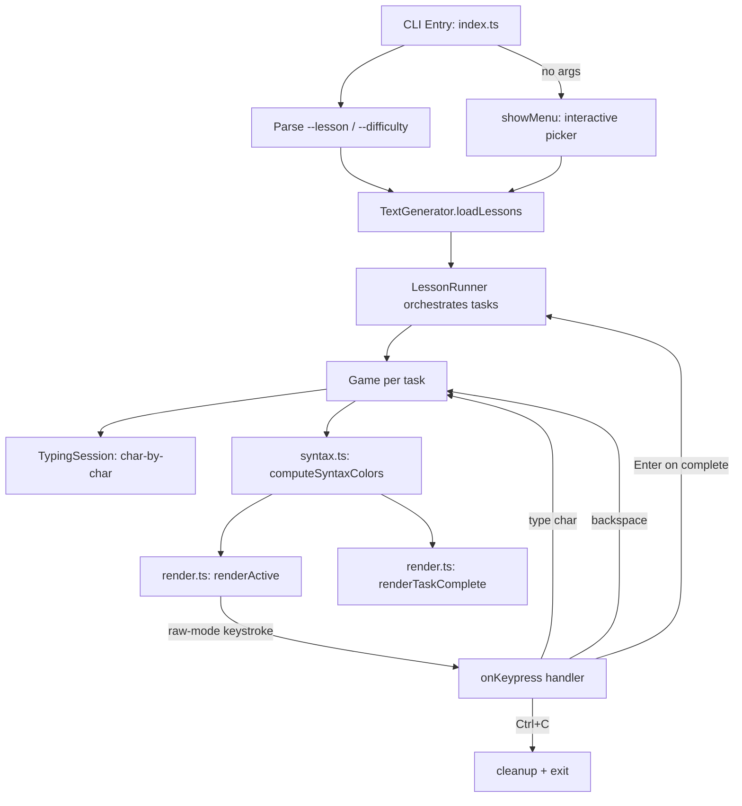

## How to Build a Terminal Typing Tutor for TypeScript

In this tutorial, you'll build Speedcode — a terminal typing tutor that teaches TypeScript by having you type real code with inline explanations. Think monkeytype for learning, not just speed.

### What to expect

```bash
$ npm run dev

# ── interactive menu ──
Select a lesson:

  1. Variables & Types  [easy]
  2. Interfaces         [easy]
  3. Functions          [easy]
  ...
  0. Exit

Enter lesson number: 2

# ── terminal clears ──
Interfaces
  Task 1/7
  [easy]

Declare the shape of an object

interface defines a contract for object shapes
interface User {
  id: number;    // every user needs a unique id
  name: string;  // display name shown in the UI
  email: string; // used for login and notifications
}

▶ 0.0 WPM · 100.0% accuracy · 0/186 chars
```

Every keystroke is rendered in real time — green for correct with syntax-colored tokens, red background for mistakes, an inverted block cursor shows your position. A live WPM counter and accuracy percentage update with every keystroke.

### What you'll learn

- Building a raw-mode terminal UI with ANSI escape codes (zero dependencies)
- Implementing a keystroke-driven game loop with character-by-character comparison
- Creating progressive lesson content with inline pedagogy
- Calculating typing speed (WPM), accuracy, and mistake count
- Adding syntax highlighting with a regex-based tokenizer
- Building an interactive lesson selector menu

### Prerequisites

- Node.js 18+
- `tsx` (TypeScript executor)
- No external runtime dependencies

### Project structure

```
speedcode/
├── package.json              # scripts: dev, build, start
├── tsconfig.json             # strict, nodenext, esnext
├── eslint.config.js          # ESLint flat config with typescript-eslint
├── .prettierrc               # formatting rules
├── src/
│   ├── index.ts              # Entry point: CLI args, raw-mode, render loop
│   ├── types.ts              # GameState enum, Difficulty enum, Task/Lesson/Score types
│   ├── generator.ts          # TextGenerator — loads and searches JSON lessons
│   ├── lesson.ts             # LessonRunner — orchestrates task progression
│   ├── game.ts               # Game engine — start/type/backspace/end, score tracking
│   ├── session.ts            # TypingSession — char-by-char comparison
│   ├── syntax.ts             # computeSyntaxColors — regex-based TypeScript highlighting
│   ├── render.ts             # renderActive / renderTaskComplete / renderLessonComplete
│   └── lessons/
│       ├── variables.json    # 6 tasks — annotations, unions, aliases, literals
│       ├── interfaces.json   # 7 tasks — optional, readonly, extends, index sig
│       ├── functions.json    # 6 tasks — params, return, arrow, rest
│       ├── arrays.json       # 6 tasks — map, filter, reduce, find, for-of
│       ├── classes.json      # 7 tasks — constructor, access modifiers, extends
│       ├── async.json        # 6 tasks — promises, async/await, error handling
│       ├── generics.json     # 6 tasks — constraints, generic class, mapped types
│       └── utility-types.json # 6 tasks — Partial, Pick, Omit, Record, ReturnType
```

### Imports

| module | exports | purpose |
|--------|---------|---------|
| `node:process` | `process.stdin`, `process.stdout` | raw-mode input, ANSI output |
| `node:fs` | `readFileSync`, `readdirSync` | load JSON lesson files |
| `node:path` | `join` | cross-platform path construction |
| `node:readline` | `createInterface` | interactive lesson selector menu |

**Zero external runtime dependencies.** Dev dependencies: `typescript`, `tsx`, `@types/node`, `eslint`, `prettier`, `typescript-eslint`.

### Architecture



### Step 1: Types and enums

File: `src/types.ts`

```typescript
export enum GameState {
  NOT_STARTED,
  IN_PROGRESS,
  COMPLETED,
}

export enum Difficulty {
  EASY = 'easy',
  MEDIUM = 'medium',
  HARD = 'hard',
}

export interface Task {
  id: number;
  title: string;
  description: string;
  code: string;
}

export interface Lesson {
  id: number;
  title: string;
  difficulty: Difficulty;
  tasks: Task[];
}

export class Score {
  constructor(
    public readonly wpm: number,
    public readonly accuracy: number,
  ) {}

  toString(): string {
    return `${this.wpm.toFixed(1)} WPM, ${this.accuracy.toFixed(1)}% accuracy`;
  }
}
```

The `GameState` enum drives the three-phase lifecycle of each task. The `Difficulty` enum acts as both a type and a string value — it serializes directly to JSON and can be compared with CLI string arguments. `Score` is a value-object with a formatted `toString()` that the render function uses directly.

### Step 2: Lesson format

Each lesson is a JSON file in `src/lessons/`. The inline comments are the pedagogical trick — by making the explanation part of the text to type, the user is forced to read it. Each comment explains the concept on the line below it.

```json
{
  "id": 2,
  "title": "Interfaces",
  "difficulty": "easy",
  "tasks": [
    {
      "id": 1,
      "title": "Define an Interface",
      "description": "Declare the shape of an object",
      "code": "// interface defines a contract for object shapes\ninterface User {\n  id: number;   // every user needs a unique id\n  name: string; // display name shown in the UI\n  email: string; // used for login and notifications\n}"
    }
  ]
}
```

There are 8 lessons covering the full TypeScript surface area. Each has 6–7 tasks at three difficulty levels: easy (variables, interfaces, functions, arrays), medium (classes, async), hard (generics, utility types).

### Step 3: TextGenerator — loading lessons

File: `src/generator.ts`

```typescript
import { readFileSync, readdirSync } from 'node:fs';
import { join } from 'node:path';
import { Difficulty } from './types.js';
import type { Lesson } from './types.js';

export class TextGenerator {
  private lessons: Lesson[] = [];

  constructor(dirPath: string) {
    const files = readdirSync(dirPath).filter((f) => f.endsWith('.json'));
    for (const file of files) {
      const data = readFileSync(join(dirPath, file), 'utf-8');
      const lesson = JSON.parse(data) as Lesson;
      this.lessons.push(lesson);
    }
  }

  getLessonByTitle(title: string): Lesson | undefined {
    const lower = title.toLowerCase();
    const exact = this.lessons.find((l) => l.title.toLowerCase() === lower);
    if (exact) return exact;
    const starts = this.lessons.find((l) => l.title.toLowerCase().startsWith(lower));
    if (starts) return starts;
    return this.lessons.find((l) => l.title.toLowerCase().includes(lower));
  }

  getLessonTitles(): string[] {
    return this.lessons.map((l) => l.title);
  }

  getRandomLesson(difficulty?: Difficulty): Lesson | undefined {
    const filtered = difficulty
      ? this.lessons.filter((l) => l.difficulty === difficulty)
      : this.lessons;
    if (filtered.length === 0) return undefined;
    return filtered[Math.floor(Math.random() * filtered.length)];
  }

  getAllLessonsOrdered(): Lesson[] {
    const order: Record<string, number> = {
      [Difficulty.EASY]: 0,
      [Difficulty.MEDIUM]: 1,
      [Difficulty.HARD]: 2,
    };
    return [...this.lessons].sort((a, b) => {
      const d = (order[a.difficulty] ?? 0) - (order[b.difficulty] ?? 0);
      return d !== 0 ? d : a.id - b.id;
    });
  }
}
```

**Why `readdirSync` and not `readdir`?** The generator is called once at startup — there's no benefit to async for a synchronous initialization step. The entire setup (read files, parse JSON) completes before the first render.

**Why three-stage matching?** `getLessonByTitle` tries exact match first, then starts-with, then includes. This means `--lesson async` matches "Async JavaScript" without typing the full name.

**Why `getLessonTitles` and `getAllLessonsOrdered`?** `getLessonTitles` lists available lessons in error messages when `--lesson` doesn't match. `getAllLessonsOrdered` returns lessons sorted by difficulty (easy → medium → hard) then by id — used by the interactive menu to show a clean, predictable ordering.

### Step 4: TypingSession — character comparison

File: `src/session.ts`

```typescript
export class TypingSession {
  typedText = '';
  targetText: string;

  constructor(text: string) {
    this.targetText = text;
  }

  addCharacter(ch: string): void {
    if (this.isComplete()) return;
    this.typedText += ch;
  }

  removeCharacter(): void {
    if (this.typedText.length === 0) return;
    this.typedText = this.typedText.slice(0, -1);
  }

  getCurrentInput(): string {
    return this.typedText;
  }

  isComplete(): boolean {
    return this.typedText.length === this.targetText.length;
  }

  getMistakeCount(): number {
    let mistakes = 0;
    for (let i = 0; i < this.typedText.length; i++) {
      if (this.typedText[i] !== this.targetText[i]) {
        mistakes++;
      }
    }
    return mistakes;
  }

  getAccuracy(): number {
    if (this.typedText.length === 0) return 100;
    const correct = this.typedText.length - this.getMistakeCount();
    return (correct / this.typedText.length) * 100;
  }
}
```

**Character-indexed accuracy**: Every character at position `i` is compared against the target at position `i`. If you type `identiTy` instead of `identitY`, every character from position 6 onwards is wrong until you backspace and correct. This is more precise than word-level comparison.

**Why a separate class?** The session is purely about string comparison — it has no concept of timing, game state, or rendering. Separating it from `Game` makes both classes testable in isolation.

### Step 5: Game engine

File: `src/game.ts`

```typescript
import { GameState, Score } from './types.js';
import { TypingSession } from './session.js';

export class Game {
  private startTime = 0;
  private endTime = 0;
  readonly session: TypingSession;
  state: GameState;

  constructor(text: string) {
    this.session = new TypingSession(text);
    this.state = GameState.NOT_STARTED;
  }

  start(): void {
    if (this.state !== GameState.NOT_STARTED) throw new Error('Game already started');
    this.startTime = Date.now();
    this.state = GameState.IN_PROGRESS;
  }

  end(): void {
    if (this.state !== GameState.IN_PROGRESS) throw new Error('Game is not in progress');
    this.endTime = Date.now();
    this.state = GameState.COMPLETED;
  }

  type(ch: string): void {
    if (this.state !== GameState.IN_PROGRESS) throw new Error('Game is not in progress');
    this.session.addCharacter(ch);
    if (this.session.isComplete()) this.end();
  }

  backspace(): void {
    if (this.state !== GameState.IN_PROGRESS) throw new Error('Game is not in progress');
    this.session.removeCharacter();
  }

  calculateWPM(): number {
    if (this.state !== GameState.COMPLETED) throw new Error('Game is not completed');
    const timeInMinutes = (this.endTime - this.startTime) / (1000 * 60);
    if (timeInMinutes <= 0) return 0;
    return this.session.typedText.length / 5 / timeInMinutes;
  }

  calculateAccuracy(): number {
    return this.session.getAccuracy();
  }

  getCurrentWPM(): number {
    if (this.state !== GameState.IN_PROGRESS) return 0;
    const elapsed = Date.now() - this.startTime;
    const timeInMinutes = elapsed / (1000 * 60);
    if (timeInMinutes <= 0) return 0;
    return this.session.typedText.length / 5 / timeInMinutes;
  }

  getCurrentAccuracy(): number {
    return this.session.getAccuracy();
  }

  getScore(): Score {
    return new Score(this.calculateWPM(), this.calculateAccuracy());
  }
}
```

**WPM formula**: `(chars / 5) / minutes` — the standard "five characters = one word" convention. The timer starts when the user types the first character (not when the task loads), so idle reading time isn't counted.

**Guarded state transitions**: `start()`, `end()`, `type()`, and `backspace()` all assert the current state. Calling `type()` after completion throws — this catches bugs early and makes the control flow explicit.

**Why `getCurrentWPM` alongside `calculateWPM`?** `calculateWPM` requires the game to be `COMPLETED` — it's for the final score. `getCurrentWPM` works during `IN_PROGRESS` using `Date.now() - this.startTime`, enabling the live `▶ XX.X WPM` display in the status bar. If the game hasn't started yet, it returns 0 instead of throwing.

### Step 6: LessonRunner — task orchestration

File: `src/lesson.ts`

```typescript
import { Game } from './game.js';
import { GameState, Score } from './types.js';
import type { Lesson, Task } from './types.js';

export class LessonRunner {
  private tasks: Task[];
  private currentTaskIndex = 0;
  private currentGame: Game | null = null;
  private taskScores: Score[] = [];

  constructor(public readonly lesson: Lesson) {
    this.tasks = lesson.tasks;
  }

  get currentTask(): Task | undefined {
    return this.tasks[this.currentTaskIndex];
  }

  get game(): Game {
    if (!this.currentGame) throw new Error('No active game');
    return this.currentGame;
  }

  get isLessonComplete(): boolean {
    return this.currentTaskIndex >= this.tasks.length;
  }

  get progress(): string {
    return `Task ${this.currentTaskIndex + 1}/${this.tasks.length}`;
  }

  get lessonScore(): Score | null {
    if (this.taskScores.length === 0) return null;
    const avgWpm = this.taskScores.reduce((s, sc) => s + sc.wpm, 0) / this.taskScores.length;
    const avgAcc = this.taskScores.reduce((s, sc) => s + sc.accuracy, 0) / this.taskScores.length;
    return new Score(avgWpm, avgAcc);
  }

  startCurrentTask(): void {
    const task = this.currentTask;
    if (!task) throw new Error('No current task');
    this.currentGame = new Game(task.code);
    this.currentGame.start();
  }

  finishCurrentTask(): void {
    if (this.currentGame?.state === GameState.COMPLETED) {
      this.taskScores.push(this.currentGame.getScore());
    }
  }

  advance(): boolean {
    this.finishCurrentTask();
    this.currentTaskIndex++;
    if (this.isLessonComplete) return false;
    this.startCurrentTask();
    return true;
  }
}
```

**Why `finishCurrentTask` + `advance` instead of one method?** Separating them allows the render function to show a "task complete" screen with the score before advancing. The caller calls `advance()` only when the user presses Enter.

**Why `lessonScore` averages all task scores?** The lesson-level score is the average WPM and accuracy across all completed tasks. This gives a single number for the entire lesson, smoothing out outliers.

### Step 7: Syntax highlighting

File: `src/syntax.ts`

The render used to show every character in plain white or green. Now it classifies tokens by their role in TypeScript — keywords in blue, strings in green, numbers in yellow, types in cyan, builtins in magenta.

```typescript
export const SyntaxColor = {
  PLAIN: '\x1b[37m',
  KEYWORD: '\x1b[94m',
  STRING: '\x1b[32m',
  NUMBER: '\x1b[33m',
  TYPE: '\x1b[36m',
  BUILTIN: '\x1b[95m',
  RESET: '\x1b[0m',
} as const;

const TYPE_KW = new Set([
  'string', 'number', 'boolean', 'symbol', 'bigint',
  'void', 'never', 'any', 'unknown', 'null', 'undefined', 'object',
]);

const KEYWORDS = new Set([
  'let', 'const', 'var', 'function', 'class', 'interface', 'type',
  'extends', 'implements', 'return', 'if', 'else', 'for', 'while',
  'do', 'switch', 'case', 'break', 'continue', 'import', 'export',
  'from', 'as', 'async', 'await', 'of', 'in', 'new', 'this', 'super',
  'true', 'false', 'enum', 'declare', 'abstract', 'readonly', 'static',
  'public', 'private', 'protected', 'throw', 'try', 'catch', 'finally',
  'yield', 'default', 'typeof', 'keyof', 'infer', 'satisfies', 'using',
]);

const BUILTINS = new Set([
  'Error', 'Promise', 'Array', 'Map', 'Set', 'Record',
  'Partial', 'Required', 'Readonly', 'Pick', 'Omit',
  'Exclude', 'Extract', 'NonNullable', 'ReturnType', 'Parameters',
  'Console', 'JSON', 'Math',
]);

const TOKEN_RE = /(`[^`\\]*(?:\\.[^`\\]*)*`|"[^"\\]*(?:\\.[^"\\]*)*"|'[^'\\]*(?:\\.[^'\\]*)*')|(\b0[xX][0-9a-fA-F]+\b|\b\d+\.?\d*\b)|([a-zA-Z_$][a-zA-Z0-9_$]*)/g;

export function computeSyntaxColors(code: string): string[] {
  const colors = new Array<string>(code.length).fill(SyntaxColor.PLAIN);
  let match: RegExpExecArray | null;

  while ((match = TOKEN_RE.exec(code)) !== null) {
    const [full, str, num, word] = match;
    const start = match.index;
    const end = start + full.length;
    let color: string;

    if (str) color = SyntaxColor.STRING;
    else if (num) color = SyntaxColor.NUMBER;
    else if (word) color = KEYWORDS.has(word) ? SyntaxColor.KEYWORD
      : TYPE_KW.has(word) ? SyntaxColor.TYPE
        : BUILTINS.has(word) ? SyntaxColor.BUILTIN
          : SyntaxColor.PLAIN;
    else continue;

    colors.fill(color, start, end);
  }

  return colors;
}
```

**How the tokenizer works**: The regex `TOKEN_RE` scans for three groups — strings (backtick, double, single quotes), numbers (hex and decimal), and identifiers (words). Non-word characters (operators, braces, semicolons) stay `PLAIN`. Each match assigns a color and fills the corresponding range in the `colors` array.

**Why a per-character array and not ANSI-wrapped spans?** The render needs to overlay correctness highlighting (green for correct characters, red for mistakes) on top of the syntax colors. A per-character color array lets the render apply syntax color first, then override with red background if the character was typed wrong. Wrapping each span in ANSI codes would require splitting and merging on every keystroke.

**Watch out for**: The regex can't handle nested template literals (`\`hello ${name}\``) — the backtick alternation matches the first backtick to the next unescaped backtick, which breaks on interpolation. For lesson code (which avoids nested templates), this is fine. For a production code editor, you'd need a parser.

### Step 8: The render module

File: `src/render.ts`

The render logic is extracted into a dedicated module with three exported render functions, one for each game state. A shared `renderHeader` function draws the title, progress, and any completed tasks above the current one.

```typescript
import { SyntaxColor } from './syntax.js';
import type { LessonRunner } from './lesson.js';

function renderHeader(runner: LessonRunner, completedTaskRenders: string[]): string {
  const out: string[] = [];
  out.push('\x1b[2J\x1b[H');
  out.push(`\x1b[1m${runner.lesson.title}\x1b[0m`);
  out.push(`  \x1b[36m${runner.progress}\x1b[0m`);
  out.push(`  \x1b[33m[${runner.lesson.difficulty}]\x1b[0m\n`);
  for (const cr of completedTaskRenders) {
    out.push(cr);
    out.push('\n');
  }
  return out.join('');
}

export function visibleLength(lines: string[], revealedLines: number): number {
  return lines.slice(0, revealedLines).join('\n').length;
}

export function revealMore(
  text: string,
  typedText: string,
  currentRevealed: number,
  totalLines: number,
): number {
  const cursorLine = text.slice(0, typedText.length).split('\n').length - 1;
  if (cursorLine >= currentRevealed - 3) {
    return Math.min(currentRevealed + 5, totalLines);
  }
  return currentRevealed;
}

export function captureCompletedTask(runner: LessonRunner, syntaxColors: string[]): string {
  const task = runner.currentTask;
  if (!task) return '';
  const game = runner.game;
  const out: string[] = [];
  const code = task.code;

  out.push(`\x1b[90m${'─'.repeat(50)}\x1b[0m\n`);
  out.push(`\x1b[1m\u2714 Task ${runner.lesson.tasks.indexOf(task) + 1}: ${task.title}\x1b[0m`);
  out.push(`  \x1b[90m${game.getScore().toString()}\x1b[0m\n`);
  for (let i = 0; i < code.length; i++) {
    out.push(syntaxColors[i] ?? SyntaxColor.PLAIN);
    out.push(code.charAt(i));
  }
  out.push(SyntaxColor.RESET);
  return out.join('');
}

export function renderLessonComplete(runner: LessonRunner, completedTaskRenders: string[]): void {
  const output: string[] = [];
  output.push(renderHeader(runner, completedTaskRenders));
  const score = runner.lessonScore;
  output.push(`\n\x1b[32mLesson Complete!\x1b[0m\n`);
  if (score) output.push(`\nAverage: ${score.toString()}\n`);
  output.push(`\n\x1b[90mPress Enter to exit\x1b[0m`);
  process.stdout.write(output.join(''));
}

export function renderTaskComplete(
  runner: LessonRunner,
  text: string,
  syntaxColors: string[],
  completedTaskRenders: string[],
): void {
  const output: string[] = [];
  output.push(renderHeader(runner, completedTaskRenders));
  if (completedTaskRenders.length > 0) {
    output.push(`\x1b[90m${'─'.repeat(50)}\x1b[0m\n\n`);
  }
  const task = runner.currentTask as Exclude<typeof runner.currentTask, undefined>;
  const game = runner.game;
  output.push(`\x1b[90m${task.description}\x1b[0m\n\n`);
  for (let i = 0; i < text.length; i++) {
    output.push(syntaxColors[i] ?? SyntaxColor.PLAIN);
    output.push(text.charAt(i));
  }
  output.push(SyntaxColor.RESET);
  output.push(`\n\n\x1b[32m\u2714 Complete!\x1b[0m  ${game.getScore().toString()}`);
  const remaining = runner.lesson.tasks.length - runner.lesson.tasks.indexOf(task) - 1;
  if (remaining > 0) {
    output.push(`\n\x1b[90mPress Enter for next task\x1b[0m`);
  } else {
    output.push(`\n\x1b[90mPress Enter to finish lesson\x1b[0m`);
  }
  process.stdout.write(output.join(''));
}

export function renderActive(
  runner: LessonRunner,
  text: string,
  lines: string[],
  revealedLines: number,
  syntaxColors: string[],
  completedTaskRenders: string[],
): void {
  const output: string[] = [];
  output.push(renderHeader(runner, completedTaskRenders));
  if (completedTaskRenders.length > 0) {
    output.push(`\x1b[90m${'─'.repeat(50)}\x1b[0m\n\n`);
  }
  const task = runner.currentTask as Exclude<typeof runner.currentTask, undefined>;
  const game = runner.game;
  output.push(`\x1b[90m${task.description}\x1b[0m\n\n`);

  const typed = game.session.typedText;
  const end = visibleLength(lines, revealedLines);
  for (let i = 0; i < end; i++) {
    const color = syntaxColors[i] ?? SyntaxColor.PLAIN;
    if (i < typed.length) {
      if (typed[i] === text[i]) {
        output.push(color);
      } else {
        output.push('\x1b[41m\x1b[37m');
      }
    } else if (i === typed.length) {
      output.push(color);
      output.push('\x1b[7m');
    } else {
      output.push(color);
      output.push(SyntaxColor.PLAIN);
    }
    output.push(text.charAt(i));
    output.push(SyntaxColor.RESET);
  }
  if (revealedLines < lines.length) {
    output.push(`\x1b[90m\n\n... ${lines.length - revealedLines} more lines ...\x1b[0m`);
  }

  const liveWpm = game.getCurrentWPM();
  const liveAcc = game.getCurrentAccuracy();
  output.push(
    `\n\n\x1b[36m\u25b6 ${liveWpm.toFixed(1)} WPM\x1b[0m  \xb7  \x1b[32m${liveAcc.toFixed(1)}% accuracy\x1b[0m  \xb7  ${typed.length}/${text.length} chars`,
  );
  process.stdout.write(output.join(''));
}
```

**Three render modes**: `renderActive` draws the typing interface with syntax-colored tokens and live stats. `renderTaskComplete` shows the completed code fully colored with the score, and tells the user to press Enter. `renderLessonComplete` shows the final average score across all tasks. The CLI entry in `index.ts` dispatches to the right one based on `GameState`.

**Completed task accumulation**: `captureCompletedTask` stores a rendered snapshot of each finished task (with its syntax coloring and score). These are prepended above the current task by `renderHeader`, so the user can see their progress through the lesson at a glance.

**Color scheme**:
| Element | ANSI code | Visual |
|---------|-----------|--------|
| Keywords (`let`, `const`, `interface`) | `\x1b[94m` | bright blue |
| Strings | `\x1b[32m` | green |
| Numbers | `\x1b[33m` | yellow |
| Types (`string`, `number`, `void`) | `\x1b[36m` | cyan |
| Builtins (`Promise`, `Array`, `Record`) | `\x1b[95m` | magenta |
| Correct character | `\x1b[32m` + syntax color | green-tinted token |
| Mistake | `\x1b[41m\x1b[37m` | red background, white text |
| Cursor | `\x1b[7m` | inverted colors |
| Hidden lines hint | `\x1b[90m` | dimmed gray |
| Metadata | `\x1b[2m`, `\x1b[33m`, `\x1b[36m` | dimmed, yellow, cyan |

### Step 9: Progressive text reveal

This logic now lives in `render.ts` as exported pure functions:

```typescript
export function revealMore(
  text: string,
  typedText: string,
  currentRevealed: number,
  totalLines: number,
): number {
  const cursorLine = text.slice(0, typedText.length).split('\n').length - 1;
  if (cursorLine >= currentRevealed - 3) {
    return Math.min(currentRevealed + 5, totalLines);
  }
  return currentRevealed;
}

export function visibleLength(lines: string[], revealedLines: number): number {
  return lines.slice(0, revealedLines).join('\n').length;
}
```

Only the first 20 lines are shown initially. As you approach the bottom (cursor within 3 lines of the visible edge), `revealMore` returns a higher revealed line count. The cursor line is calculated by counting newlines in the typed text and the target text up to that point.

**Why pure functions instead of mutating module state?** `revealMore` now accepts all its inputs as parameters and returns the new value. This makes the render module stateless — the caller (`index.ts`) owns the `revealedLines` variable and calls `revealMore` after every keystroke:

```typescript
revealedLines = revealMore(text, game.session.typedText, revealedLines, lines.length);
```

### Step 10: Raw-mode keystroke handling

The `onKeypress` handler is now a thin dispatcher that calls the imported render functions. It no longer contains rendering logic — just input parsing and state transitions.

```typescript
function render(): void {
  if (runner.isLessonComplete) { renderLessonComplete(runner, completedTaskRenders); return; }
  if (runner.game.state === GameState.COMPLETED) { renderTaskComplete(runner, text, syntaxColors, completedTaskRenders); return; }
  renderActive(runner, text, lines, revealedLines, syntaxColors, completedTaskRenders);
}

function onKeypress(chunk: Buffer): void {
  const byte = chunk[0];

  if (byte === 3) { cleanup(); process.exit(0); }

  if (runner.isLessonComplete) {
    if (byte === 0x0d || byte === 0x0a) { cleanup(); process.exit(0); }
    return;
  }

  const game = runner.game;

  if (game.state === GameState.COMPLETED) {
    if (byte === 0x0d || byte === 0x0a) {
      completedTaskRenders.push(captureCompletedTask(runner, syntaxColors));
      const hasMore = runner.advance();
      if (hasMore) {
        text = (runner.currentTask as Exclude<typeof runner.currentTask, undefined>).code;
        syntaxColors = computeSyntaxColors(text);
        lines = text.split('\n');
        revealedLines = Math.min(20, lines.length);
      }
      render();
    }
    return;
  }

  if (byte === 0x7f || byte === 0x08) {
    game.backspace();
  } else if (byte === 0x09) {
    game.type('  ');
  } else if (byte === 0x0d || byte === 0x0a) {
    game.type('\n');
  } else {
    const ch = chunk.toString('utf8');
    if (ch.length === 1 && ch >= ' ' && ch <= '~') {
      game.type(ch);
    }
  }

  revealedLines = revealMore(text, game.session.typedText, revealedLines, lines.length);
  render();
}
```

**Why raw mode?** Without it, stdin buffers input line-by-line and echoes characters to the terminal. Raw mode gives us every keystroke immediately and suppresses echo — we handle all rendering ourselves.

**Why check `ch >= ' ' && ch <= '~'`?** This range covers printable ASCII (space through tilde). Control characters, multi-byte UTF-8 sequences, and escape sequences are ignored. Tab is special-cased to insert two spaces (standard TypeScript indentation).

```typescript
function cleanup() {
  process.stdout.write('\x1b[2J\x1b[H');
  process.stdout.write('\x1b[?25h');
  if (process.stdin.isTTY) {
    process.stdin.setRawMode(false);
  }
  process.stdin.destroy();
}
```

### Step 11: CLI entry point

The entry point is now `async` and supports three modes: `--lesson` for a specific lesson, `--difficulty` for a random pick, or an interactive menu when no arguments are given.

```typescript
import process from 'node:process';
import readline from 'node:readline';
import { TextGenerator } from './generator.js';
import { LessonRunner } from './lesson.js';
import { Difficulty, GameState } from './types.js';
import type { Lesson } from './types.js';
import { computeSyntaxColors } from './syntax.js';
import {
  renderActive,
  renderTaskComplete,
  renderLessonComplete,
  captureCompletedTask,
  revealMore,
} from './render.js';

const generator = new TextGenerator('src/lessons');

let runner: LessonRunner;
let text: string;
let lines: string[];
let revealedLines: number;
let syntaxColors: string[] = [];
const completedTaskRenders: string[] = [];

function usage(): string {
  return `Usage: npm run dev -- [options]

Options:
  --lesson <name>      Pick a specific lesson by title
  --difficulty <level> Pick a random lesson by difficulty (easy | medium | hard)

Examples:
  npm run dev -- --lesson interfaces
  npm run dev -- --difficulty easy
`;
}

function showMenu(): Promise<Lesson> {
  const lessons = generator.getAllLessonsOrdered();

  console.log('\n\x1b[1mSelect a lesson:\x1b[0m\n');
  for (let i = 0; i < lessons.length; i++) {
    const l = lessons[i];
    if (!l) continue;
    const color = l.difficulty === Difficulty.EASY ? '\x1b[32m'
      : l.difficulty === Difficulty.MEDIUM ? '\x1b[33m' : '\x1b[31m';
    console.log(`  \x1b[36m${i + 1}.\x1b[0m ${l.title}  ${color}[${l.difficulty}]\x1b[0m`);
  }
  console.log(`  \x1b[36m0.\x1b[0m Exit\n`);

  return new Promise<Lesson>((resolve) => {
    const rl = readline.createInterface({ input: process.stdin, output: process.stdout });
    rl.question('\x1b[90mEnter lesson number:\x1b[0m ', (answer) => {
      rl.close();
      const num = parseInt(answer.trim(), 10);
      if (isNaN(num) || num < 1 || num > lessons.length) {
        console.log('Exiting.');
        process.exit(0);
      }
      const chosen = lessons[num - 1];
      if (!chosen) { console.log('Exiting.'); process.exit(0); }
      resolve(chosen);
    });
  });
}

async function main() {
  const args = process.argv.slice(2);
  let lessonName: string | undefined;
  let difficulty: Difficulty | undefined;

  for (let i = 0; i < args.length; i++) {
    if (args[i] === '--lesson' && i + 1 < args.length) {
      lessonName = args[++i];
    } else if (args[i] === '--difficulty' && i + 1 < args.length) {
      const val = args[++i] as string;
      if (val !== 'easy' && val !== 'medium' && val !== 'hard') {
        console.error(`Error: invalid difficulty "${val}". Must be easy, medium, or hard.\n`);
        console.error(usage());
        process.exit(1);
      }
      difficulty = val as Difficulty;
    }
  }

  let lesson;
  if (lessonName) {
    lesson = generator.getLessonByTitle(lessonName);
    if (!lesson) {
      const available = generator
        .getLessonTitles()
        .map((t) => `  - ${t}`)
        .join('\n');
      console.error(`Error: lesson "${lessonName}" not found.\n\nAvailable lessons:\n${available}\n`);
      console.error(usage());
      process.exit(1);
    }
  } else if (difficulty) {
    lesson = generator.getRandomLesson(difficulty);
    if (!lesson) {
      console.error(`Error: no lessons found for difficulty "${difficulty}".\n`);
      console.error(usage());
      process.exit(1);
    }
  } else {
    lesson = await showMenu();
  }

  runner = new LessonRunner(lesson);
  text = (runner.currentTask as Exclude<typeof runner.currentTask, undefined>).code;
  syntaxColors = computeSyntaxColors(text);
  lines = text.split('\n');
  revealedLines = Math.min(20, lines.length);
  runner.startCurrentTask();

  if (process.stdin.isTTY) process.stdin.setRawMode(true);
  process.stdin.resume();
  process.stdout.write('\x1b[?25l');

  render();

  process.stdin.on('data', onKeypress);
}

main().catch((err: unknown) => {
  cleanup();
  console.error(err);
  process.exit(1);
});
```

**Why `async main()`?** The `showMenu()` function returns a `Promise<Lesson>` — it uses `readline.question` which is callback-based. Wrapping it in a Promise and awaiting it in `main()` keeps the control flow linear without nesting.

**Why `getLessonTitles` in the error path?** When `--lesson` doesn't match, the error message now lists every available lesson so the user doesn't have to guess spelling. This is more helpful than a generic "not found" message.

**Why not use a CLI library (commander, yargs)?** Manual parsing keeps the dependency count at zero. The API surface is two flags — the parsing logic is 15 lines. For a tutorial project, this is simpler and more instructive than pulling in a library.

### Design decisions

| Decision | Alternative | Why this won |
|----------|-------------|--------------|
| **Synchronous render** | Game loop (requestAnimationFrame) | For a typing tutor, there's nothing to animate between keystrokes. Synchronous rendering is simpler and more efficient. Every `onKeypress` call triggers exactly one `render()`. |
| **Inline comments as pedagogy** | Separate explanations | By making explanations part of the typed text, users can't skip the reading. It's a code walkthrough you must actively participate in. |
| **Character-indexed accuracy** | Word-level comparison | More precise. Every mistyped character is immediately visible — red background on the wrong character — and must be corrected with backspace. |
| **Progressive reveal** | Full text or scrollable view | 20 lines initially, +5 when cursor is within 3 of the bottom. Prevents overwhelm on long tasks while keeping context manageable. |
| **Zero runtime dependencies** | Libraries (commander, chalk, etc.) | The entire app uses Node.js built-ins. Manual CLI parsing (15 lines) and raw ANSI codes keep the dependency count at zero. |
| **Regex-based syntax highlighting** | Full parser (Tree-sitter) | A regex tokenizer classifies keywords, strings, numbers, types, and builtins into distinct ANSI colors. It can't handle nested template literals, but for lesson code that's sufficient. The per-character color array allows correctness highlighting to overlay syntax colors. |
| **Interactive menu (`showMenu`)** | CLI flags only | `readline.question` displays a numbered lesson picker when no arguments are given. Removes the need to remember lesson names for casual use, while `--lesson` and `--difficulty` remain for power users and scripting. |
| **Extracted render module** | Render logic in index.ts | Three exported functions (`renderActive`, `renderTaskComplete`, `renderLessonComplete`) map to the three game states. Pure helper functions (`revealMore`, `visibleLength`) keep the module testable and the CLI entry thin. |

The full source is at [github.com/priyanshu360/speedcode](https://github.com/priyanshu360/speedcode).
