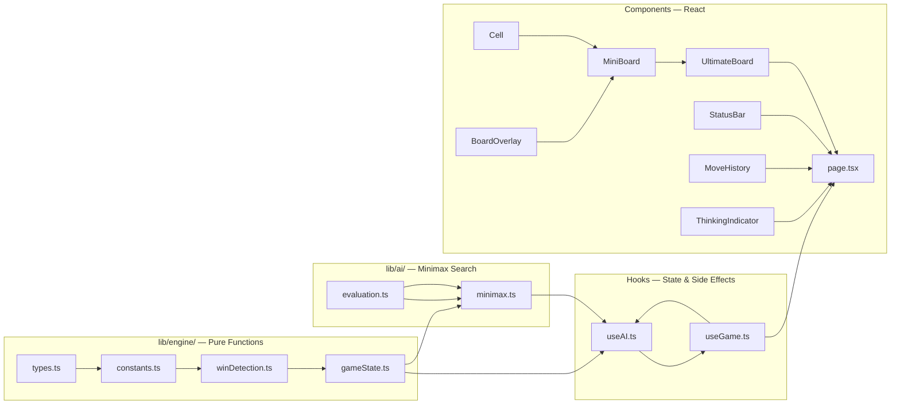

## How to Build Ultimate Tic-Tac-Toe with a Minimax AI

In this tutorial, you'll build Ultimate Tic-Tac-Toe — a 3x3 grid of 3x3 mini-boards — with a depth-3 minimax AI opponent, using Next.js 16, React 19, TypeScript 5, and Tailwind CSS v4.

### What to expect

```
Board 1   Board 2   Board 3
 . | X | .   . | O | .   . | . | .
---|---|---   ---|---|---   ---|---|---
 . | . | .   . | . | .   . | . | .
---|---|---   ---|---|---   ---|---|---
 . | . | .   . | . | .   . | . | .

Your move in a cell determines which board your opponent plays in next.
Win three mini-boards in a row to win the game.
```

### What you'll learn

- Modeling complex game state with immutable pure functions
- Implementing minimax with alpha-beta pruning and move ordering
- Writing a heuristic evaluation function with center/corner/threat scoring
- Building a turn-based UI with Tailwind CSS v4
- Handling AI turns with a guard-ref pattern to prevent duplicate triggers

### Prerequisites

- Node.js 20+
- Familiarity with React and TypeScript
- Basic knowledge of game tree search algorithms

### Project structure

```
ultimate-tic-tac-toe-ai/
├── src/
│   ├── app/
│   │   ├── globals.css        # Tailwind v4 import
│   │   ├── layout.tsx         # Root layout
│   │   └── page.tsx           # Home — wires everything together
│   ├── lib/
│   │   ├── engine/
│   │   │   ├── types.ts       # CellValue, Player, GameState, etc.
│   │   │   ├── constants.ts   # WIN_LINES, createInitialGameState
│   │   │   ├── winDetection.ts# checkBoardWinner, checkOverallWinner
│   │   │   └── gameState.ts   # isValidMove, applyMove (pure functions)
│   │   └── ai/
│   │       ├── evaluation.ts  # Heuristic board scoring
│   │       └── minimax.ts     # Depth-3 minimax with alpha-beta
│   ├── hooks/
│   │   ├── useGame.ts         # Game state management
│   │   └── useAI.ts           # AI turn watcher with 800ms delay
│   └── components/
│       ├── board/
│       │   ├── Cell.tsx              # Single clickable cell
│       │   ├── MiniBoard.tsx         # 3×3 grid of cells + overlay
│       │   ├── BoardOverlay.tsx      # Winner/draw overlay
│       │   └── UltimateBoard.tsx     # 3×3 grid of MiniBoards
│       ├── ai/
│       │   └── ThinkingIndicator.tsx # "AI is thinking..." pulse
│       └── game/
│           ├── StatusBar.tsx         # Turn/winner/free-move info
│           └── MoveHistory.tsx       # Scrollable move log
├── package.json
├── next.config.ts
├── tsconfig.json
├── postcss.config.mjs
└── eslint.config.mjs
```

### Imports

| Package | Version | Why |
|---------|---------|-----|
| `next` | 16.2.9 | App Router, React Server Components, turbopack |
| `react` / `react-dom` | 19.2.4 | Latest React with the new compiler |
| `typescript` | ^5 | Type safety across engine, AI, and UI |
| `tailwindcss` | ^4 | CSS utility framework — `@import "tailwindcss"`, `@theme` directive |
| `@tailwindcss/postcss` | ^4 | PostCSS plugin for Tailwind v4 |

**Why no external game libraries?** The entire game engine is ~120 lines of pure TypeScript. No dependency brings enough value to justify the bundle cost — the rules are simple enough that hand-rolling them is shorter than reading a library's docs.

**Why Tailwind v4 over v3?** Tailwind v4 ships with a CSS-first configuration model. The `@import "tailwindcss"` syntax replaces the old `@tailwind` directives, and `@theme inline` in `globals.css` replaces `tailwind.config.js`. No config file needed.

### Architecture



### Step 1: Game state model

File: `lib/engine/types.ts`

```typescript
export type CellValue = "X" | "O" | null;
export type Player = "X" | "O";
export type Winner = Player | "draw" | null;
export type BoardState = CellValue[];

export type MoveRecord = {
  boardIdx: number;
  cellIdx: number;
  player: Player;
};

export type GameState = {
  boards: BoardState[];
  turn: Player;
  activeBoard: number | null;
  miniBoardWinners: Winner[];
  overallWinner: Winner;
  lastMove: MoveRecord | null;
  moveHistory: MoveRecord[];
};
```

**Why `null` vs `"draw"` for winners?** A `null` winner means the board is still in play. `"draw"` means all cells are filled with no winner. This three-state system (`Player | "draw" | null`) lets the UI branch on all three cases — render the board for `null`, show an overlay for `Player`, show "Draw" for `"draw"`.

### Step 2: Constants and initial state

File: `lib/engine/constants.ts`

```typescript
import type { BoardState, GameState } from "./types";

export const BOARD_SIZE = 9;
export const WIN_LINES = [
  [0, 1, 2], [3, 4, 5], [6, 7, 8],
  [0, 3, 6], [1, 4, 7], [2, 5, 8],
  [0, 4, 8], [2, 4, 6],
];

export function createEmptyBoard(): BoardState {
  return Array(9).fill(null);
}

export function createInitialGameState(): GameState {
  return {
    boards: Array.from({ length: 9 }, () => createEmptyBoard()),
    turn: "X",
    activeBoard: null,
    miniBoardWinners: Array(9).fill(null),
    overallWinner: null,
    lastMove: null,
    moveHistory: [],
  };
}
```

### Step 3: Win detection

File: `lib/engine/winDetection.ts`

```typescript
import type { BoardState, Winner } from "./types";
import { WIN_LINES } from "./constants";

export function checkBoardWinner(board: BoardState): Winner {
  for (const [a, b, c] of WIN_LINES) {
    if (board[a] && board[a] === board[b] && board[a] === board[c]) {
      return board[a];
    }
  }
  if (board.every(v => v !== null)) return "draw";
  return null;
}

export function checkOverallWinner(winners: Winner[]): Winner {
  for (const [a, b, c] of WIN_LINES) {
    if (winners[a] && winners[a] === winners[b] && winners[a] === winners[c]) {
      return winners[a];
    }
  }
  if (winners.every(w => w !== null)) return "draw";
  return null;
}
```

**Why split board and overall detection?** `checkBoardWinner` operates on a single mini-board (9 cells). `checkOverallWinner` operates on the meta-board (9 mini-board winners). They share the same `WIN_LINES` constant but operate on different data. Keeping them separate avoids conflating the two levels.

### Step 4: Move validation

File: `lib/engine/gameState.ts`

```typescript
export function isValidMove(
  state: GameState,
  boardIdx: number,
  cellIdx: number
): boolean {
  if (state.overallWinner) return false;
  if (state.activeBoard !== null && state.activeBoard !== boardIdx) return false;
  if (state.miniBoardWinners[boardIdx]) return false;
  if (state.boards[boardIdx][cellIdx] !== null) return false;
  return true;
}
```

Four checks, in order of cheap-to-expensive:
1. Is the game over? (single boolean)
2. Is this the correct board? (if a board is forced)
3. Has this mini-board already been won?
4. Is the target cell empty?

**Watch out for** the second check: `state.activeBoard !== null && state.activeBoard !== boardIdx`. When `activeBoard` is `null`, the player can play any free board — this is the "free move" rule. The first condition (`!== null`) must come first to short-circuit.

### Step 5: Applying a move

```typescript
export function applyMove(
  state: GameState,
  boardIdx: number,
  cellIdx: number
): GameState {
  const nextBoards = state.boards.map(b => [...b]);
  nextBoards[boardIdx][cellIdx] = state.turn;

  const nextWinners = [...state.miniBoardWinners];
  const mbWinner = checkBoardWinner(nextBoards[boardIdx]);
  if (mbWinner) nextWinners[boardIdx] = mbWinner;

  const move: MoveRecord = { boardIdx, cellIdx, player: state.turn };
  const nextHistory = [...state.moveHistory, move];

  const overallWinner = checkOverallWinner(nextWinners);
  if (overallWinner) {
    return {
      ...state,
      boards: nextBoards,
      miniBoardWinners: nextWinners,
      overallWinner,
      lastMove: move,
      moveHistory: nextHistory,
    };
  }

  const destFull = nextBoards[cellIdx].every(v => v !== null);
  const destDone = nextWinners[cellIdx] !== null;
  const nextActive = destFull || destDone ? null : cellIdx;

  return {
    ...state,
    boards: nextBoards,
    turn: state.turn === "X" ? "O" : "X",
    activeBoard: nextActive,
    miniBoardWinners: nextWinners,
    overallWinner: null,
    lastMove: move,
    moveHistory: nextHistory,
  };
}
```

Key design decisions:

- **`state.boards.map(b => [...b])`**: Creates a shallow copy of each board array. This is sufficient for immutability since `CellValue` is a primitive (`string | null`). No deep clone needed.
- **Early return on overall win**: If the game is over, we still produce a valid `GameState` but skip computing the next active board and switching turns. This prevents downstream bugs where the UI reads `turn` after the game ends.

The next-active-board logic in three lines:

```typescript
const destFull = nextBoards[cellIdx].every(v => v !== null);
const destDone = nextWinners[cellIdx] !== null;
const nextActive = destFull || destDone ? null : cellIdx;
```

If the destination board is full or already won, the next player gets a free move (`null`). Otherwise they're forced into `cellIdx`.

### Step 6: Evaluation function

File: `lib/ai/evaluation.ts`

```typescript
import type { GameState, Player, CellValue } from "@/lib/engine/types";

const WIN_LINES = [
  [0, 1, 2], [3, 4, 5], [6, 7, 8],
  [0, 3, 6], [1, 4, 7], [2, 5, 8],
  [0, 4, 8], [2, 4, 6],
];

const CORNERS = [0, 2, 6, 8];
const CENTER = 4;

export function evaluateBoard(board: CellValue[], aiPlayer: Player): number {
  const humanPlayer: Player = aiPlayer === "X" ? "O" : "X";
  let score = 0;

  if (board[CENTER] === aiPlayer) score += 3;
  else if (board[CENTER] === humanPlayer) score -= 3;

  for (const corner of CORNERS) {
    if (board[corner] === aiPlayer) score += 2;
    else if (board[corner] === humanPlayer) score -= 2;
  }

  for (const [a, b, c] of WIN_LINES) {
    const marks = [board[a], board[b], board[c]];
    const aiCount = marks.filter(m => m === aiPlayer).length;
    const humanCount = marks.filter(m => m === humanPlayer).length;

    if (aiCount === 2 && humanCount === 0) score += 10;
    if (humanCount === 2 && aiCount === 0) score -= 10;
    if (aiCount === 1 && humanCount === 0) score += 1;
    if (humanCount === 1 && aiCount === 0) score -= 1;
  }

  return score;
}

export function evaluate(state: GameState, aiPlayer: Player): number {
  const humanPlayer: Player = aiPlayer === "X" ? "O" : "X";

  if (state.overallWinner === aiPlayer) return 1_000_000;
  if (state.overallWinner === humanPlayer) return -1_000_000;
  if (state.overallWinner === "draw") return 0;

  let score = 0;

  for (let i = 0; i < 9; i++) {
    const winner = state.miniBoardWinners[i];
    if (winner === aiPlayer) score += 100;
    else if (winner === humanPlayer) score -= 100;
    else score += evaluateBoard(state.boards[i], aiPlayer);
  }

  return score;
}
```

**Evaluation weights (why these numbers?):**

| Feature | Weight | Rationale |
|---------|--------|-----------|
| Overall win | ±1,000,000 | Absolute — must outweigh all other factors combined |
| Mini-board win | ±100 | Winning a board is a significant strategic advantage |
| Threat (2-in-a-row) | ±10 | One move away from winning a mini-board |
| Single mark on a line | ±1 | Slight positional pressure |
| Center control | ±3 | Center participates in 4 win-lines (vs 3 for corners) |
| Corner control | ±2 | Corners participate in 3 win-lines (vs 2 for edges) |

**Why threat detection checks `humanCount === 0`?** A line with two of your marks and one opponent mark is contested, not a pure threat. By requiring `humanCount === 0` (or `aiCount === 0`), we only score lines that are uncontested — you're guaranteed to convert them on your next turn unless blocked elsewhere.

**Why `evaluateBoard` is separate from `evaluate`?** `evaluateBoard` scores an individual mini-board (used for boards that aren't won yet). The top-level `evaluate` iterates all 9 boards — won boards get ±100, active boards get a positional score from `evaluateBoard`. This separation means the per-board scoring logic is testable in isolation.

### Step 7: Minimax with alpha-beta pruning

File: `lib/ai/minimax.ts`

```typescript
import type { GameState, Player } from "@/lib/engine/types";
import { applyMove } from "@/lib/engine/gameState";
import { evaluate } from "./evaluation";

const CENTER = 4;
const CORNERS = [0, 2, 6, 8];
const EDGES = [1, 3, 5, 7];

function moveOrderScore(cellIdx: number): number {
  if (cellIdx === CENTER) return 3;
  if (CORNERS.includes(cellIdx)) return 2;
  if (EDGES.includes(cellIdx)) return 1;
  return 0;
}

function generateMoves(state: GameState) {
  const moves: { boardIdx: number; cellIdx: number; score: number }[] = [];
  if (state.overallWinner) return moves;

  const boardsToCheck = state.activeBoard !== null
    ? [state.activeBoard]
    : [0, 1, 2, 3, 4, 5, 6, 7, 8];

  for (const boardIdx of boardsToCheck) {
    if (state.miniBoardWinners[boardIdx]) continue;
    const board = state.boards[boardIdx];
    for (let cellIdx = 0; cellIdx < 9; cellIdx++) {
      if (board[cellIdx] === null) {
        moves.push({ boardIdx, cellIdx, score: moveOrderScore(cellIdx) });
      }
    }
  }

  moves.sort((a, b) => b.score - a.score);
  return moves;
}
```

Move ordering sorts candidates so the most promising cells (center first, then corners, then edges) are evaluated first. This maximizes alpha-beta pruning — when the best move is searched first, more branches are cut.

```typescript
export function minimax(
  state: GameState,
  depth: number,
  alpha: number,
  beta: number,
  isMaximizing: boolean,
  aiPlayer: Player,
): { score: number; boardIdx: number; cellIdx: number } | null {
  if (depth === 0 || state.overallWinner) {
    return { score: evaluate(state, aiPlayer), boardIdx: -1, cellIdx: -1 };
  }

  const moves = generateMoves(state);
  if (moves.length === 0) {
    return { score: evaluate(state, aiPlayer), boardIdx: -1, cellIdx: -1 };
  }

  let bestMove: { boardIdx: number; cellIdx: number } | null = null;

  if (isMaximizing) {
    let bestScore = -Infinity;
    for (const { boardIdx, cellIdx } of moves) {
      const nextState = applyMove(state, boardIdx, cellIdx);
      const result = minimax(nextState, depth - 1, alpha, beta, false, aiPlayer);
      const score = result?.score ?? 0;

      if (score > bestScore) {
        bestScore = score;
        bestMove = { boardIdx, cellIdx };
      }
      alpha = Math.max(alpha, score);
      if (beta <= alpha) break;
    }
    return bestMove ? { score: bestScore, ...bestMove } : null;
  } else {
    let bestScore = Infinity;
    for (const { boardIdx, cellIdx } of moves) {
      const nextState = applyMove(state, boardIdx, cellIdx);
      const result = minimax(nextState, depth - 1, alpha, beta, true, aiPlayer);
      const score = result?.score ?? 0;

      if (score < bestScore) {
        bestScore = score;
        bestMove = { boardIdx, cellIdx };
      }
      beta = Math.min(beta, score);
      if (beta <= alpha) break;
    }
    return bestMove ? { score: bestScore, ...bestMove } : null;
  }
}
```

**Why depth 3 and not deeper?** Depth 3 picks the best move within ~50ms in JavaScript. Depth 5 takes ~2 seconds and plays near-perfectly. Depth 3 is a sweet spot — strong enough to beat casual players, fast enough to feel instant. The 800ms artificial delay (see Step 9) dominates the perceived wait anyway.

**Why alpha-beta and not pure minimax?** Without pruning, depth 3 evaluates up to `b^3` nodes where `b` is the branching factor (often 10-40 in Ultimate TTT). Alpha-beta pruning reduces this to roughly `b^(3/2)` in the best case. With move ordering, we approach the best case consistently.

**Minimax vs MCTS: why minimax?**

| Criteria | Minimax (chosen) | MCTS |
|----------|-----------------|------|
| Deterministic | Yes — same position, same move | Probabilistic — varies between runs |
| Implementation | ~90 lines | ~200+ lines (UCB1, tree traversal, backpropagation) |
| Depth limit | Hard limit (depth 3) | Soft limit (time budget) |
| Evaluation function | Required | Optional (can use random playouts) |
| Performance | Instant at depth 3 | Needs thousands of simulations for quality |

For a tutorial project with a fixed search budget, minimax is simpler, deterministic (easier to debug), and produces stronger play at shallow depths than the same number of MCTS simulations.

### Step 8: Game state hook

File: `hooks/useGame.ts`

```typescript
import { useState, useCallback } from "react";
import type { GameState } from "@/lib/engine/types";
import { createInitialGameState } from "@/lib/engine/constants";
import { isValidMove, applyMove } from "@/lib/engine/gameState";
import { useAI } from "./useAI";

export default function useGame() {
  const [state, setState] = useState<GameState>(createInitialGameState());

  const makeMove = useCallback((boardIdx: number, cellIdx: number) => {
    setState(prev => {
      if (!isValidMove(prev, boardIdx, cellIdx)) return prev;
      return applyMove(prev, boardIdx, cellIdx);
    });
  }, []);

  const onAIMove = useCallback((boardIdx: number, cellIdx: number) => {
    makeMove(boardIdx, cellIdx);
  }, [makeMove]);

  const ai = useAI(state, onAIMove);

  function reset() {
    setState(createInitialGameState());
  }

  return { state, makeMove, reset, ai };
}
```

**Why `setState(prev => ...)` instead of `setState(newState)`?** The functional updater form guarantees we always read the latest state. This is critical because `makeMove` can be called from both the human (`page.tsx` passes it directly) and the AI (via `onAIMove`). Without the updater form, stale closures could reset the state to an older version.

### Step 9: AI hook with guard ref

File: `hooks/useAI.ts`

```typescript
import { useEffect, useRef, useState } from "react";
import type { GameState, Player } from "@/lib/engine/types";
import { minimax } from "@/lib/ai/minimax";

type UseAIReturn = {
  isThinking: boolean;
  aiEnabled: boolean;
  setAIEnabled: (v: boolean) => void;
};

const AI_DEPTH = 3;
const AI_MOVE_DELAY = 800;

export function useAI(
  state: GameState,
  onAIMove: (boardIdx: number, cellIdx: number) => void,
  aiPlayer: Player = "O",
): UseAIReturn {
  const [isThinking, setIsThinking] = useState(false);
  const [aiEnabled, setAIEnabled] = useState(false);
  const onMoveRef = useRef(onAIMove);
  const guardRef = useRef(false);

  useEffect(() => {
    onMoveRef.current = onAIMove;
  });

  useEffect(() => {
    if (!aiEnabled) return;
    if (state.overallWinner) return;
    if (state.turn !== aiPlayer) return;
    if (guardRef.current) return;

    guardRef.current = true;
    queueMicrotask(() => setIsThinking(true));

    const result = minimax(state, AI_DEPTH, -Infinity, Infinity, true, aiPlayer);

    const timer = setTimeout(() => {
      if (result && result.boardIdx >= 0) {
        onMoveRef.current(result.boardIdx, result.cellIdx);
      }
      setIsThinking(false);
      guardRef.current = false;
    }, AI_MOVE_DELAY);

    return () => {
      clearTimeout(timer);
      guardRef.current = false;
    };
  }, [state, aiEnabled, aiPlayer]);

  return { isThinking, aiEnabled, setAIEnabled };
}
```

**The guard ref pattern — why is it needed?** React strict mode runs effects twice in development. Without `guardRef`, the effect would fire twice, running minimax twice, and calling `onAIMove` twice (placing two AI moves in one turn). The ref persists across renders and is not reset by the effect cleanup, so the second invocation of the effect in Strict Mode sees `guardRef.current === true` and bails out.

**Why `queueMicrotask` for `setIsThinking(true)`?** The synchronous `minimax` call on line 37 blocks the main thread. If we set `isThinking` synchronously before it, React batches the state update and the "AI is thinking..." text never shows during the computation. `queueMicrotask` defers the thinking state update to after the current microtask checkpoint, ensuring React commits it before the minimax work starts.

**Why `onMoveRef` instead of using `onAIMove` directly?** The `onAIMove` callback is recreated when `makeMove` changes (which is never in this case, since `makeMove` is wrapped in `useCallback` with `[]` deps). But as a general pattern, using a ref avoids adding `onAIMove` to the effect dependency array, which would re-trigger the AI effect on every render.

### Step 10: Components

#### Cell (`components/board/Cell.tsx`)

```tsx
export default function Cell({ value, isLastMove, onClick }: CellProps) {
  return (
    <button
      onClick={onClick}
      disabled={value !== null}
      className={`aspect-square h-10 w-10 text-xl font-bold flex items-center justify-center
        hover:enabled:bg-blue-100 text-blue-950
        ${isLastMove ? "bg-blue-200" : "bg-white"}`}
    >
      {value}
    </button>
  );
}
```

#### MiniBoard (`components/board/MiniBoard.tsx`)

```tsx
export default function MiniBoard({ cells, winner, boardIdx, lastMove, onCellClickAction }: MiniBoardProps) {
  return (
    <div className="relative w-full">
      <div className="grid grid-cols-3 gap-0.5 bg-black">
        {cells.map((value, i) => (
          <Cell
            key={i}
            value={value}
            isLastMove={lastMove?.boardIdx === boardIdx && lastMove?.cellIdx === i}
            onClick={() => onCellClickAction(i)}
          />
        ))}
      </div>
      <BoardOverlay winner={winner} />
    </div>
  );
}
```

#### BoardOverlay (`components/board/BoardOverlay.tsx`)

```tsx
export default function BoardOverlay({ winner }: BoardOverlayProps) {
  if (!winner) return null;

  return (
    <div className="absolute inset-0 bg-black/60 flex items-center justify-center rounded">
      <span className="text-white text-3xl font-bold">
        {winner === "draw" ? "Draw" : `${winner} wins!`}
      </span>
    </div>
  );
}
```

**Why `absolute inset-0` overlay instead of replacing the cells?** The overlay preserves the board layout — the grid cells stay in place underneath the semi-transparent overlay. This means won boards keep their move history visible, and the UI doesn't shift when a board is won.

#### UltimateBoard (`components/board/UltimateBoard.tsx`)

```tsx
export default function UltimateBoard({ boards, miniBoardWinners, activeBoard, lastMove, onMove }: UltimateBoardProps) {
  return (
    <div className="grid grid-cols-3 gap-3 p-4">
      {boards.map((board, i) => {
        const isActive = activeBoard === null || activeBoard === i;
        return (
          <div
            key={i}
            className={isActive
              ? "ring-2 ring-blue-500 rounded"
              : "opacity-60 pointer-events-none"}
          >
            <MiniBoard
              cells={board}
              winner={miniBoardWinners[i]}
              boardIdx={i}
              lastMove={lastMove}
              onCellClickAction={(cellIdx) => onMove(i, cellIdx)}
            />
          </div>
        );
      })}
    </div>
  );
}
```

**Why `pointer-events-none` here and also on the parent in `page.tsx`?** The `pointer-events-none` on inactive boards (line 26) prevents clicking on boards that aren't the active board. The separate `pointer-events-none` on the outer `div` in `page.tsx:23` prevents all board interaction during the AI's turn (since the AI owns `"O"`). These serve different purposes: one enforces game rules, the other prevents input during the AI's synchronous computation + delay.

### Step 11: Wiring it together

File: `app/page.tsx`

```tsx
'use client'

import UltimateBoard from "@/components/board/UltimateBoard";
import StatusBar from "@/components/game/StatusBar";
import MoveHistory from "@/components/game/MoveHistory";
import useGame from "@/hooks/useGame";

export default function Home() {
  const { state, makeMove, reset, ai } = useGame();

  const isAITurn = ai.aiEnabled && state.turn === "O";

  return (
    <div className="flex flex-col items-center gap-3 justify-center min-h-screen bg-zinc-50 font-sans">
      <StatusBar
        turn={state.turn}
        overallWinner={state.overallWinner}
        activeBoard={state.activeBoard}
        isThinking={ai.isThinking}
        aiEnabled={ai.aiEnabled}
      />

      <div className={isAITurn ? "pointer-events-none" : ""}>
        <UltimateBoard
          boards={state.boards}
          miniBoardWinners={state.miniBoardWinners}
          activeBoard={state.activeBoard}
          lastMove={state.lastMove}
          onMove={makeMove}
        />
      </div>

      <MoveHistory moves={state.moveHistory} />

      <div className="flex gap-3">
        <button
          className="cursor-pointer px-4 py-2 bg-blue-500 text-white rounded hover:bg-blue-600 disabled:opacity-50"
          onClick={() => ai.setAIEnabled(!ai.aiEnabled)}
        >
          {ai.aiEnabled ? "vs AI: ON" : "vs AI: OFF"}
        </button>
        <button
          className="cursor-pointer px-4 py-2 bg-gray-500 text-white rounded hover:bg-gray-600"
          onClick={reset}
        >
          Reset
        </button>
      </div>
    </div>
  );
}
```

### Feature comparison

| Feature | Old blog (inaccurate) | Actual repo |
|---------|----------------------|-------------|
| Engine files | Single code block | 4 separate files: `types.ts`, `constants.ts`, `winDetection.ts`, `gameState.ts` |
| `applyMove` immutability | `boards.map((b, i) => i === boardIdx ? b.map(...) : b)` | `boards.map(b => [...b])` then mutate copy (simpler, fewer closures) |
| `applyMove` early return | Always computes `nextActive` | Early returns if `overallWinner` is set (no turn switch) |
| Evaluation scoring | Single function, center=4, corners=3, edges=1 | Split into `evaluateBoard` + `evaluate`, center=3, corners=2, plus 2-in-a-row threats (±10) and single marks (±1) |
| Move ordering | Mentioned but no code | Explicit `moveOrderScore` function: center=3, corners=2, edges=1 |
| AI hook | Uses `onMove` in deps, no ref guard | Uses `onMoveRef` + `guardRef` pattern, `queueMicrotask` for thinking indicator |
| AI delay | 800ms `setTimeout` around minimax | Synchronous minimax, 800ms `setTimeout` for the actual move dispatch |
| Components | Single `Board` component | 7 components: `Cell`, `MiniBoard`, `BoardOverlay`, `UltimateBoard`, `StatusBar`, `MoveHistory`, `ThinkingIndicator` |
| Active board highlight | `ring-2 ring-blue-500` on inner grid | `ring-2 ring-blue-500` on containing `div` in `UltimateBoard` |
| Inactive boards | `opacity-50` | `opacity-60 pointer-events-none` |
| AI turn lock | N/A | `pointer-events-none` on board wrapper + `guardRef` in hook |
| Last move highlight | N/A | Blue background (`bg-blue-200`) on the last-played cell |
| Move history | N/A | Scrollable log with move number, player, board, cell |
| Human vs AI toggle | N/A | Button toggles `aiEnabled` — game works as Human vs Human when off |
| Tailwind version | v3 (`@tailwind`, config file) | v4 (`@import "tailwindcss"`, `@theme inline`) |
| Dependencies | Unspecified | Only `next`, `react`, `react-dom`, `typescript`, `tailwindcss` — zero game libraries |

### Gotchas

**1. Duplicate AI moves in Strict Mode.** React 19's Strict Mode double-invokes effects. Without the `guardRef`, the AI fires twice. The ref is set synchronously at the top of the effect, so the second invocation sees it blocked.

**2. Stale closures in AI callbacks.** The `onAIMove` function could reference an outdated `state`. The functional updater in `useGame` (`setState(prev => ...)`) eliminates this risk by reading the latest state inside the updater.

**3. Synchronous minimax blocks the UI.** At depth 3, minimax takes ~50ms — fast enough that blocking isn't noticeable. If you increase depth, wrap it in a Web Worker or use `setTimeout` to yield to the event loop.

**4. Tailwind v4 class detection.** Tailwind v4 scans your source files for class names at build time. Dynamic class construction like `className={`bg-${color}-500`}` won't be detected. The actual repo uses static classes exclusively.

**5. Board overlay z-index.** The `BoardOverlay` uses `absolute inset-0`, which requires the parent (`MiniBoard`'s `relative` div) to have `position: relative`. Without it, the overlay escapes the grid bounds.

### Next steps

- Add difficulty levels by varying search depth (easy=1, medium=3, hard=5)
- Implement a transposition table with Zobrist hashing to cache evaluated positions
- Add online multiplayer with WebSockets
- Animate the active board transition with Framer Motion
- Use a Web Worker to run minimax asynchronously for deeper search

The full source is at [github.com/priyanshu360/ultimate-tic-tac-toe-ai](https://github.com/priyanshu360/ultimate-tic-tac-toe-ai).
