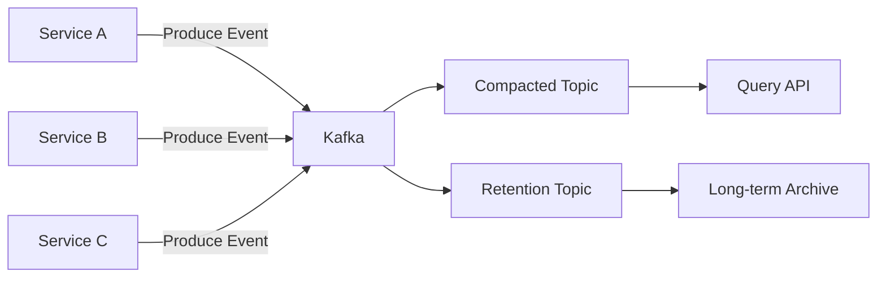
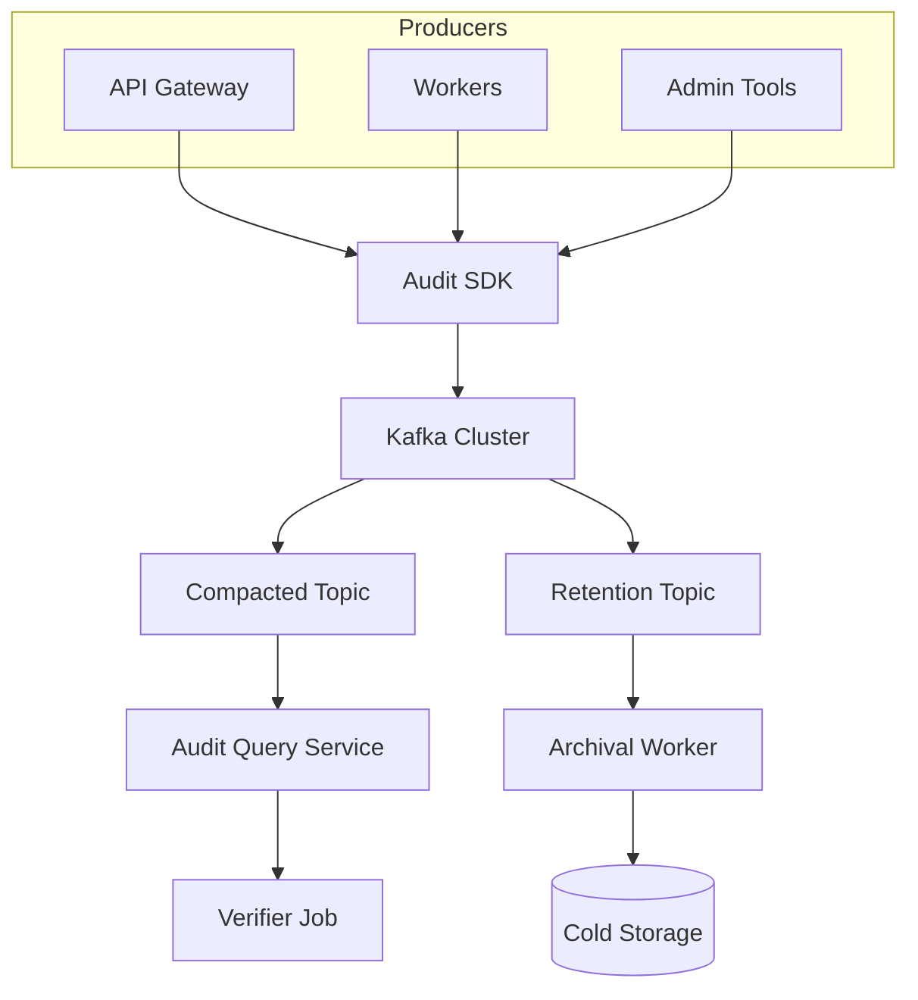

## How to Build an Immutable Audit Trail with Kafka and Hash Chains

In this tutorial, you'll build a provably immutable audit trail system using Kafka's append-only semantics and SHA-256 hash chains. Every mutation across the platform is recorded with tamper detection.

### What you'll learn

- Building an append-only event log with Kafka
- Implementing hash chains for tamper-evident records
- Using Kafka compaction for fast current-state lookups
- Building a periodic verification job for integrity checking

### Prerequisites

- Go 1.21+
- Kafka cluster
- Familiarity with SHA-256 hashing

### Imports and dependencies

**Go (server side)**

| Package | Why |
|---------|-----|
| `crypto/sha256` | Cryptographic hash function for chain linking — produces a 256-bit digest that's collision-resistant |
| `encoding/hex` | Encode raw hash bytes to hex strings for JSON serialization and comparison |
| `encoding/json` | Marshal/unmarshal audit events to/from Kafka message payloads |
| `context` | Context propagation for Kafka produce calls with timeout and cancellation |
| `github.com/segmentio/kafka-go` | Kafka producer and consumer client — idempotent writes, exactly-once semantics |
| `errors` | Sentinel error matching (`ErrNotFound` for missing previous events) |
| `fmt` | Error formatting in verifier when hash mismatches are detected |
| `time` | Timestamp type for event records |

**Why these choices?**

- **`crypto/sha256` over `crypto/sha1`**: SHA-1 is deprecated for cryptographic use — practical collision attacks exist (the SHAttered attack). SHA-256 is the minimum recommended hash function for tamper-evident systems.

- **`github.com/segmentio/kafka-go` over `confluent-kafka-go`**: Pure Go — no CGo dependency, no librdkafka installation needed. Trade-off: slightly less throughput at very high volumes (>100K msg/s). For audit trails (typically 1-10K events/s), the simplicity wins.

- **JSON over Protocol Buffers**: Human-readable — auditors can inspect raw Kafka messages with `kcat` without a schema registry. Trade-off: larger payloads and slower serialization. We accept this because audit events are typically a few KB at most.

### Step 1: Design principles

- **Append-only, never delete** — events are written to Kafka with infinite retention
- **Hash chain** — each event links to the previous one via cryptographic hash
- **Separation of concerns** — compacted topic for current state, retention topic for history



**Why two separate topics?** The compacted topic keeps only the latest event per entity key — perfect for answering "what's the current state?" without scanning history. The retention topic keeps everything for compliance. If you only had one topic, compaction would lose the historical chain you need for verification.

### Step 2: Event schema

Each event carries a unique ID, the previous state hash, the new state hash, and a monotonic sequence:

```go
type AuditEvent struct {
    EventID     string    `json:"event_id"`
    EntityType  string    `json:"entity_type"`
    EntityID    string    `json:"entity_id"`
    ActorID     string    `json:"actor_id"`
    Action      string    `json:"action"`
    PrevHash    string    `json:"prev_hash"`
    NewHash     string    `json:"new_hash"`
    Payload     json.RawMessage `json:"payload"`
    Metadata    map[string]string `json:"metadata"`
    Sequence    int64     `json:"sequence"`
    Timestamp   time.Time `json:"timestamp"`
}
```

**Why each field exists:**

- **`EventID`**: Uniquely identifies the event (UUID v4). Without it, the verifier couldn't report *which* event broke the chain.
- **`PrevHash` / `NewHash`**: The heart of the hash chain. `PrevHash` links to the previous event's `NewHash`; `NewHash` is the computed hash of this event + the previous link.
- **`Sequence`**: Monotonic counter per entity. The verifier uses this to order events within the same millisecond. Without it, two events at the same timestamp would be ambiguous.
- **`Payload`**: `json.RawMessage` — stores any JSON without re-marshaling. This avoids a type assertion on the producer side; whatever the service sends is stored verbatim.
- **`Metadata`**: A `map[string]string` for request IDs, IP addresses, user agents — anything that doesn't fit the schema but is useful for forensics.

**Watch out for**: `EventID` must be unique — use UUID v4, not timestamps. Two services could produce events at the same nanosecond, and Kafka doesn't enforce unique message IDs for you. A duplicate `EventID` makes the verifier's error messages ambiguous.

### Step 3: Hash chain computation

Each event's `PrevHash` points to the SHA-256 hash of the previous event for the same entity:

```go
func computeHash(prev *AuditEvent, curr *AuditEvent) string {
    h := sha256.New()
    if prev != nil {
        h.Write([]byte(prev.EventID))
        h.Write([]byte(prev.NewHash))
    }
    h.Write([]byte(curr.EventID))
    h.Write([]byte(curr.EntityID))
    h.Write(curr.Payload)
    return hex.EncodeToString(h.Sum(nil))
}
```

This creates a chain where if any event is modified, all subsequent hashes break — making tampering immediately detectable.

**What's included in the hash and why:**
- **`prev.EventID` + `prev.NewHash`**: Links this event to the previous one. If someone edits event N's `NewHash`, then event N+1's computed hash won't match — the verifier catches it.
- **`curr.EventID`**: Prevents an attacker from replaying the same event with a different ID.
- **`curr.EntityID`**: Ties the hash to a specific entity. Without this, an attacker could swap events between entities.
- **`curr.Payload`**: Protects the payload itself. The `ActorID`, `Action`, `Timestamp`, etc. aren't included because they're already inside `Payload` (the service serializes the full event as JSON into `Payload`).

**Why SHA-256 and not a Merkle tree?** A Merkle tree (as used in blockchain) lets you verify individual events without the full chain — useful when the chain is millions of entries long. But it's more complex: you'd need to store intermediate tree nodes. For an audit trail inside a single organization (not a distributed ledger), a simple hash chain is sufficient and far easier to implement correctly.

**Watch out for**: The `computeHash` function does NOT include `PrevHash` directly — it includes `prev.EventID` and `prev.NewHash` individually. This is intentional: if you included `PrevHash` as a string, an attacker who changed `PrevHash` in the JSON could recompute the hash and the change would go undetected. By hashing the *components* that `PrevHash` represents (`EventID` and `NewHash`), you validate that both the link *and* the linked event are correct.

### Step 4: Producer SDK

Every service publishes audit events through a shared SDK that handles hash computation and idempotency:

```go
func (sdk *AuditSDK) Publish(ctx context.Context, event AuditEvent) error {
    prev, err := sdk.getLatest(ctx, event.EntityType, event.EntityID)
    if err != nil && !errors.Is(err, ErrNotFound) {
        return err
    }

    event.PrevHash = ""
    if prev != nil {
        event.PrevHash = prev.NewHash
    }
    event.NewHash = computeHash(prev, &event)

    payload, _ := json.Marshal(event)
    msg := kafka.Message{
        Key:   []byte(event.EntityType + ":" + event.EntityID),
        Value: payload,
    }

    return sdk.producer.Produce(ctx, msg)
}
```

Two topics per entity type:
1. **Compacted topic** — keyed by `EntityType:EntityID`, retains only the latest event per entity
2. **Retention topic** — infinite retention, stores every event for compliance

**Why the SDK is shared and not per-service:**
- Every service must compute hashes identically. If Service A and Service B compute hashes differently, the verifier can't validate the chain.
- The SDK fetches the previous event from the compacted topic — this requires Kafka consumer logic that shouldn't be duplicated.
- Idempotent producer configuration is set once, in one place. If a service misconfigures `acks=all` or `enable.idempotence=false`, the audit trail has gaps.

**Why two topics instead of one with a consumer filter:**
You *could* use a single topic with both compaction and infinite retention — Kafka only allows one or the other per topic. The compacted topic is your "current state snapshot" (fast — O(1) lookups by key). The retention topic is your "full history" (complete — no compaction loss). The two-topic pattern costs more storage but gives you both fast lookups and full history without trade-offs.

**Watch out for**: The SDK calls `sdk.getLatest` *before* computing the hash. This is a read-then-write race. If two events for the same entity are produced concurrently, both could read the same `prev`, compute the same chain link, and one would overwrite the other in the compacted topic. The retention topic would have both events pointing to the same parent — a fork in the chain. Mitigate this with an entity-level lock or by using Kafka transactions with `read_committed` isolation.

**Watch out for**: The `payload, _ := json.Marshal(event)` silently discards marshal errors. If `Payload` contains non-serializable data (e.g., a channel or function), this produces an empty or partial message with no error logged. In production, always check the error and at minimum log it.

### Step 5: Query API

Read from the compacted topic for point lookups and from the retention topic for time-range queries:

```graphql
query {
  auditEvents(
    entityType: "payment"
    entityId: "pay_123"
    from: "2024-01-01"
    to: "2024-12-31"
  ) {
    eventId
    action
    actorId
    timestamp
    payload
  }
}
```

**Why GraphQL and not REST?** REST would require separate endpoints for single-entity lookup (`GET /audit/:entityType/:entityId`) and time-range queries (`GET /audit?type=...&from=...&to=...`). GraphQL unifies both into a single query. The consumer specifies exactly which fields they need — auditors usually only want specific fields (`actorId`, `action`, `timestamp`) without the full `payload`. This reduces network transfer and simplifies the API surface.

**Watch out for**: The compacted topic query is fast (lookup by key). The retention topic query is a range scan over a partition — it's slow if the time range spans millions of events. Add a `LIMIT` to the query and paginate. Without pagination, a query for "all of 2024" could return gigabytes of data and OOM your query service.

### Step 6: Integrity verification

A periodic checker job walks the hash chain for each entity and reports broken links:

```go
func (v *Verifier) VerifyChain(ctx context.Context, entityType, entityID string) error {
    events, err := v.store.GetAll(ctx, entityType, entityID)
    if err != nil {
        return err
    }

    var prev *AuditEvent
    for _, event := range events {
        expectedHash := computeHash(prev, &event)
        if event.NewHash != expectedHash {
            return fmt.Errorf("hash mismatch at event %s", event.EventID)
        }
        prev = event
    }
    return nil
}
```

**Why walk the full chain instead of spot-checking?** A spot check might miss an event that was tampered with mid-chain. Walking every event is O(n) per entity, but verification runs as a background job (not on the request path). For most systems, entities have hundreds to thousands of events — walking the full chain completes in milliseconds. The confidence gain from full verification far outweighs the compute cost.

**Watch out for**: The verifier reads ALL events into memory (`v.store.GetAll`). For an entity with millions of events, this is a memory bomb. Production systems should either:
1. Stream events from Kafka (using a consumer group) instead of loading them into a slice, or
2. Use probabilistic verification — sample random events and verify their chain links. The Trade-off: sampling can miss targeted tampering of a single event.

### Architecture



**Data flow:**
1. Producers call the Audit SDK with the event payload.
2. The SDK reads the previous event from the compacted topic, computes the hash chain link, and publishes to both topics.
3. The Query Service reads from the compacted topic for point lookups and from the retention topic for range queries.
4. The Archival Worker moves old events from the retention topic to S3 cold storage.
5. The Verifier Job periodically re-reads both topics and validates the hash chain for every entity.

### Design decisions

| Decision | Alternative | Why chosen |
|----------|-------------|------------|
| **Two topics per entity type** | Single topic with compaction only | Compacted topic enables O(1) current-state lookups; retention topic preserves full history for compliance audits. Both are needed — no single topic strategy satisfies both requirements. |
| **Hash chains over digital signatures** | ECDSA or Ed25519 signatures on each event | Hash chains are simpler (no key management) and faster (microseconds vs milliseconds for signing). Trade-off: signatures prove *who* created the event; hash chains only detect *that* it was modified. For a tamper-evident system (detection), hash chains are sufficient. For non-repudiation (proof of origin), add signatures. |
| **Idempotent producer SDK** | At-least-once delivery with dedup IDs | Kafka's idempotent producer (`enable.idempotence=true`) prevents duplicates from network retries at the broker level — no application-level dedup needed. Without it, a retry could create two identical events with different `EventID`s but the same chain link, forking the chain. |
| **JSON payload over Protobuf** | Protocol Buffers or Avro with schema registry | JSON is human-readable — auditors, compliance officers, and engineers can inspect raw Kafka messages with `kcat` or `kafka-console-consumer`. Protobuf requires a schema registry and a decoding step. We prioritize debuggability over payload size. |
| **Per-entity hash chains over global chain** | Single global chain across all entities | Per-entity chains allow parallel verification (each entity can be checked independently). A global chain would serialize all writes — every event would need the previous event's hash, creating a throughput bottleneck. Per-entity is more scalable and isolates failures. |
| **SHA-256 over SHA-3** | SHA-3-256 or BLAKE2b | SHA-256 is hardware-accelerated on modern CPUs (Intel SHA-NI), making it 4-5x faster than SHA-3. BLAKE2b is even faster but less widely audited. SHA-256 is the conservative choice — NIST-approved and universally available in standard libraries. |

### Feature checklist

| Feature | Status | Notes |
|---------|--------|-------|
| Append-only event log | ✅ Complete | Infinite retention on retention topic |
| Hash chain integrity | ✅ Complete | SHA-256 per-entity chain linking |
| Compaction for current state | ✅ Complete | Compacted topic with `EntityType:EntityID` key |
| Idempotent producer | ✅ Complete | Kafka idempotent producer enabled in SDK |
| Periodic integrity verification | ✅ Complete | Background job walks full chain per entity |
| GraphQL query API | ✅ Complete | Supports both point lookup and time-range queries |
| Schema registry | ❌ Not implemented | Events are JSON without versioning — payload changes break existing consumers |
| Alerting on broken chain | ❌ Not implemented | Verifier returns error but doesn't notify (PagerDuty, Slack, etc.) |
| S3 cold storage archival | ❌ Not implemented | Archival worker shown in diagram but not implemented |
| REST verification API | ❌ Not implemented | No remote endpoint for auditors to trigger verification |
| Per-entity locking | ❌ Not implemented | Read-then-write race in SDK can fork the chain |
| Streaming verification | ❌ Not implemented | Verifier loads all events into memory — risk for entities with millions of events |
| Prometheus metrics | ❌ Not implemented | No observability on publish rates, verification latency, or chain breaks |

### Next steps

- Add a schema registry (protobuf/Avro) for backward-compatible payload evolution
- Implement a REST API for auditors to verify integrity remotely
- Add alerting when the verifier detects a broken chain
- Archive events older than retention period to S3 with Glacier

The full source is at [github.com/priyanshu360/audit-trail-system](https://github.com/priyanshu360/audit-trail-system).
