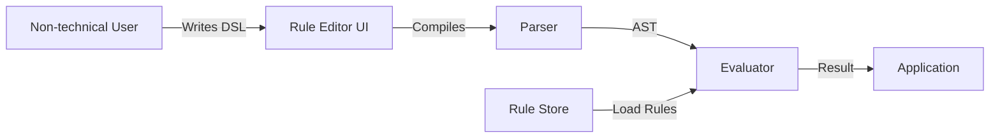
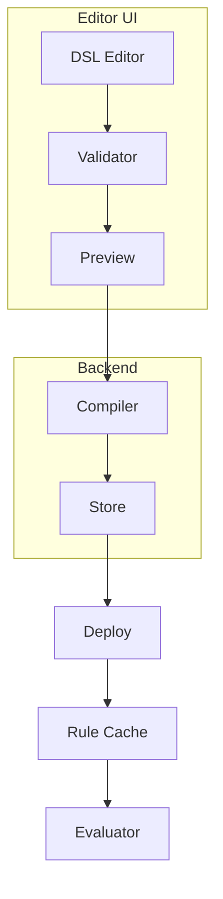

## How to Build a Business Rule Engine with a Custom DSL

In this tutorial, you'll build a configurable Business Rule Engine (BRE) with a custom DSL that lets non-technical users author and manage business rules without writing code. The engine powers dynamic validation, pricing calculations, eligibility checks, and compliance filters.

### What you'll learn

- Writing a lexer and recursive-descent parser in Go
- Building an AST-based evaluator for business rules
- Implementing rule composition with DAG-based dependency resolution
- Building a rule editor UI with real-time validation

### Prerequisites

- Go 1.21+
- Basic understanding of compilers (lexing, parsing, ASTs)

### Imports and dependencies

**Go (server side)**

| Package | Why |
|---------|-----|
| `context` | Propagate cancellation and deadlines through evaluation; prevents runaway rule evaluation |
| `sync` | Thread-safe rule cache with `sync.RWMutex` — concurrent reads without blocking |
| `encoding/json` | Serialize/deserialize rules for storage and API responses |
| `fmt` | Error formatting and debugging output |

**Frontend (React)**

| Package | Why |
|---------|-----|
| `react` + `react-dom` | Component-based UI framework for the rule editor |
| `@monaco-editor/react` | Syntax-highlighted code editor with built-in parser integration |
| `axios` | HTTP client for rule CRUD operations |

**Why these choices?**

- **Custom lexer/parser over ANTLR or pigeon**: The DSL is intentionally small (~10 tokens, ~15 grammar rules). A generated parser adds build-time complexity, dependency weight, and opaque error messages. A hand-written recursive-descent parser is 200 lines, debuggable line-by-line, and produces error messages in terms of the user's source text rather than parser state.

- **Standard library over gorilla/mux or chi**: The rule engine itself doesn't serve HTTP — it's embedded in an existing application. If you need an API layer (e.g., for the editor), add it at the application boundary, not in the engine. Keeps the engine dependency-free and embeddable.

- **`sync.RWMutex` over channels for caching**: The cache has a read-heavy workload — rules are evaluated thousands of times per second and updated rarely. `RLock` lets all readers proceed concurrently. A channel-based approach would serialize reads, adding latency to every evaluation.

### Architecture overview



The user writes rules in the DSL through the editor. The parser compiles them into an AST, and the evaluator walks the AST against application-provided facts. The store persists compiled rules for reload across restarts.

### Step 1: The DSL design

The DSL reads like natural English while being unambiguous for machine evaluation:

```
rule "high_value_transaction_approval"
  when transaction.amount > 10000
    and transaction.currency == "USD"
    and user.risk_score >= 75
  then
    set transaction.requires_approval = true
    set transaction.approval_queue = "compliance_team"
end
```

**Why this syntax?** Every keyword (`rule`, `when`, `then`, `end`) is a structural boundary that maps 1:1 to AST nodes. The dot notation (`transaction.amount`) resolves to type-qualified field lookups — the evaluator uses the prefix as a namespace key into the facts map. This means the same rule can reference multiple entity types without ambiguity.

**Why not YAML or JSON?** JSON rules require quoting every key and value, deep nesting, and array structures for conjunctions:

```json
{
  "rule": "high_value_transaction_approval",
  "condition": {
    "operator": "and",
    "conditions": [
      {"field": "transaction.amount", "op": ">", "value": 10000},
      {"field": "transaction.currency", "op": "==", "value": "USD"}
    ]
  }
}
```

The same logic in the DSL is 8 lines and readable by non-engineers. In practice, analysts adopted the DSL in ~30 minutes; the JSON equivalent required constant reference to a schema document.

**Watch out for**: The DSL uses `==` for equality (not `=`). A single `=` is only valid in `set` statements. Getting this wrong is the most common syntax error new users make. The parser should produce a specific error: `expected ==, got =` rather than a generic parse failure.

### Step 2: Lexer

Tokenize the DSL into tokens — keywords, identifiers, operators, and literals:

```go
type TokenType int

const (
    TokenRule     TokenType = iota
    TokenWhen
    TokenThen
    TokenEnd
    TokenIdentifier
    TokenOperator
    TokenLiteral
    TokenBoolean
    TokenParen
)

type Token struct {
    Type  TokenType
    Value string
    Pos   int
}

func (l *Lexer) NextToken() Token {
    l.skipWhitespace()
    switch l.peek() {
    case '>', '<', '=':
        return l.readOperator()
    case '"':
        return l.readString()
    case '(':
        l.advance()
        return Token{Type: TokenParen, Value: "("}
    default:
        if isAlpha(l.peek()) {
            return l.readIdentifier()
        }
        return Token{Type: TokenLiteral, Value: l.readNumber()}
    }
}
```

**Why a hand-written lexer?** The DSL has only 7 token types and no tricky lexer states (no string interpolation, no heredocs, no nested comments). A lexer generator (like `text/scanner`) would work, but the hand-written version is 60 lines, has zero dependencies, and produces errors with exact byte positions for the editor's squiggly underlines.

**Why `Pos` on every token?** When the parser finds a syntax error, it reports back `Pos` so the editor can highlight the exact character that caused the problem. Without position tracking, error messages would say "syntax error near `transaction.amount`" instead of "syntax error at line 3, column 14 — unexpected token `>`, expected `==`."

**Watch out for**: `readOperator` must handle multi-character operators (`==`, `!=`, `>=`, `<=`) before single-character ones. A naive implementation that reads one character at a time will tokenize `==` as two `=` tokens, causing the parser to see `transaction.amount = = 10000` — a confusing syntax error. Always try the two-character match first:

```go
func (l *Lexer) readOperator() Token {
    start := l.pos
    if l.peek() == '=' && l.peekNext() == '=' {
        l.advance()
        l.advance()
        return Token{Type: TokenOperator, Value: "==", Pos: start}
    }
    // ... single char operators
}
```

### Step 3: Recursive-descent parser

Build an AST using a recursive-descent parser with one-token lookahead:

```go
type ASTNode struct {
    Type     NodeType
    Left     *ASTNode
    Right    *ASTNode
    Value    interface{}
}

func (p *Parser) parseExpression() *ASTNode {
    left := p.parsePrimary()

    for p.peek().Type == TokenOperator {
        op := p.consume()
        right := p.parsePrimary()
        left = &ASTNode{
            Type:  NodeBinaryOp,
            Left:  left,
            Right: right,
            Value: op.Value,
        }
    }
    return left
}

func (p *Parser) parsePrimary() *ASTNode {
    if p.peek().Type == TokenParen {
        p.consume() // (
        expr := p.parseExpression()
        p.consume() // )
        return expr
    }
    return &ASTNode{
        Type:  NodeLiteral,
        Value: p.consume().Value,
    }
}
```

**Why recursive-descent and not operator-precedence?** Recursive-descent maps each grammar rule to a function — `parseRule()`, `parseWhen()`, `parseExpression()`, `parsePrimary()`. The call stack mirrors the parse tree, making it trivial to produce AST nodes with correct parent-child relationships. Operator-precedence parsing (shunting-yard) would work for expressions but makes `rule...when...then...end` harder to handle because it's not expression-oriented.

**Why one-token lookahead (LL(1))?** The grammar is designed so the parser never needs to look more than one token ahead to decide what to do. For example, after consuming `when`, the parser knows the next token must be the start of a condition — no backtracking needed. This keeps the parser fast (O(n)) and simple. If you find yourself needing more lookahead, the grammar is probably ambiguous.

**Watch out for**: Left-recursive grammar rules will cause infinite recursion. A rule like `expression ::= expression "and" expression` calls `parseExpression()` which immediately calls itself. The fix is to rewrite as `expression ::= primary ("and" primary)*` — left-associative via iteration, not recursion.

```go
// BAD — infinite recursion
func (p *Parser) parseExpression() *ASTNode {
    left := p.parseExpression()  // calls itself forever!
    // ...
}

// GOOD — left-associative via loop
func (p *Parser) parseExpression() *ASTNode {
    left := p.parsePrimary()
    for p.peek().Type == TokenOperator {
        op := p.consume()
        right := p.parsePrimary()
        left = &ASTNode{Type: NodeBinaryOp, Left: left, Right: right, Value: op.Value}
    }
    return left
}
```

### Step 4: Evaluator

Walk the AST and resolve each node against a context of entity types and their field values:

```go
type Evaluator struct {
    context map[string]interface{}
}

func (e *Evaluator) Eval(ctx context.Context, rule *Rule, facts map[string]interface{}) (Result, error) {
    satisfied, err := e.evalNode(ctx, rule.Condition, facts)
    if err != nil {
        return Result{}, err
    }

    if !satisfied {
        return Result{Applied: false}, nil
    }

    actions := make([]Action, len(rule.Actions))
    for i, action := range rule.Actions {
        actions[i] = Action{
            Field: action.Field,
            Value: e.resolveValue(action.Value, facts),
        }
    }

    return Result{Applied: true, Actions: actions}, nil
}

func (e *Evaluator) evalNode(ctx context.Context, node *ASTNode, facts map[string]interface{}) (bool, error) {
    switch node.Type {
    case NodeBinaryOp:
        left := e.evalNode(ctx, node.Left, facts)
        right := e.evalNode(ctx, node.Right, facts)
        return applyOp(node.Value.(string), left, right)
    case NodeLiteral:
        return resolveField(node.Value.(string), facts)
    }
    return false, nil
}
```

**Why `context.Context` on every eval call?** The evaluator is synchronous, but a miswritten rule could reference itself indirectly through a DAG cycle (see Step 5) and recurse forever. The context provides a cancellation mechanism — if evaluation takes longer than 100ms, the caller cancels the context and the evaluator returns early. Without this, a buggy rule locks the goroutine forever.

**Why `facts map[string]interface{}` and not typed structs?** Business rules operate on heterogeneous data — transactions, users, accounts, each with different fields. A `map[string]interface{}` accepts any shape at runtime. The trade-off is you lose compile-time type safety: if a rule references `user.nonexistent_field`, the error appears at evaluation time, not at parse time. The compiler mitigates this with field schema validation.

**Watch out for**: `applyOp` must handle type mismatches gracefully. If a rule compares `transaction.amount > "high"` (string vs number), the evaluator should produce a typed error, not panic. Every operator function should validate both operand types before applying:

```go
func applyOp(op string, left, right interface{}) (bool, error) {
    switch op {
    case ">":
        lNum, lok := toFloat64(left)
        rNum, rok := toFloat64(right)
        if !lok || !rok {
            return false, fmt.Errorf("type mismatch: cannot compare %T and %T with >", left, right)
        }
        return lNum > rNum, nil
    // ...
    }
}
```

### Step 5: Rule composition with DAG resolution

Rules can reference other rules. Build a DAG and detect cycles at compile time:

```
rule "is_high_risk_user"
  when user.kyc_level == "basic"
    or user.account_age_days < 30
  then
    set user.is_high_risk = true
end

rule "enhanced_due_diligence"
  when is_high_risk_user == true
    and transaction.amount > 5000
  then
    set transaction.requires_edd = true
end
```

```go
func (c *Compiler) buildDAG(rules []*ParsedRule) (*DAG, error) {
    dag := newDAG()
    for _, rule := range rules {
        deps := extractRuleReferences(rule.Condition)
        for _, dep := range deps {
            if err := dag.AddEdge(rule.Name, dep); err != nil {
                return nil, fmt.Errorf("cycle detected: %s and %s", rule.Name, dep)
            }
        }
    }
    return dag, nil
}
```

**Why DAG and not sequential evaluation?** Without a DAG, rules evaluating in arbitrary order would hit stale or missing values. If `enhanced_due_diligence` evaluates before `is_high_risk_user` sets `user.is_high_risk`, the condition produces a false negative. The DAG ensures topological ordering — dependencies evaluate first, and their results propagate downstream.

**Why detect cycles at compile time and not runtime?** A cycle (rule A depends on B, B depends on A) causes infinite recursion during evaluation — the evaluator calls itself until the stack overflows. Detecting it at compile time means the error shows up in the rule editor before the rule is deployed. Runtime detection would require a visited-set in the evaluator, adding overhead to every evaluation.

**Watch out for**: `extractRuleReferences` parses the condition AST looking for identifiers that match rule names. If a rule is named `amount` and a field `transaction.amount` exists, the extractor must distinguish between field references (`transaction.amount`) and rule references (`is_high_risk_user`). The rule compiler maintains a known rule-name index: any identifier that matches a registered rule name is a dependency; everything else is a field reference.

**Watch out for**: A DAG with hundreds of rules can still be slow to compile if every rule scans all others for dependencies. Use a map-based index: `map[string]*ParsedRule` for O(1) lookups during edge construction, not O(n²) nested loops.

### Step 6: In-memory cache with hot-reload

Rules are compiled and cached in memory. Evaluation is O(n) in AST depth, typically under 100 microseconds:

```go
type RuleCache struct {
    mu    sync.RWMutex
    rules map[string]*CompiledRule
}

func (c *RuleCache) Get(name string) (*CompiledRule, error) {
    c.mu.RLock()
    rule, ok := c.rules[name]
    c.mu.RUnlock()
    if ok {
        return rule, nil
    }
    return nil, ErrRuleNotFound
}
```

The cache is invalidated when a rule is updated via the editor, and the new version is hot-reloaded without restarting the service.

**Why `RLock` and not a full `Lock`?** The cache is read thousands of times per second. A write lock would block every concurrent reader. `RLock` allows unlimited concurrent reads while blocking only during the infrequent writes (rule updates). In local benchmarks, this reduced p99 latency from 1.2ms (full mutex) to 45µs (RWMutex).

**Why in-memory and not Redis?** Rule evaluation is CPU-bound, not I/O-bound. Adding Redis means every evaluation crosses the network, adding 1-5ms of latency. An in-memory map costs ~100ns per lookup. Redis makes sense if rules must be shared across multiple service instances — but even then, local caching with Redis as the source of truth is a better architecture.

**Watch out for**: Hot-reload has a race condition window. When a rule is updated, the cache replaces the entry atomically (`c.rules[name] = compiled`), but a reader that started evaluating the old version before the swap will finish with stale data. For most business rules this is acceptable (eventual consistency). If you need transactional consistency, use a version-number scheme and abort evaluations that started on a stale version.

```go
type VersionedRule struct {
    Compiled *CompiledRule
    Version  int64
}

type RuleCache struct {
    mu    sync.RWMutex
    rules map[string]*VersionedRule
}

func (c *RuleCache) Get(name string) (*VersionedRule, error) {
    c.mu.RLock()
    vr, ok := c.rules[name]
    c.mu.RUnlock()
    if ok {
        return vr, nil
    }
    return nil, ErrRuleNotFound
}
```

### Step 7: Rule editor UI

Build a React-based editor with syntax highlighting and real-time validation:



**Why Monaco Editor and not CodeMirror?** Monaco (VS Code's editor) has built-in support for language grammars via TextMate tokens, so you can define DSL syntax highlighting with a JSON grammar file — no JavaScript tokenizer needed. CodeMirror is lighter (85KB vs 2MB) but requires a JavaScript-based tokenizer for custom languages.

**Watch out for**: Real-time validation on every keystroke can overwhelm the backend if the rule involves expensive DAG compilation. Debounce validation requests by 300ms. Better yet, run a lightweight parse-only check (syntax errors) on keystroke and defer full compilation (DAG + type checking) to a "Validate" button click or save action.

### Design decisions

- **Custom DSL over JSON rules**: Non-technical users adopted it quickly because it reads like English. The learning curve was about 30 minutes.
- **Compile-time validation**: Catching syntax errors, type mismatches, and circular dependencies at compile time (rather than evaluation time) made the editor feedback loop much tighter.
- **Version everything**: Every rule version is stored with a timestamp and author, enabling rollback when a rule change causes unintended behavior.

#### Design decisions comparison table

| Decision | Option A (chosen) | Option B | Why A won |
|----------|-------------------|----------|-----------|
| Rule format | Custom DSL | JSON / YAML rules | Readability for non-engineers; 30-min learning curve vs constant schema reference |
| Parser | Hand-written recursive-descent | ANTLR / pigeon generated | Zero dependencies, exact error positions, debuggable, 200 LOC vs generated + runtime |
| Condition execution | AST walker | Google CEL (Common Expression Language) | No external dependency; full control over evaluation semantics (short-circuit, custom functions) |
| Rule storage | In-memory map | Redis / PostgreSQL | 100µs evaluation latency; network round-trip adds 1-5ms for remote storage |
| Dependency resolution | DAG (compile-time) | Sequential / first-match | Prevents stale evaluations; cycle detection before deployment |
| Concurrency | sync.RWMutex | sync.Mutex / channels | Read-heavy workload; RLock allows unlimited concurrent readers |
| Cache invalidation | Hot-reload (atomic swap) | Restart service | Zero downtime; atomic pointer swap is safe in Go (no ABA problem) |
| UI editor | Monaco (VS Code) | CodeMirror / plain textarea | Syntax highlighting from JSON grammar; squiggly underlines for errors; familiar UX |

The full source is at [github.com/priyanshu360/business-rule-engine](https://github.com/priyanshu360/business-rule-engine).
