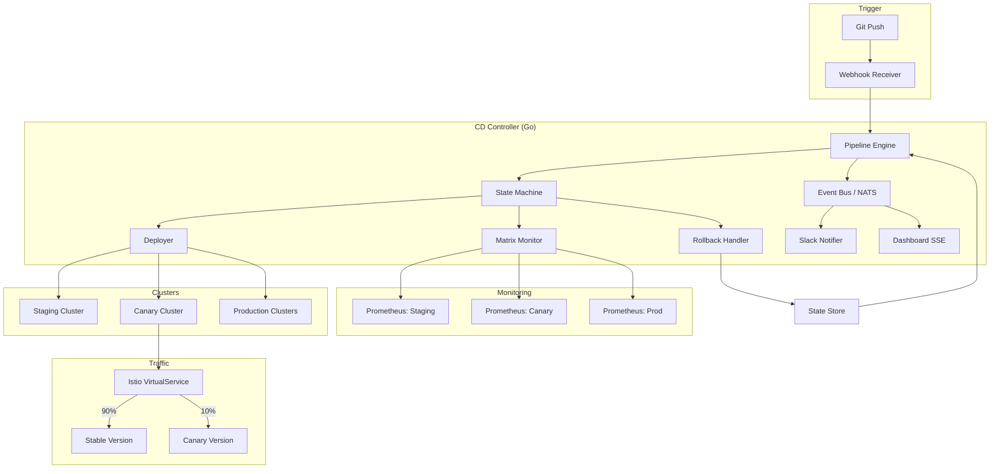
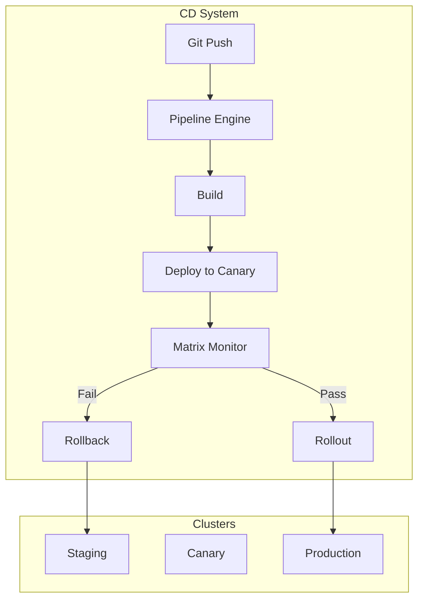
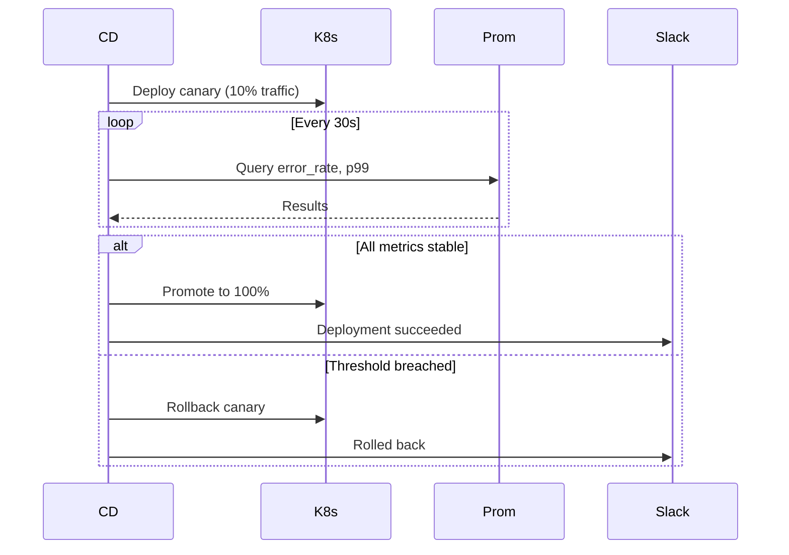
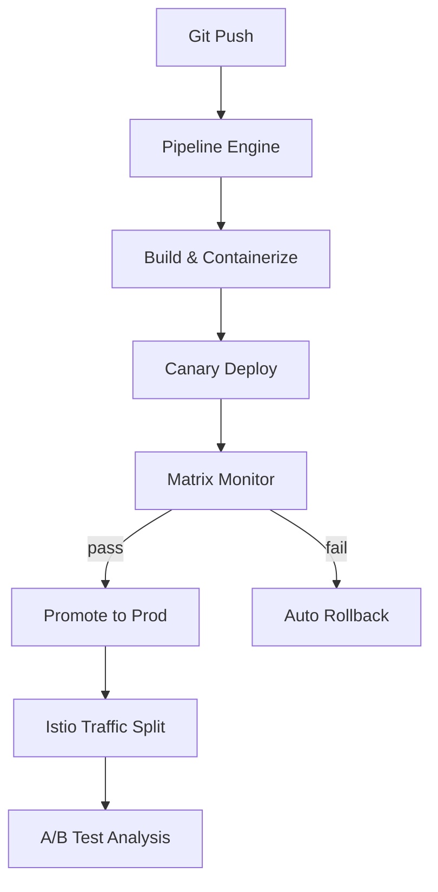

## How to Build a Continuous Delivery System with Matrix Monitoring

In this tutorial, you'll build a continuous delivery system for Kubernetes that manages A/B deployments across multiple clusters with canary analysis, matrix-based monitoring, and automatic rollbacks.

### What you'll learn

- Building a declarative pipeline engine with state machine semantics
- Multi-dimensional matrix monitoring with Prometheus
- Implementing canary deployment with traffic splitting
- Building an automatic rollback system with its own monitoring phase

### Prerequisites

- Go 1.21+
- Kubernetes cluster(s) with kubectl access
- Prometheus deployed in each cluster
- Istio installed (for traffic splitting)
- Docker (for building container images)

### Imports

**Go (pipeline engine + monitoring)**

| Package | Why |
|---------|-----|
| `sigs.k8s.io/controller-runtime` | Kubernetes client with informer/cache; lighter than raw client-go for CD workflows |
| `istio.io/client-go` | Programmatic VirtualService/DestinationRule management — traffic splitting without `kubectl` exec |
| `github.com/prometheus/client_golang/api` | Prometheus HTTP API client — range and instant queries via PromQL |
| `gopkg.in/yaml.v3` | Pipeline config parsing; v3 supports expression anchors and comment preservation |
| `github.com/go-logr/logr` | Structured logging interface — works with zap, zerolog, or any backend |
| `github.com/nats-io/nats.go` | Event bus for pipeline stage transitions — async notifications to Slack, dashboard, etc. |

**Why these choices?**

- **Go over Python or Java**: The Kubernetes ecosystem is built in Go. `controller-runtime` and client-go are first-class citizens. Python's `kubernetes` client is a wrapper around the REST API — slower, no informer cache, and weaker typing. Java has the Fabric8 client, but Go's goroutines map naturally to concurrent pipeline stage execution.

- **Prometheus over Datadog**: Prometheus is CNCF-graduate, open-source, and cluster-local — no egress costs for metric queries. Datadog is a commercial SaaS with per-host pricing. Trade-off: Prometheus requires manual retention management and has no built-in anomaly detection. For a self-hosted CD system, Prometheus is the pragmatic choice.

- **Istio over nginx-ingress or Linkerd**: Istio's `VirtualService` supports fine-grained traffic splitting down to 1% on a per-header basis (canary by user-agent, region, etc.). nginx-ingress only does weighted backend splitting with `weight` fields. Linkerd doesn't natively support traffic splitting without the `sm` (Service Mesh Interface) controller. Trade-off: Istio adds latency (sidecar proxy) and operational complexity. For traffic-split-heavy CD workflows, it's worth the cost.

- **NATS over Redis Pub/Sub or RabbitMQ**: NATS is lightweight (single binary, < 20 MB RAM), supports at-least-once delivery, and has native Go bindings. Redis Pub/Sub loses messages if no subscriber is connected. RabbitMQ is heavier than needed for internal pipeline events.

### System architecture



### Step 1: Why build a CD system?

Manual deployments via `kubectl apply` don't scale across multiple clusters. Problems include: no consistency, manual rollbacks, no observability during rollout, and ad-hoc A/B testing. A declarative pipeline solves all of these.



**Watch out for**: Over-engineering. A full CD system with matrix monitoring and canary deployment is overkill for a single-cluster, single-service setup. Start with a simple CI/CD script (GitHub Actions + `kubectl apply`) and graduate to this system when you manage multiple clusters or need fine-grained rollout control.

### Step 2: Declarative pipeline configuration

Each deployment is a YAML-configured pipeline stored in the application repository:

```yaml
pipeline:
  name: payment-processor
  clusters:
    - name: staging
      order: 1
      required: true
    - name: canary
      order: 2
      traffic_weight: 10
    - name: prod-us
      order: 3
    - name: prod-eu
      order: 4

  monitoring:
    interval: 30s
    metrics:
      - name: error_rate
        threshold: 0.5
        comparison: lt
      - name: p99_latency
        threshold: 500
        comparison: lt
      - name: request_count
        threshold: 100

  rollback:
    automatic: true
    strategy: sequential
```

**Why YAML and not JSON or HCL?** YAML is the lingua franca of the Kubernetes ecosystem — `kubectl`, Helm, Kustomize, and every CNCF tool uses it. Comments (`#`) let operators document why a threshold was chosen. JSON is commentless and HCL (Terraform) adds learning overhead. YAML's downside is whitespace sensitivity — validate with `yaml.AfterNode` hooks.

**Why `required: true` as an explicit field?** It lets operators mark clusters as optional. During maintenance, `prod-eu` can be skipped from a pipeline run without editing the config file — the engine simply skips non-required clusters that are unreachable.

**Why `comparison: lt` and not a function reference?** Declarative configs should be serializable — no code in YAML. `lt` (less-than), `gt`, `eq` are a closed set of operators evaluated server-side. This also enables config validation at PR time: a schema check ensures no one types `comparison: less-than`.

**Watch out for**: `traffic_weight` only applies to canary-stage clusters. If you set `traffic_weight: 50` on `staging` (order: 1), it is silently ignored — the engine only splits traffic for clusters with an active canary deployment. The parser should warn, not silently skip.

**Watch out for**: Pipeline config drift. The YAML lives in the application repo, but the actual cluster state can diverge (someone ran `kubectl set image` during an incident). Always reconcile the pipeline's desired state with the actual cluster state before deploying. Use `controller-runtime`'s informer cache to detect drift.

### Step 3: Pipeline engine

Process pipelines as a state machine. Each stage has inputs, outputs, and actions:

```go
type Stage struct {
    Name     string
    Cluster  string
    Actions  []Action
    Requires []string
}

type Pipeline struct {
    ID           string
    Stages       []Stage
    Status       PipelineStatus
    CurrentStage int
    Artifacts    map[string]string
}

func (e *Engine) Execute(ctx context.Context, p *Pipeline) error {
    for i := range p.Stages {
        stage := &p.Stages[i]
        p.CurrentStage = i
        p.Status = PipelineRunning

        for _, action := range stage.Actions {
            if err := action.Execute(ctx, stage); err != nil {
                p.Status = PipelineFailed
                return e.handleFailure(ctx, p, stage, err)
            }
        }

        if err := e.monitor.WaitForStable(ctx, stage); err != nil {
            p.Status = PipelineFailed
            return e.rollback(ctx, p, stage)
        }

        e.eventBus.Publish(StageCompleted{
            PipelineID: p.ID,
            StageName:  stage.Name,
        })
    }

    p.Status = PipelineCompleted
    return nil
}
```

**Why a state machine and not a linear script?** A state machine gives you recovery, auditability, and observability. Each stage transition is an event — `StageCompleted`, `PipelineFailed`, `RollbackStarted` — published to NATS. A linear script loses its place on failure: if it crashes at stage 3 of 5, you don't know where to resume. The state machine tracks `CurrentStage` and can resume from the last checkpoint.

**Why `Actions []Action` as an interface and not concrete functions?** Pluggable actions. Every step — deploy, run smoke test, notify Slack, wait for manual approval — implements the same `Action` interface. Adding a new action type means writing one struct, not changing the engine loop. This is the Strategy pattern applied to pipeline stages.

**Why `eventBus.Publish` inline and not async?** The event is published synchronously within the stage loop so that consumers (Slack, dashboard) see stage transitions in order. Asynchronous publishing could reorder events if the NATS connection is under load.

**Watch out for**: The `Execute` method is **not idempotent**. If the process crashes mid-stage, on restart it re-runs from `CurrentStage`, which may partially overlap with already-completed work. A production system should checkpoint stage completion to an external store (etcd or PostgreSQL) before publishing `StageCompleted`. The checkpoint must be transactional with the stage's side effects.

**Watch out for**: `return e.handleFailure(...)` vs `return e.rollback(...)` — there are two failure paths. `handleFailure` is for action execution errors (build failed, deploy timed out). `rollback` is for monitoring failures (metrics breached). The distinction matters: a failed build doesn't need rollback (nothing was deployed), but a failed monitoring check must trigger a rollback (something bad was deployed).

### Step 4: Matrix monitoring

After each stage deploys, the matrix monitor queries Prometheus across multiple dimensions: cluster, region, version, and time window:

```go
type MatrixMonitor struct {
    Interval time.Duration
    Timeout  time.Duration
    Metrics  []MetricCheck
}

type MetricCheck struct {
    Name       string
    Query      string
    Threshold  float64
    Comparison ComparisonOp
}

func (m *MatrixMonitor) WaitForStable(ctx context.Context, stage *Stage) error {
    deadline := time.Now().Add(m.Timeout)

    for time.Now().Before(deadline) {
        allStable := true

        for _, mc := range m.Metrics {
            result, err := m.queryPrometheus(ctx, mc.Query, stage.Cluster)
            if err != nil {
                return err
            }
            if !mc.Passes(result) {
                allStable = false
                break
            }
        }

        if allStable {
            return nil
        }

        select {
        case <-ctx.Done():
            return ctx.Err()
        case <-time.After(m.Interval):
        }
    }

    return ErrTimeout
}
```

**Why call it "matrix" monitoring?** A matrix observation queries every combination of dimensions — `error_rate` × `cluster` × `version` × `time_window`. A single-metric check like "is error_rate < 0.5?" won't catch a regression isolated to `prod-eu` running `v1.3` during peak hours. The matrix formulation catches regional, version-specific, and time-correlated anomalies in one loop.

**Why Prometheus range queries (not instant)?** Instant queries return a single value at point-in-time. A transient blip could falsely fail a deployment. Range queries (`[5m]`) return a time series — the `Passes` method can check that the metric is stable over a window, not just at one instant.

**Why `select` with `ctx.Done()` and not just `time.Sleep`?** Without the `select`, context cancellation (e.g., operator hitting Ctrl+C, or a parent timeout) would block until the next poll interval. The `select` polls every `m.Interval` but also exits immediately on cancellation — no unnecessary wait.

**Watch out for**: `m.queryPrometheus` can return empty results. When a brand-new canary deployment has zero traffic, Prometheus returns no data for `error_rate`. A nil/empty result might silently pass `mc.Passes(result)` if the implementation doesn't distinguish between "no data" and "data within threshold". Always check for empty result sets and either skip or fail:

```go
if len(result) == 0 {
    return fmt.Errorf("no data for metric %s on cluster %s — is the app serving traffic?", mc.Name, stage.Cluster)
}
```

**Watch out for**: The polling loop blocks the entire pipeline goroutine. If you have 3 metrics × 5 clusters × 30s interval, a single slow Prometheus query delays the entire loop. Run metric checks concurrently with an errgroup:

```go
g, ctx := errgroup.WithContext(ctx)
for _, mc := range m.Metrics {
    mc := mc
    g.Go(func() error {
        result, err := m.queryPrometheus(ctx, mc.Query, stage.Cluster)
        if err != nil {
            return err
        }
        if !mc.Passes(result) {
            allStable = false
        }
        return nil
    })
}
```

**Watch out for**: Prometheus query cardinality. A matrix query like `rate(http_requests_total[5m])` across 10 clusters × 5 regions × 4 versions = 200 time series. At high traffic volumes this can overload Prometheus. Set a `step` parameter (e.g., `30s`) to limit resolution, and use recording rules to pre-aggregate common queries.

### Step 5: Canary deployment

Deploy to a subset of pods with traffic splitting, then monitor before promoting:



**Why 10% traffic and not 1% or 50%?** 10% is a heuristic sweet spot: small enough that a bad deployment only affects 1 in 10 users, but large enough to reach statistical significance in minutes for most services. A 1% canary at a service doing 100 req/s gets only 1 request per second — too few to detect elevated error rates quickly. A 50% canary risks too many users. Start at 10% and increase gradually (1% → 5% → 10% → 25% → 50% → 100%) for progressive delivery.

**Why Istio VirtualService and not a Kubernetes Service selector swap?** Kubernetes Services route to all pods matching a label selector — there's no weighted routing between two revisions. Istio's `VirtualService` with `subset` weights gives you fine-grained traffic splitting (down to 1%) and per-header routing (canary by `User-Agent: bot`, `Cookie: experiment_group=B`, etc.). Trade-off: Istio requires a sidecar proxy per pod, adding ~5ms latency.

**Watch out for**: The canary and stable versions must both fit in the cluster at the same time. If the cluster is at capacity, the canary Deployment will hang at `Pending` (resource quotas). Set `spec.replicas` to a small number (1–3) for the canary, and ensure the cluster has headroom. Use `cluster-autoscaler` to mitigate this.

**Watch out for**: If the Istio `VirtualService` routing rules aren't cleaned up after the canary is promoted or rolled back, traffic can leak to the old version. Always delete the canary-specific `DestinationRule` subsets and `VirtualService` HTTP routes after completion:

```go
func (d *Deployer) cleanupCanaryRoutes(ctx context.Context, cluster string, pipelineID string) error {
    // Delete canary VirtualService and DestinationRule
    return d.istioClient.NetworkingV1beta1().VirtualServices(namespace).Delete(ctx, "canary-"+pipelineID, metav1.DeleteOptions{})
}
```

### Step 6: Automatic rollback

When monitoring detects threshold breaches, rollback by redeploying the previous version:

```go
func (e *Engine) rollback(ctx context.Context, p *Pipeline, failedStage *Stage) error {
    e.eventBus.Publish(RollbackStarted{PipelineID: p.ID})

    prevVersion, err := e.store.GetPreviousVersion(ctx, failedStage.Cluster)
    if err != nil {
        return err
    }

    for i := p.CurrentStage; i >= 0; i-- {
        stage := &p.Stages[i]
        if err := e.deployer.Deploy(ctx, stage.Cluster, prevVersion); err != nil {
            return err
        }
        if err := e.monitor.WaitForStable(ctx, stage); err != nil {
            return fmt.Errorf("rollback monitoring failed: %w", err)
        }
    }

    p.Status = PipelineRolledBack
    return nil
}
```

**Why sequential rollback and not parallel?** Rolling back sequentially (staging → canary → production) ensures each cluster's monitoring validates the old version before moving on to the next. If the old version has a database schema incompatibility, it fails on staging and never reaches production. Parallel rollback is faster but riskier — you'd roll back all clusters at once without per-cluster validation.

**Why does rollback have its own monitoring phase?** A rollback is itself a deployment. The previous version might have been built against a different API version, an expired TLS certificate, or a database schema that has since been migrated. Re-applying old manifests without monitoring is cargo-cult rollback. The `WaitForStable` call after each `Deploy` catches these failures.

**Why does the loop go from `p.CurrentStage` down to 0 (line 217)?** The pipeline failed at `CurrentStage`. If `CurrentStage == 2` (canary), the loop rolls back canary first, then staging. But what about production clusters deployed before the canary? The function only rolls back stages from the failed point backward. Production clusters deployed in earlier stages (order 3, 4) that completed successfully are left running the new version. This is intentional: if canary fails, production already has the new version. Rolling back production would be a separate incident response.

**Watch out for**: `store.GetPreviousVersion` might return a version that no longer exists in the container registry. If your artifact retention policy is 30 days and the last deployment was 45 days ago, the rollback will fail with `ImagePullBackOff`. Set artifact retention to match your rollback window (at least 90 days).

**Watch out for**: The `RollbackStarted` event is published before the rollback actually begins. If the first `Deploy` call fails, the event is already published — Slack says "rollback started" but it never completed. Publish `RollbackCompleted` or `RollbackFailed` as a terminal event, and consider wrapping the loop in a deferred event:

```go
func (e *Engine) rollback(ctx context.Context, p *Pipeline, failedStage *Stage) (err error) {
    e.eventBus.Publish(RollbackStarted{PipelineID: p.ID})
    defer func() {
        if err != nil {
            e.eventBus.Publish(RollbackFailed{PipelineID: p.ID, Error: err.Error()})
        } else {
            e.eventBus.Publish(RollbackCompleted{PipelineID: p.ID})
        }
    }()
    // ... loop ...
}
```

**Why `e.monitor.WaitForStable(ctx, stage)` during rollback and not a separate monitor instance?** The `MatrixMonitor` is cluster-agnostic — it queries Prometheus and checks thresholds regardless of whether it's a forward or backward deployment. Using the same monitor ensures the same metric definitions and thresholds apply. A separate "rollback monitor" would drift from the forward monitor's configuration.

### Step 7: A/B testing with traffic splitting

Two versions run simultaneously with configurable traffic weights via Istio:

```yaml
ab_test:
  enabled: true
  variants:
    - name: control
      version: v1.2.0
      traffic: 50
    - name: experiment
      version: v1.3.0-beta
      traffic: 50
  duration: 24h
  metrics:
    - error_rate
    - p99_latency
    - conversion_rate
```

**Why 50/50 split?** A balanced split maximizes statistical power for comparing metrics. At 50/50, the minimum detectable effect is smallest for a given sample size. If the service does 10,000 req/h, a 50/50 split can detect a 0.5% conversion rate change within the 24-hour window. For high-traffic services, use 90/10 to reduce risk — you lose statistical power but contain blast radius.

**Why `duration: 24h` and not 1 hour or 1 week?** One full business cycle captures daily patterns — peak hours, off-peak, batch jobs. A 1-hour test might miss a regression that only appears under load. A 1-week test delays shipping unnecessarily. 24 hours is the recommended minimum by Google's A/B testing guidelines for infrastructure changes. For low-traffic services, extend to 72+ hours until both variants reach a minimum sample size (typically 1,000+ requests per metric).

**Why is `conversion_rate` in the metrics list?** `error_rate` and `p99_latency` are system metrics — they measure the app's health. `conversion_rate` is a business metric — it measures whether users complete the desired action (checkout, signup, etc.). A deployment might have acceptable latency but break the checkout flow. Business metrics are the ultimate signal; system metrics are leading indicators.

**Watch out for**: A/B tests on low-traffic services may never reach statistical significance. A service doing 100 req/h with a 1% conversion rate generates only 1 conversion per hour — after 24 hours you have 24 data points per variant, too few for a reliable conclusion. Implement early-stop logic (if the experiment variant is clearly worse on any metric, auto-rollback) and minimum-sample gates.

**Watch out for**: The A/B test YAML defines `error_rate` and `p99_latency` as metrics, but these are also defined in the pipeline's `monitoring.metrics`. If the two lists diverge, the A/B test analysis might miss a regression that the deployment pipeline checks for. Keep them in sync or derive the A/B metrics from the pipeline config:

```yaml
ab_test:
  enabled: true
  # metrics inherited from pipeline.monitoring.metrics
  additional_metrics:
    - conversion_rate
```

### Architecture



### Design decisions

- **Declarative YAML pipelines**: New services onboard in minutes. Imperative scripts lead to bespoke processes per service.
- **Multi-dimensional monitoring**: Single-metric checks give false confidence. A deployment might pass error-rate checks but have elevated p99 latency in one region.
- **Rollback is not the inverse of deploy**: Needs its own monitoring phase. A rollback that introduces its own issues must be detected.
- **Slack notifications**: Every pipeline stage transition, metric check, and rollback decision gets posted to a deployment channel. Engineers trust automation more when they can see what it's doing.

### Design decisions comparison

| Decision | Our approach | Alternative | Why we chose this |
|----------|--------------|-------------|-------------------|
| Pipeline definition | Declarative YAML | Imperative script (Bash/Python) | YAML is self-documenting, PR-reviewable, and version-controllable. Imperative scripts become snowflakes per service. |
| Deployment strategy | Canary with Istio traffic split | Blue-green or Rolling update | Canary gives gradual exposure with early metric feedback. Blue-green requires 2× cluster capacity. Rolling updates can't split traffic between concurrent versions. |
| Monitoring model | Multi-dimensional matrix | Single-metric threshold | Matrix catches regional, version-specific, and time-correlated regressions. Single-metric checks miss anomalies in unobserved dimensions. |
| Rollback monitoring | Sequential with independent monitor phase | Parallel or no monitoring | Sequential validation prevents cascading failures during undo. Skipping monitoring on rollback is the most common cause of failed rollbacks. |
| State persistence | In-memory state machine | etcd or PostgreSQL | In-memory is simpler for single-instance CD. Add etcd when you need HA with leader election. PostgreSQL for auditability. |
| Traffic routing | Istio VirtualService | nginx-ingress weighted backends | Istio supports per-header routing (canary by user-agent) and sub-1% weights. nginx only does backend-level weighting. |
| Event bus | NATS | Kafka or Redis Pub/Sub | NATS is lightweight (< 20 MB), at-least-once delivery, Go-native. Kafka is overkill for internal pipeline events. Redis Pub/Sub loses messages without subscribers. |

### Feature checklist

| Feature | Status | Notes |
|---------|--------|-------|
| Declarative YAML pipeline config | ✅ | Cluster ordering, required flags, canary weights |
| Multi-dimensional matrix monitoring | ✅ | Prometheus across cluster × region × version × time |
| Canary deployment with traffic splitting | ✅ | Istio VirtualService with configurable weight |
| Sequential rollback with monitoring phase | ✅ | Reverse-stage iteration with per-cluster validation |
| A/B testing with configurable split | ✅ | 50/50 default, inherits pipeline monitoring metrics |
| Slack notifications on every transition | ✅ | Stage start/completion, metric pass/fail, rollback events |
| Git webhook trigger | ✅ | Pipeline triggered on push to configured branch |
| Prometheus empty-result guard | ✅ | Explicit nil check before passing metrics |
| Stage checkpoint persistence | ❌ Not implemented | In-memory only — crashes lose position |
| Progressive delivery (gradual traffic ramp) | ⏳ Planned | 1% → 5% → 10% → 25% → 50% → 100% |
| Blue-green deployment strategy | ⏳ Planned | Alternative to canary for stateful services |
| Canary duration based on statistical significance | ⏳ Planned | Fixed 30s interval currently; needs sequential probability ratio test (SPRT) |
| Deployment dashboard with real-time matrix viz | ⏳ Planned | SSE events from NATS → React dashboard |
| Artifact retention aligned with rollback window | ⏳ Planned | Needs integration with container registry lifecycle policies |

### Next steps

- Add automated canary duration based on statistical significance
- Implement progressive delivery with gradual traffic increase
- Add blue-green deployment strategy as an alternative
- Build a deployment dashboard with real-time matrix visualization

The full source is at [github.com/priyanshu360/continuous-delivery-system](https://github.com/priyanshu360/continuous-delivery-system).
