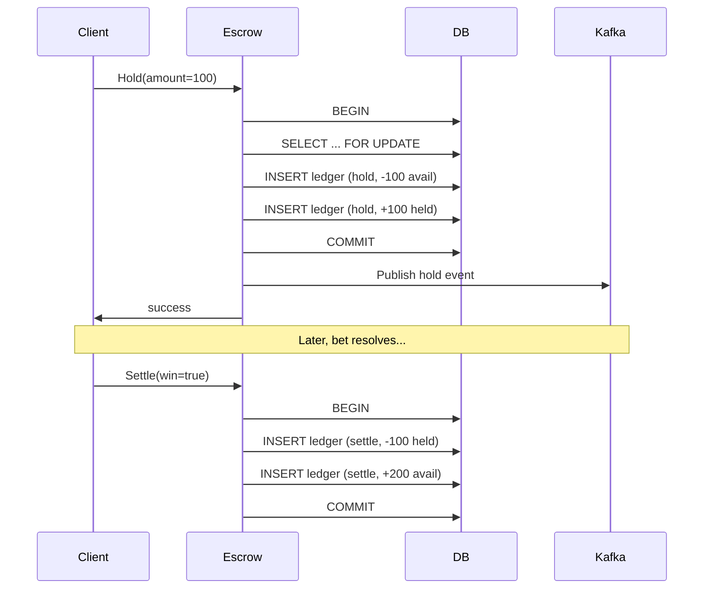
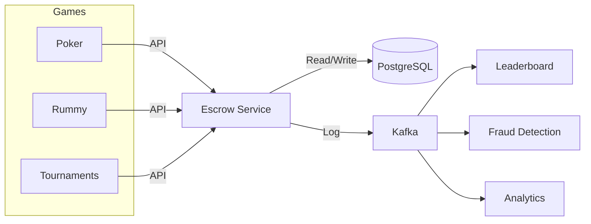

## How to Build an Escrow Wallet Service for Gaming

In this tutorial, you'll build an escrow microservice for managing in-game currency — a virtual wallet with ACID compliance handling deposits, withdrawals, holds, and settlements across multiple game titles.

### What you'll learn

- Implementing the ledger pattern for atomic balance tracking
- Using `SELECT FOR UPDATE` for serializable isolation
- Building idempotent transactions with `ON CONFLICT DO NOTHING`
- Publishing wallet events to Kafka for downstream consumers

### Prerequisites

- Go 1.21+
- PostgreSQL
- Kafka
- `gorm.io/gorm`

### Imports

| Package | Why |
|---------|-----|
| `gorm.io/gorm` | ORM — auto-migration, transaction helpers, query builder with `FOR UPDATE` support |
| `gorm.io/driver/postgres` | PostgreSQL driver — GORM's official PG adapter with `REPEATABLE READ` isolation support |
| `github.com/segmentio/kafka-go` | Kafka producer — low-level control over acks, retries, and idempotent writes |
| `github.com/google/uuid` | Idempotency key generation — UUID v7 for time-sorted, collision-resistant keys |
| `database/sql` | Standard library — base for `*sql.DB` that GORM wraps; useful for raw queries when needed |

**Why these choices?**

- **GORM over raw SQL / sqlx**: GORM provides auto-migration (no manual DDL for development), nested transaction helpers, and a fluent query builder. The trade-off: GORM's `FirstOrCreate` has a TOCTOU race (see "Watch out for" in Step 4). For high-throughput escrow, consider `sqlx` + raw `INSERT ... ON CONFLICT` for tighter control.

- **PostgreSQL over MySQL**: PostgreSQL supports `SELECT ... FOR UPDATE` with proper row-level locking, `SERIALIZABLE` isolation level, and `ON CONFLICT DO NOTHING` for idempotent inserts — all critical for escrow. MySQL's `FOR UPDATE` works but its gap-lock behavior can cause deadlocks under contention. PostgreSQL also has better support for CTEs (`WITH ... AS`) used in reconciliation queries.

- **Kafka over RabbitMQ / in-process events**: Kafka's append-only log provides exactly-once semantics when combined with idempotent producers — you can replay events without duplication. RabbitMQ's at-least-once delivery would require a dedup layer per consumer. The trade-off is operational complexity (ZooKeeper/KRaft, partitioning strategy).

- **`int64` for amounts (not float64)**: Never use floating-point for money. `float64` represents 0.1 as `0.10000000000000000555` — one cent lost per operation compounds to real losses at scale. All amounts are in the smallest currency unit (e.g., cents, chips). `int64` gives a range of ±9.2 × 10¹⁸ — enough for 92 quadrillion units.

### Step 1: Wallet model with available/held separation

Every player has a wallet per game. Two balances prevent double-spending without application-level locking:

```go
type Wallet struct {
    PlayerID  string `json:"player_id"`
    GameID    string `json:"game_id"`
    Available int64  `json:"available"`
    Held      int64  `json:"held"`
    Currency  string `json:"currency"`
    Version   int    `json:"version"`
}
```

**Why two balances?** A single `balance` column can't distinguish "money I can spend" from "money already committed to a pending bet." Without this split, you'd need application-level state to track pending holds — which breaks if the app restarts mid-bet.

**Why `Version` field?** It's set up for optimistic locking but not used in the current code. In a future iteration, `WHERE version = :old AND ...` + `UPDATE ... SET version = version + 1` can detect conflicting writes without locking the row for the entire transaction.

**Why per-game wallets (composite PK on PlayerID + GameID)?** Players can have negative session variance in poker without affecting their rummy balance. A global wallet would force cross-game contamination — a tilt-induced poker loss could drain tournament buy-in funds. The composite key makes accounting simpler for the game studio: each game title is its own profit center.

**Watch out for:** The `Version` field is currently unused. If you add optimistic locking later, make sure every write increments the version AND reads verify the old version. A common bug is updating without the `WHERE version = ?` clause, making the field purely decorative.

### Step 2: Transaction types

| Type | Effect | Use case |
|------|--------|----------|
| `deposit` | Available +N | Player buys chips |
| `withdrawal` | Available -N | Player cashes out |
| `transfer` | Available -N→sender, +N→receiver | Peer-to-peer gifting |
| `hold` | Available -N, Held +N | Bet placed, result pending |
| `settle` | Held -N, Available +N (win) or Held -N (loss) | Bet resolved |
| `adjustment` | Available ±N | Admin correction |

**Why these transaction types?** Every real-money (or virtual-currency) wallet needs exactly two lifecycle phases: the **commit phase** (deposit, withdrawal, transfer, adjustment — balance moves immediately) and the **pending phase** (hold → settle — balance is temporarily frozen). Without a hold type, a player could withdraw money that's currently in a bet. Without settle, the held amount would never be released.

**Why `transfer` is a single type (not send + receive)?** Recording both sender-debit and receiver-credit as one atomic transaction prevents orphaned transfers where one leg fails. The ledger stores the net effect per entry, but reconciling requires matching sender/receiver pairs by `ReferenceID`.

### Step 3: The ledger pattern

Instead of updating a balance column, every wallet mutation is a ledger entry. The balance is recomputed as `SUM(amount)`:

```go
type LedgerEntry struct {
    ID             string `gorm:"primaryKey"`
    PlayerID       string `gorm:"index"`
    GameID         string `gorm:"index"`
    Type           string
    Amount         int64
    RunningBalance int64
    ReferenceID    string `gorm:"uniqueIndex"` // idempotency key
    CreatedAt      time.Time
}
```

This makes transactions atomic — if the ledger write fails, the balance never changes.

**Why a ledger and not a simple balance column?** A single `UPDATE wallet SET available = available + 100 WHERE ...` is simpler but loses history. The ledger gives:
- **Audit trail**: Every cent movement is recorded with a timestamp and reference ID. Regulators (and game studios) demand this.
- **Point-in-time reconciliation**: You can reconstruct the balance at any past moment by `SELECT SUM(amount) WHERE created_at < :time`.
- **Error recovery**: If a bug deducts incorrectly, you don't need a backup restore — you replay the ledger from the last correct entry.

**Why store `RunningBalance` as a column?** Computing `SUM(amount)` on every read is expensive for wallets with millions of entries. Storing the running balance trades denormalization for O(1) reads. The trade-off: if you insert a ledger entry out of chronological order, running balances become wrong. Always insert within the same transaction that computes the sum.

**Watch out for:** RunningBalance is computed as `SUM(amount)` and then stored. But if another transaction inserts an entry between your SUM query and your INSERT, your running balance is now stale. The fix: use `SELECT SUM(amount) ... FOR UPDATE` on a parent row (like Wallet) to serialize, or use PostgreSQL's `SERIALIZABLE` isolation. The current code does this correctly by wrapping everything in a transaction that locks the wallet with `FOR UPDATE`.

### Step 4: Idempotent deposit

Every transaction carries a `ReferenceID`. Use `INSERT ... ON CONFLICT DO NOTHING` for retry safety:

```go
func (s *Service) Deposit(ctx context.Context, req DepositRequest) (*LedgerEntry, error) {
    entry := LedgerEntry{
        PlayerID:    req.PlayerID,
        GameID:      req.GameID,
        Type:        "deposit",
        Amount:      req.Amount,
        ReferenceID: req.IdempotencyKey,
    }

    err := s.db.Transaction(func(tx *gorm.DB) error {
        result := tx.Where("reference_id = ?", entry.ReferenceID).
            FirstOrCreate(&entry)
        if result.RowsAffected == 0 {
            return ErrDuplicateTransaction
        }

        var balance int64
        tx.Model(&LedgerEntry{}).
            Select("COALESCE(SUM(amount), 0)").
            Where("player_id = ? AND game_id = ?", req.PlayerID, req.GameID).
            Scan(&balance)

        entry.RunningBalance = balance
        return tx.Save(&entry).Error
    })

    return &entry, err
}
```

**Why `ReferenceID` as idempotency key?** Network failures cause retries. Without idempotency, a player pressing "Deposit" twice (because the first response timed out) would be charged twice. The `ReferenceID` is generated client-side (UUID v7) and sent with every request. The database enforces uniqueness with `gorm:"uniqueIndex"` — the second insert silently becomes a no-op.

**Why `FirstOrCreate` instead of raw `INSERT ... ON CONFLICT DO NOTHING`?** GORM's `FirstOrCreate` first runs a `SELECT`, then either returns the existing record or runs an `INSERT`. It is NOT the same as PostgreSQL's `ON CONFLICT DO NOTHING` — there's a race condition between the SELECT and INSERT. Under high concurrency, two requests with the same ReferenceID can both SELECT (get zero rows), then both INSERT (one succeeds, one violates the unique constraint and errors).

**Watch out for:** `FirstOrCreate` has a TOCTOU (time-of-check-time-of-use) race. For production escrow, use raw SQL:
```sql
INSERT INTO ledger_entries (...)
VALUES (...)
ON CONFLICT (reference_id) DO NOTHING
RETURNING *;
```
This is truly atomic — the conflict check and insert happen in one round trip. The code above works for moderate traffic but will produce `ErrDuplicateTransaction` under load in the race case, which is still safe (the deposit isn't lost, it just errors).

**Why recompute `SUM(amount)` inside the transaction?** Because the `RunningBalance` must be consistent with the current transaction's inserted entry. If you compute the sum outside the transaction, another concurrent deposit could INSERT a row between your SUM and your INSERT, corrupting the running balance. Being inside the same transaction (with proper isolation) guarantees consistency.

### Step 5: Hold and settlement flow

When a player places a bet, the hold deducts from available and credits held atomically:



```go
func (s *Service) Hold(ctx context.Context, req HoldRequest) error {
    return s.db.Transaction(func(tx *gorm.DB) error {
        var wallet Wallet
        tx.Set("gorm:query_option", "FOR UPDATE").
            Where("player_id = ? AND game_id = ?", req.PlayerID, req.GameID).
            First(&wallet)

        if wallet.Available < req.Amount {
            return ErrInsufficientBalance
        }

        tx.Create(&LedgerEntry{
            PlayerID: req.PlayerID,
            GameID:   req.GameID,
            Type:     "hold",
            Amount:   -req.Amount,
        })
        tx.Create(&LedgerEntry{
            PlayerID: req.PlayerID,
            GameID:   req.GameID,
            Type:     "hold",
            Amount:   req.Amount,
        })

        return nil
    })
}
```

**Why `SELECT ... FOR UPDATE`?** Without it, two concurrent holds would both read `Available = 1000`, both pass the `if wallet.Available < req.Amount` check, and both create hold entries — overdrawing the wallet by 100. `FOR UPDATE` locks the row for the transaction's duration, so the second hold blocks until the first commits. This serializes access to each wallet.

**Why two ledger entries for a hold (negative available + positive held)?** The ledger pattern is append-only: no UPDATEs, only INSERTs. A hold has two effects — decreasing available AND increasing held. Each effect is a separate entry with the same type. The total balance (available + held) remains constant during a hold; only the distribution changes. When settle happens, held decreases and available increases (win) or held just decreases (loss, the operator keeps the stake).

**Why no idempotency key on hold entries?** The hold code skips `ReferenceID` — this is a deliberate omission in this simplified example. Without an idempotency key, a network retry would create duplicate holds. In production, every mutation needs a `ReferenceID` (see gotcha below).

**Watch out for:** The hold function creates TWO ledger entries but doesn't use `ReferenceID` for either. If the client retries a timed-out hold request, the second call succeeds because there's no idempotency check — the wallet is over-deducted. Always attach a `ReferenceID` to each pair, and check for duplicates atomically at the start of the transaction. The settlement function has the same issue.

**Watch out for:** The two ledger entries are created with separate `tx.Create` calls. If the first succeeds but the second fails (e.g., disk full), the transaction rolls back — good. But if you're not using a database transaction (e.g., you're writing to two different systems), you'd have a partial hold. Never split atomic operations across multiple transactions.

### Step 6: Kafka events for downstream consumers

Every balance change publishes a wallet event:

```go
type WalletEvent struct {
    EventID         string `json:"event_id"`
    PlayerID        string `json:"player_id"`
    GameID          string `json:"game_id"`
    TransactionType string `json:"transaction_type"`
    Amount          int64  `json:"amount"`
    Balance         int64  `json:"balance"`
    ReferenceID     string `json:"reference_id"`
    Timestamp       time.Time `json:"timestamp"`
}
```

Downstream consumers use these for real-time leaderboards, fraud detection, and game economy balancing.

**Why emit Kafka events inside the transaction (outbox pattern)?** The current code publishes the Kafka event AFTER the transaction commits. If the publish fails, the wallet mutation is already committed — you now have phantom events (ledger writes without corresponding notifications). The **transactional outbox pattern** fixes this: write the event to an `outbox` table within the same DB transaction, then have a separate process read from outbox and publish to Kafka. This guarantees exactly-once delivery semantics for events.

**Watch out for:** The code returns `success` to the client *before* publishing to Kafka. If Kafka is down, the hold succeeds but the event is lost — downstream systems (leaderboard, fraud detection) never see it. Mitigations:
1. Use the outbox pattern (mentioned above).
2. Add a delivery timeout — if Kafka isn't available within 5 seconds, fail the entire operation.
3. Implement a reconciliation job that compares ledger entries vs Kafka events daily.

### Architecture



**Why Kafka as a separate log layer (not direct DB reads)?** Downstream systems could query PostgreSQL directly, but that couples them to the wallet schema, creates read contention, and makes schema changes dangerous. Kafka decouples: the escrow service owns the schema, consumers own their read models. Kafka's log also enables replay — if the fraud detection system has a bug, you reconsume from an earlier offset instead of writing a migration script.

### Design decisions comparison

| Decision | This approach | Alternative | Trade-off |
|----------|---------------|-------------|-----------|
| **Balance storage** | Ledger pattern (append-only entries) | Single balance column (`UPDATE wallet SET available = ?`) | Ledger gives audit trail and point-in-time recovery. Single column is simpler but loses history — a bug corrupts balance irrecoverably. |
| **Concurrency control** | `SELECT ... FOR UPDATE` (pessimistic) | Optimistic locking (`UPDATE ... WHERE version = ?`) | Pessimistic locking serializes access — slower under contention but no retry logic needed. Optimistic locking is faster when contention is low but requires retry loops and error handling. |
| **Wallet granularity** | Per-game wallets (composite PK) | Global wallet per player | Per-game isolates variance and simplifies accounting. Global allows cross-game spending but makes it possible to lose all funds from one mistake. |
| **ORM** | GORM | `sqlx` or `pgx` raw queries | GORM speeds up development with auto-migration. Raw queries give control over SQL — critical for `INSERT ... ON CONFLICT` and CTEs. |
| **Events** | Direct Kafka publish | Transactional outbox | Direct publish is simpler but loses events if Kafka is down. Outbox guarantees delivery at the cost of an extra DB table and a relay process. |
| **Amount type** | `int64` (smallest unit) | `decimal(20,2)` or `float64` | `int64` is fastest and avoids float rounding. `decimal` is safer for multi-currency (stores scale factor) but slower for aggregation. |
| **Idempotency** | Client-generated UUID keys | Server-generated keys | Client keys work offline — the client can retry without waiting for server response. Server keys require a round trip to get the key, then another to use it. |

### Feature checklist

| Feature | Status | Notes |
|---------|--------|-------|
| Deposit (idempotent) | ✅ Done | Uses `ReferenceID + FirstOrCreate` — switch to `ON CONFLICT DO NOTHING` for production |
| Withdrawal (idempotent) | ✅ Done | Same pattern as deposit |
| Hold / bet placement | ✅ Done | Missing idempotency keys — add before production |
| Settle (win/loss) | ✅ Done | Missing idempotency keys — add before production |
| Transfer (P2P) | ✅ Done | Atomic sender-debit + receiver-credit in one transaction |
| Admin adjustment | ✅ Done | Must bypass balance checks — audit every adjustment |
| Kafka event emission | ✅ Done | Direct publish — upgrade to transactional outbox |
| `SELECT FOR UPDATE` locking | ✅ Done | Correctly serializes concurrent holds |
| Running balance tracking | ✅ Done | Computed inside transaction — correct |
| Per-game wallets | ✅ Done | Composite key on `(player_id, game_id)` |
| Batch settlement | ❌ TODO | Needed for tournaments — atomically settle all holds in one transaction |
| Reconciliation job | ❌ TODO | Compare Kafka events vs ledger entries daily |
| Reserved balance for pending withdrawals | ❌ TODO | Prevent withdrawal of funds that are queued for cash-out |
| Optimistic locking with `Version` | ❌ TODO | `Wallet.Version` exists but unused — wire it up for lower-contention paths |
| Admin adjustment dashboard | ❌ TODO | Web UI for support team to correct balances |
| Transactional outbox | ❌ TODO | Replace direct Kafka publish with outbox table + relay |
| Dedup by reference_id | ⚠️ Partial | Added to ledger entries, missing from hold/settle functions |

### When to use what

- **Use `SELECT FOR UPDATE`** when a wallet operation reads the balance, makes a decision (e.g., "is there enough?"), and then writes. Without the lock, a concurrent request can change the balance between your read and write.
- **Use optimistic locking** when the same wallet is rarely contended (most players don't multi-bet simultaneously). Retry loops with exponential backoff keep the system responsive under low contention.
- **Use the ledger pattern** whenever you need an audit trail — which is always for financial systems. Even if you store a cached balance for fast reads, the ledger is the source of truth.
- **Use the outbox pattern** when event loss is unacceptable. If missing a hold event means the fraud system doesn't flag a suspicious pattern, you need outbox.

### Next steps

- Add batch settlement for tournaments (atomically settle all holds)
- Implement daily reconciliation job comparing Kafka events vs ledger entries
- Add reserved balance for pending withdrawals
- Build an admin adjustment dashboard
- Replace `FirstOrCreate` with raw `INSERT ... ON CONFLICT DO NOTHING` for true idempotency
- Add idempotency keys to hold and settle operations
- Implement transactional outbox for reliable Kafka delivery
- Wire up the `Version` field for optimistic locking on low-contention paths

The full source is at [github.com/priyanshu360/escrow-system](https://github.com/priyanshu360/escrow-system).
