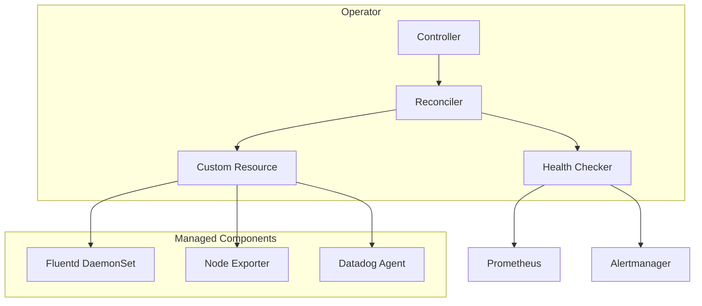
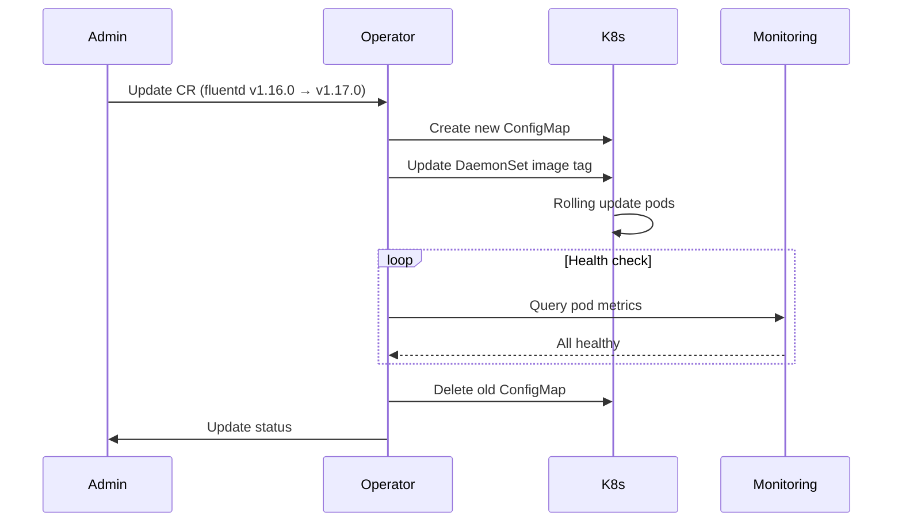

## How to Build a Kubernetes Operator for Observability Stack Management

In this tutorial, you'll build a Kubernetes operator that manages the lifecycle of log collectors and monitoring agents (Fluentd, Prometheus Node Exporter, Datadog Agent) across multiple clusters using the operator pattern.

### What you'll learn

- Defining Custom Resource Definitions (CRDs) for operator configuration
- Building a controller-reconciler loop with controller-runtime
- Managing component upgrades with rolling updates
- Implementing health monitoring and status reporting on CRs

### Dependencies

**Go modules**

| Package | Why |
|---------|-----|
| `sigs.k8s.io/controller-runtime` | Core reconciler framework — handles watch, informer, and leader election for you |
| `sigs.k8s.io/yaml` | CRD YAML parsing and generation for dynamic resource creation |
| `k8s.io/api` | Core Kubernetes types (DaemonSet, ConfigMap, Pod, etc.) |
| `k8s.io/apimachinery` | API machinery — runtime.Object, Scheme, REST mappings |
| `k8s.io/client-go` | Kubernetes client for CRUD operations on cluster resources |
| `k8s.io/code-generator` | Generates deepcopy functions and typed clients from CRD types |

**Why these choices?**

- **controller-runtime over hand-rolled informers**: Writing informers, caches, and workqueues from scratch is error-prone. controller-runtime gives you a tested reconciler loop with automatic leader election, metrics, and health probes. Trade-off: you lose fine-grained control over the workqueue configuration, but for observability agents that's rarely needed.

- **code-generator over manual deepcopy**: Without generated deepcopy methods, the CRD can't be stored in etcd or cached in the informer. Writing these by hand across 10+ types is tedious and fragile. The generator is verbose (it produces large files), but that's a one-time cost during `make generate`.

### Prerequisites

- Go 1.21+
- Kubernetes cluster
- `sigs.k8s.io/controller-runtime`
- Familiarity with Kubernetes concepts (DaemonSets, ConfigMaps, CRDs)

### Step 1: Why an operator?

Shell scripts that install observability components are fragile — if a step fails midway, cleanup is manual. Version upgrades across 10+ clusters require SSH-ing into each one. Drift between clusters is inevitable.

An operator brings Kubernetes-native reconciliation: it continuously ensures the actual state matches the desired state defined in a Custom Resource.



**Watch out for**: An operator is overkill for a single cluster with static configuration. The operator pattern shines when you have 5+ clusters or need to respond to configuration changes automatically. For a single dev cluster, a shell script + CronJob for drift detection is simpler.

### Step 2: Custom Resource Definition

Define a `ClusterObservability` CRD that declares the desired state:

```yaml
apiVersion: observability.io/v1
kind: ClusterObservability
metadata:
  name: production-cluster
spec:
  components:
    - name: fluentd
      version: v1.16.1
      config: fluentd-production
      resources:
        requests:
          cpu: 500m
          memory: 512Mi
        limits:
          cpu: 1
          memory: 1Gi
    - name: node-exporter
      version: v1.7.0
      enabled: true
    - name: datadog-agent
      version: 7.55.0
      apiKeySecret:
        name: datadog-keys
        key: api-key
  globalConfig:
    logLevel: info
    retentionDays: 30
```

**Why these choices for the CRD shape?**

- **Flat component list over nested groups**: A flat list under `spec.components` is simpler to reconcile — the controller iterates once and handles each component independently. Nested groups (e.g., `spec.logging.fluentd`, `spec.monitoring.nodeExporter`) would require separate reconciler entry points for each group, adding indirection without benefit.

- **Separate `apiKeySecret` field over inline secret**: Referencing a Kubernetes Secret by name (rather than inlining the API key in the CR) means the CR itself contains no sensitive data. The CR is stored in etcd and may be backed up — you don't want API keys in backups. The operator reads the secret at runtime via a service account binding.

- **`enabled: true` on node-exporter**: Not all components should run on every cluster. The `enabled` field lets you selectively disable node-exporter on control-plane-only clusters or ARM-based clusters where certain agents don't have builds.

**Watch out for**: CRD versioning is hard. Once you have CRs in the wild, changing `spec.components[*].version` from a string to a struct is a breaking change. Use `preserveUnknownFields: false` and plan your API versions upfront (v1alpha1 → v1beta1 → v1).

### Step 3: Reconciler structure

The reconciler watches for changes to the CR and creates/updates/deletes Kubernetes resources:

```go
type ObservabilityReconciler struct {
    client.Client
    Scheme *runtime.Scheme
}

func (r *ObservabilityReconciler) Reconcile(ctx context.Context, req ctrl.Request) (ctrl.Result, error) {
    var cr observabilityv1.ClusterObservability
    if err := r.Get(ctx, req.NamespacedName, &cr); err != nil {
        return ctrl.Result{}, client.IgnoreNotFound(err)
    }

    for _, component := range cr.Spec.Components {
        switch component.Name {
        case "fluentd":
            if err := r.reconcileFluentd(ctx, &cr, &component); err != nil {
                return ctrl.Result{}, err
            }
        case "node-exporter":
            if err := r.reconcileNodeExporter(ctx, &cr, &component); err != nil {
                return ctrl.Result{}, err
            }
        case "datadog-agent":
            if err := r.reconcileDatadog(ctx, &cr, &component); err != nil {
                return ctrl.Result{}, err
            }
        }
    }

    if err := r.updateStatus(ctx, &cr); err != nil {
        return ctrl.Result{}, err
    }

    return ctrl.Result{RequeueAfter: 5 * time.Minute}, nil
}
```

**Why a switch statement and not a registry pattern?** The switch is explicit and simple — every component's reconciler is visible at a glance. A registry (map[string]Reconciler) would let you add components without touching this file, but adds indirection and makes it harder to see the full reconciliation flow. For 3–5 components, the switch is the right call. Beyond 10, refactor to a registry.

**Why `RequeueAfter: 5 * time.Minute`?** This forces a full reconciliation every 5 minutes even if the CR hasn't changed. It catches drift caused by manual edits (someone deleting a DaemonSet pod directly) or cluster disruptions. Without requeue, the operator only reacts to CR changes, not to cluster drift.

**Watch out for**: The switch only reconciles components listed in the CR. If a component existed from a previous reconciliation but is removed from the CR spec, the operator doesn't clean it up. You must add a "delete orphaned components" pass before the switch statement. This is a common bug in operator tutorials.

### Step 4: Component reconciliation

Each component has its own reconciler. For Fluentd, create/update a ConfigMap and DaemonSet:

```go
func (r *ObservabilityReconciler) reconcileFluentd(ctx context.Context,
    cr *observabilityv1.ClusterObservability, comp *observabilityv1.Component) error {

    cm := &corev1.ConfigMap{
        ObjectMeta: metav1.ObjectMeta{
            Name:      comp.Config,
            Namespace: "observability",
            Labels:    componentLabels(comp.Name),
        },
        Data: map[string]string{
            "fluent.conf": generateFluentdConfig(cr.Spec.GlobalConfig),
        },
    }
    if err := r.applyResource(ctx, cm); err != nil {
        return err
    }

    ds := &appsv1.DaemonSet{
        ObjectMeta: metav1.ObjectMeta{
            Name:      "fluentd-" + cr.Name,
            Namespace: "observability",
        },
        Spec: appsv1.DaemonSetSpec{
            Template: corev1.PodTemplateSpec{
                Spec: corev1.PodSpec{
                    Containers: []corev1.Container{{
                        Name:  "fluentd",
                        Image: "fluent/fluentd:" + comp.Version,
                        VolumeMounts: []corev1.VolumeMount{{
                            Name:      "config",
                            MountPath: "/fluentd/etc",
                        }},
                    }},
                    Volumes: []corev1.Volume{{
                        Name: "config",
                        VolumeSource: corev1.VolumeSource{
                            ConfigMap: &corev1.ConfigMapVolumeSource{
                                LocalObjectReference: corev1.LocalObjectReference{
                                    Name: comp.Config,
                                },
                            },
                        },
                    }},
                },
            },
        },
    }

    return r.applyResource(ctx, ds)
}
```

The `applyResource` method uses create-or-update semantics (via `CreateOrUpdate` or a custom apply), making the reconciler fully idempotent.

**Why ConfigMap + DaemonSet and not a single combined resource?** Separating config from workload means you can update the Fluentd configuration without restarting pods (if you mount the ConfigMap with `--watch`). In practice, Fluentd doesn't auto-reload config changes, so you'd still need a rollout — but keeping them separate means the ConfigMap can be validated independently, and a bad config doesn't block the DaemonSet from running.

**Why hardcode `Namespace: "observability"`?** For this operator, all observability components live in a single namespace. An alternative would be to read the namespace from the CR or a flag. Hardcoding simplifies the reconciler but means you can't deploy to different namespaces per cluster. For a multi-tenant setup, make the namespace a field in `globalConfig`.

**Watch out for**: The DaemonSet uses `comp.Config` (the ConfigMap name from the CR) but the Volume reference is set at creation time. If the ConfigMap is deleted and recreated with a new UID, the DaemonSet will still reference the old UID. The operator doesn't detect this. A fix: include a content hash in the DaemonSet pod template labels so any ConfigMap change triggers a DaemonSet update.

### Step 5: Upgrade management

When a component version changes in the CR, the operator triggers a rolling update by updating the DaemonSet's pod template. Kubernetes handles the actual rolling update — the operator just changes the desired state.

For major version upgrades requiring config changes, use a two-phase approach:

1. Create the new ConfigMap alongside the old one
2. Update the DaemonSet to reference the new ConfigMap
3. Monitor pod health during rollout
4. Delete the old ConfigMap after successful rollout



**Why two-phase and not in-place upgrade?** Replacing the ConfigMap before the DaemonSet creates a window where running pods use the old config but new pods use the new config — mixed-version logging, inconsistent formats. Two-phase ensures all pods are on the new version before the old ConfigMap is removed. The trade-off is temporary storage overhead (two ConfigMaps coexist briefly).

**Watch out for**: Rolling updates for DaemonSets can stall on nodes with taints or resource constraints. The operator should set a timeout on the upgrade and mark the component as "UpgradeStalled" in the status if the rollout doesn't complete within the expected window. Without this, a stuck rollout blocks future reconciliations.

**Watch out for**: Image pull failures during rolling updates are silent — Kubernetes will keep retrying, but the operator sees all pods as "pending." The health checker should distinguish between "container creating" and "ImagePullBackOff" by inspecting pod status conditions.

### Step 6: Status reporting

The operator updates the CR status block after every reconciliation:

```yaml
status:
  components:
    - name: fluentd
      version: v1.16.1
      status: Healthy
      pods: 12
      ready: 12
      lastUpdated: "2024-01-15T10:30:00Z"
    - name: node-exporter
      version: v1.7.0
      status: Healthy
    - name: datadog-agent
      version: 7.55.0
      status: Degraded
      message: "3/5 pods ready"
```

```go
func (r *ObservabilityReconciler) updateStatus(ctx context.Context, cr *observabilityv1.ClusterObservability) error {
    for i, comp := range cr.Status.Components {
        pods, err := r.getPodsForComponent(ctx, comp.Name)
        if err != nil {
            continue
        }
        ready := countReady(pods)
        comp.Pods = int32(len(pods))
        comp.Ready = int32(ready)

        if ready == len(pods) {
            comp.Status = "Healthy"
        } else if ready > 0 {
            comp.Status = "Degraded"
        } else {
            comp.Status = "Unhealthy"
        }
    }
    return r.Status().Update(ctx, cr)
}
```

**Why `r.Status().Update` and not `r.Update`?** In controller-runtime, `.Status()` returns a subresource writer. Updating via `r.Status().Update` sends a PATCH to the `/status` subresource endpoint, which doesn't trigger another reconciliation loop. If you use `r.Update` (which updates the main resource), the update would trigger the informer, causing an infinite reconciliation loop.

**Why three status tiers (Healthy / Degraded / Unhealthy)?** Two tiers (Healthy / Unhealthy) don't capture partial failures — a node-exporter missing on 1 of 10 nodes is very different from 0 of 10. Three tiers let you alert on Degraded (warning) vs Unhealthy (critical). The exact thresholds can be tuned: some teams add "Unknown" for components that haven't been reconciled yet.

**Watch out for**: The `continue` on error inside the loop silently skips components whose pods can't be queried. If the Kubernetes API is temporarily unavailable, all components are silently skipped, and the status is stale — but no error is returned to the reconciler. Consider aggregating errors and surfacing them in a top-level `status.lastError` field.

**Watch out for**: `r.Status().Update` can fail with conflict errors if the CR was modified by another controller (e.g., another operator instance or a webhook). The reconciler should retry on conflict — controller-runtime's default workqueue does this automatically, but if you're using `RequeueAfter`, conflicts are not retried. Wrap the status update in a retry loop.

### Design decisions

| Decision | Alternative | Why this won |
|----------|-------------|--------------|
| **`applyResource` (create-or-update)** | `Create` then `Update` on error | Idempotent across operator restarts. Without it, restarting the operator would error on resources that already exist. |
| **Operator pattern** | Helm chart | Helm applies state once; an operator ensures state continuously. For observability components that must always be present, the operator is a better fit. |
| **Status reporting** | No status updates | Without CR status updates, the operator is a black box. The status block makes it transparent for cluster admins and monitoring tools. |
| **Fake clients for testing** | Full integration tests only | Use `envtest` for unit tests and `kind` clusters for integration tests. Test the reconciler directly with fake clients rather than spinning up a full operator for every test. |
| **Hardcoded namespace** | Namespace from CR field | Simplifies the reconciler for single-tenant deployments. Revisit for multi-tenant. |
| **Component switch statement** | Registry pattern (map of reconcilers) | Explicit and easy to read for 3–5 components. The trade-off is a longer Reconcile function. |
| **5-minute requeue** | Watch-only (no requeue) | Catches drift from manual edits and cluster disruptions that informer events wouldn't trigger. |

### Feature comparison / checklist

| Feature | Status | Notes |
|---------|--------|-------|
| CRD definition | ✅ Done | `ClusterObservability` with component list + global config |
| Reconciler loop | ✅ Done | Watches CR changes, reconciles all components |
| Fluentd lifecycle | ✅ Done | ConfigMap + DaemonSet create/update |
| Node Exporter lifecycle | ✅ Done | On/off toggle via `enabled` field |
| Datadog Agent lifecycle | ✅ Done | Secret-based API key via `apiKeySecret` |
| Idempotent apply | ✅ Done | `applyResource` with create-or-update semantics |
| Component status reporting | ✅ Done | Three-tier health with pod counts |
| Rolling upgrade management | ✅ Done | Two-phase ConfigMap + DaemonSet update |
| Upgrade health monitoring | ✅ Done | Post-rollout health check loop |
| Orphan component cleanup | ❌ Missing | Components removed from CR are not deleted |
| ConfigMap change detection | ❌ Missing | DaemonSet not updated when ConfigMap content changes |
| Upgrade timeout detection | ❌ Missing | Stuck rollouts not surfaced in status |
| Retry on status update conflict | ❌ Missing | No retry for 409 Conflict on status write |
| Per-user rate limiting | N/A | Applies to webhook layer, not operator core |

### Next steps

- Add support for custom component types via a plug-in system
- Implement drift detection between CR and actual cluster state
- Add a webhook for CR validation
- Build a dashboard showing operator health across all clusters

The full source is at [github.com/priyanshu360/kubernetes-operator](https://github.com/priyanshu360/kubernetes-operator).
