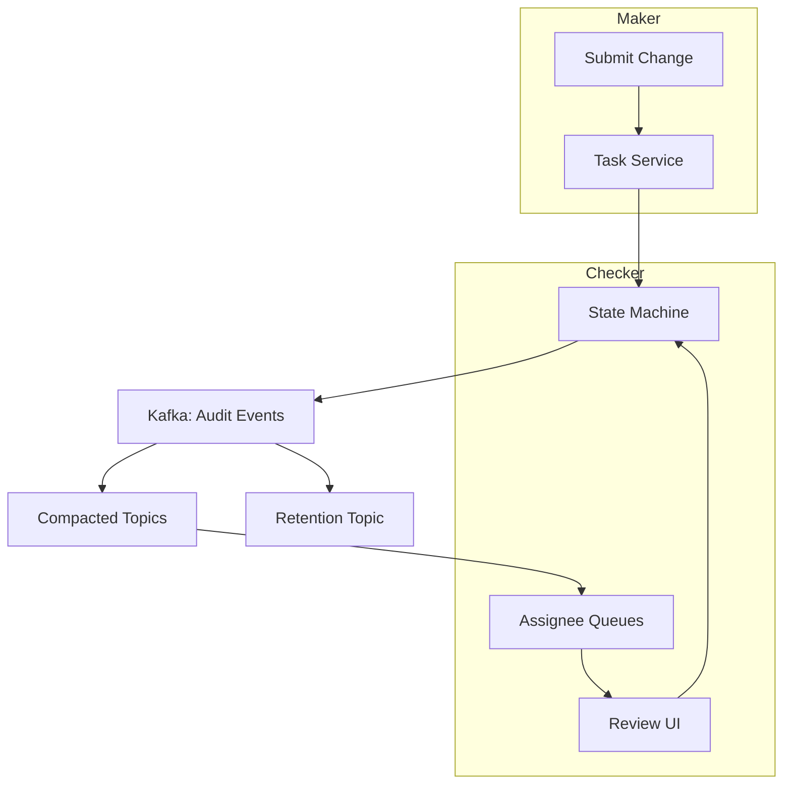
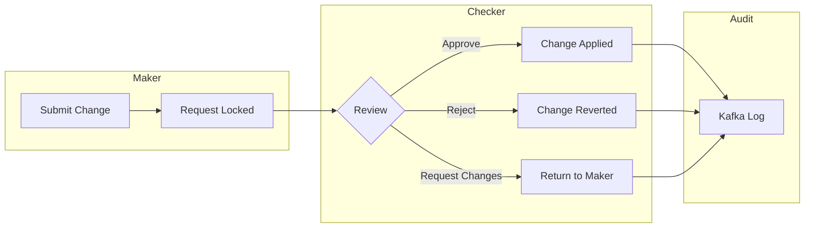
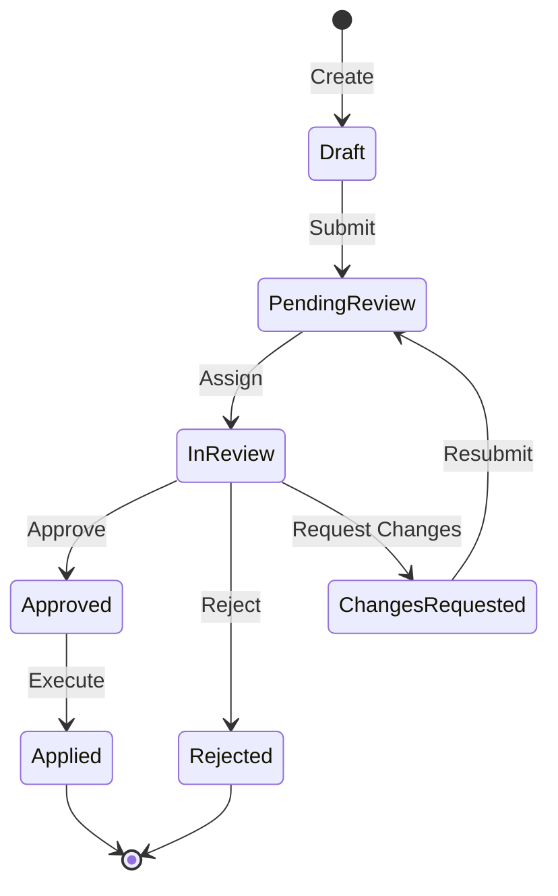

## How to Build a Maker-Checker Approval System with Kafka

In this tutorial, you'll build an enterprise-grade maker-checker approval system — a state machine-driven workflow where one user creates a change ("maker") and another reviews it ("checker"), with Kafka for auditability and concurrency safety.

### What you'll learn

- Implementing a formal state machine with guard functions
- Using Kafka for exactly-once audit logging and fan-out
- Building assignment queues with compacted topics
- Handling concurrent approvals with optimistic locking

### Prerequisites

- Go 1.21+
- Kafka (or Redpanda)
- PostgreSQL

### Dependencies

| Package | Why |
|---------|-----|
| `github.com/segmentio/kafka-go` | Pure Go Kafka client — no CGO, no librdkafka dependency. Simpler CI/CD and cross-compilation |
| `github.com/jackc/pgx/v5` | PostgreSQL driver with native `COPY`, `LISTEN`/`NOTIFY`, and connection pooling |
| `gopkg.in/yaml.v3` | YAML parsing for workflow config — supports anchors, comments, and multi-line strings |
| `github.com/golang-jwt/jwt/v5` | JWT parsing and validation for RBAC claims |
| `github.com/google/uuid` | UUID v7 generation for task IDs — time-ordered, good for B-tree index performance |

### Why these choices?

**Kafka over RabbitMQ or a database-backed queue.** A maker-checker system needs three properties that Kafka provides natively: (1) an immutable audit log — every state change is recorded forever, (2) exactly-once semantics — critical for financial audit compliance, (3) independent fan-out consumers — notifications, compliance dashboards, and webhooks each read the same topic at their own pace. RabbitMQ is better for point-to-point command delivery but lacks the built-in replayable log. A PostgreSQL `LISTEN`/`NOTIFY` approach would be simpler but doesn't scale beyond a few hundred tasks per second and offers no replay capability.

**Table-driven state machine over enum-switch or code generation.** A switch statement over an enum requires touching multiple cases every time you add a state or event. Code generation (e.g., `stateless` library) adds a build step and generates opaque code. The table-driven approach — a `map[State]map[Event]Transition` — is data, not code. New workflow types (vendor onboarding, expense approval, access request) can be configured entirely in YAML without recompiling.

**Optimistic locking over pessimistic (SELECT FOR UPDATE).** An approval transition involves a database update *plus* a Kafka publish. With pessimistic locking, you hold the database transaction open while the Kafka publish completes. If Kafka is slow or briefly unavailable, that connection is blocked. Optimistic locking via a `Version` field and `WHERE version = ?` means the DB update is a fast atomic operation; the Kafka publish happens afterward. Trade-off: under high contention (two checkers approving the same task simultaneously), one UPDATE returns 0 rows and the caller must retry.

**Compacted topics over partitioned topics for assignment queues.** A compacted topic retains only the latest event per key. When a checker opens their queue, they immediately see the current state of every assigned task without replaying history. A regular partitioned topic would require a consumer to process every event since the beginning of time to reconstruct current state — prohibitively expensive for long-running workflows.

**YAML over JSON or TOML for workflow configuration.** YAML supports comments, anchors (for reusing transition blocks), and multi-line strings — important when non-developer compliance officers need to define or audit workflows. JSON lacks comments. TOML is less widely known and has no anchor/alias feature.

### Architecture



The state machine sits at the center of the system. Every transition is recorded to Kafka, which fans out to both the compacted queue topics and the long-retention audit topic.

### Step 1: The maker-checker pattern

In financial systems, every write operation that mutates critical data needs a second pair of eyes. The classic pattern: a maker creates or modifies a resource, and a different user with sufficient authority reviews and approves or rejects it.



**Why "Request Changes" is a distinct outcome (not just Reject + resubmit).** A rejection is terminal — the change is discarded. Requesting changes signals intent: the checker believes the change is viable but needs modifications. This preserves the original task ID and context, avoiding duplicate audit entries. The YAML workflow config can attach different side effects to each outcome (e.g., notify Slack on Reject, email the maker on Request Changes).

**Watch out for**: The maker and checker must be different users. The `checkNotOwner` guard on the Approve/Reject transitions enforces this, but the guard is only as strong as the authentication layer beneath it. If JWT validation is bypassed, the guard is never called.

### Step 2: Task model

Every approval workflow starts as a Task — a diff-like payload describing the pending change:

```go
type Task struct {
    ID          string          `json:"id"`
    Type        TaskType        `json:"type"`
    State       TaskState       `json:"state"`
    Payload     json.RawMessage `json:"payload"`
    CreatedBy   string          `json:"created_by"`
    AssignedTo  string          `json:"assigned_to"`
    Role        string          `json:"role"`
    Deadline    time.Time       `json:"deadline"`
    Version     int             `json:"version"`
}
```

The `Version` field enables optimistic concurrency control — critical for preventing double-approval.

**Why `json.RawMessage` for Payload and not `interface{}`?** `json.RawMessage` is a byte slice that implements `json.Unmarshaler`. It defers deserialization — the task service stores and forwards the payload without needing to understand its schema. Different workflow types (vendor onboarding, expense report, access request) have completely different payload structures. `interface{}` would require type-switching on every transition; `json.RawMessage` stays opaque until a workflow-specific handler processes it.

**Why `AssignedTo` and `Role` both on the Task?** This is a dual-binding pattern. `AssignedTo` identifies the specific checker, while `Role` defines the minimum authority required. A manager with the `finance_manager` role might be assigned to multiple tasks, but a task's `Role` field ensures it can only be claimed by the correct authority level. The assignment queue for each checker uses `AssignedTo` as the topic key.

**Why UUID v7 for `ID` and not auto-increment?** UUID v7 is time-ordered (k-sorted), so PostgreSQL B-tree indexes stay efficient — no random insert overhead. And UUIDs are safe to expose in Kafka message keys without leaking the total task count.

**Watch out for**: The `Version` field starts at 1 (not 0). The zero value of `int` in Go is 0, which would match `UPDATE tasks SET version = 1 WHERE id = ? AND version = 0` on the very first update. Always initialize `Version` to 1 on task creation to avoid accidental no-op updates.

### Step 3: State machine with guard functions

A formal state machine prevents invalid transitions at compile time:



**Why this specific state map?** The topology mirrors a real-world approval cycle. `ChangesRequested` loops back to `PendingReview` (not `Draft`) because the task already has reviewer context — returning to `Draft` would lose the assignment. `InReview` is a distinct state from `PendingReview` because a checker has claimed the task, and the system needs to prevent other checkers from claiming it concurrently.

Implement as a table-driven transition map with guard functions:

```go
var transitions = map[TaskState]map[Event]struct{
    next  TaskState
    guard func(ctx context.Context, t *Task) error
}{
    TaskStateDraft: {
        EventSubmit: {next: TaskStatePendingReview, guard: checkPayload},
    },
    TaskStatePendingReview: {
        EventAssign: {next: TaskStateInReview, guard: checkRole},
    },
    TaskStateInReview: {
        EventApprove: {next: TaskStateApproved, guard: checkNotOwner},
        EventReject:  {next: TaskStateRejected, guard: checkNotOwner},
    },
}
```

**Why a table-driven state machine instead of a switch statement?** Consider what happens when you add a `Cancelled` state. With a switch:
```go
func (s *Service) Transition(...) error {
    switch task.State {
    case TaskStateDraft:
        // ...
    case TaskStatePendingReview:
        // ...
    }
}
```
You add a new case block. Then add allowed transitions to it. Then add another case to prevent `Cancelled` → `Approved`. The permission logic scatters across the file. With the table-driven approach, you add one row: `TaskStateInReview: {EventCancel: ...}`. Every transition for every state is visible in a single map. The map is also serializable — you could load it from YAML for workflow-specific state machines.

**Why embed the guard function inside the transition struct instead of calling it separately?** Binding the guard to the transition guarantees that no code path can skip the check. If the guard were called separately (e.g., `checkPermissions(event, task)` before looking up the transition), a future code change could reorder or forget the call. By colocating guard and next state in the struct, the type system enforces that every transition has a precondition.

**Watch out for**: Guard functions must be pure — no side effects, no database writes, no Kafka publishes. The guard is evaluated *before* the transition executes. If a guard function writes to the database, that write happens even if the subsequent `s.store.Update` fails due to a version conflict. Guards should only read state and return an error.

**Watch out for**: The transition map is a global variable. If you update it at runtime (e.g., hot-reloading workflow config), you need a mutex or atomic swap. For production, make `loadTransitions` return a new map and swap it atomically with `atomic.Pointer`.

### Step 4: Transition execution with Kafka logging

Each state transition publishes an audit event to Kafka:

```go
func (s *Service) Transition(ctx context.Context, taskID string, event Event) error {
    task, err := s.store.Get(ctx, taskID)

    txn, ok := transitions[task.State][event]
    if !ok {
        return ErrInvalidTransition
    }
    if err := txn.guard(ctx, task); err != nil {
        return err
    }

    prev := task.State
    task.State = txn.next
    task.Version++

    if err := s.store.Update(ctx, task); err != nil {
        return err
    }

    return s.producer.Publish(ctx, AuditEvent{
        TaskID:    task.ID,
        From:      prev,
        To:        task.State,
        Payload:   task.Payload,
        Timestamp: time.Now(),
    })
}
```

**Why publish the audit event *after* the database update and not before?** Fail-fast. If the database update fails (version conflict, constraint violation), we never publish a Kafka message. If we published first and the DB update failed, we'd have an orphan audit event for a transition that didn't happen — requiring a compensation event.

**Why not wrap both in a distributed transaction?** Kafka doesn't participate in XA transactions with PostgreSQL. The pattern above is an "outbox-later" pattern: the DB update succeeds first, then the Kafka publish happens. If the Kafka publish fails, the task is already updated in the DB. This is recoverable — a background reconciliation job can republish missed audit events by comparing DB version vs. Kafka offset.

**Why include the full `Payload` in the audit event, not just before/after state?** The payload may have changed during the transition (e.g., a checker modifies the terms during approval). Storing the payload at each transition point gives a complete before/after diff. Downstream consumers (compliance dashboards, analytics) need the payload to reason about what *content* changed, not just what *state* changed.

Kafka gives us:
1. **Exactly-once semantics** — offset tracking prevents lost or duplicated transitions
2. **Immutable audit trail** — every state change with before/after diff
3. **Fan-out** — downstream consumers (notifications, webhooks, analytics) subscribe independently

**Why "exactly-once" and not "at-least-once"?** For financial audit, duplicates are unacceptable. Kafka's exactly-once requires three things: (1) idempotent producer (`EnableIdempotent: true`), (2) transactional producer/consumer with `isolation.level=read_committed`, (3) unique message keys per task transition. Without idempotent producer, a network retry could insert the same audit event twice, making the audit trail unreliable.

**Watch out for**: The code above doesn't handle the Kafka publish failure gracefully. If `s.producer.Publish` returns an error, the function returns an error to the caller, but the DB is already updated. The caller retries `Transition` — but the retry sees `task.State` already advanced (from the DB) and returns `ErrInvalidTransition`. You need either a reconciliation loop or a transactional outbox pattern (write the audit event to a DB table in the same transaction as the state update, then publish from a separate CDC worker).

**Watch out for**: The `Version` field is incremented optimistically, but there's no retry loop here. If two checkers attempt `EventApprove` simultaneously, exactly one succeeds (the one whose `WHERE version = old_version` matches). The other gets a zero-row-update error. Wrap the transition in a retry loop with backoff:
```go
for i := 0; i < 3; i++ {
    err := s.Transition(ctx, taskID, event)
    if errors.Is(err, ErrOptimisticLock) {
        continue // refetch and retry
    }
    return err
}
```

### Step 5: Assignment queues with compacted topics

Each checker's queue is a Kafka compacted topic keyed by assignee. Compaction retains only the latest event per key, so new subscribers immediately see only the current state of each task:

```go
// Checker claims a task by publishing an Assign event
func (s *Service) Assign(ctx context.Context, taskID, checkerID string) error {
    return s.Transition(ctx, taskID, Event{
        Type: EventAssign,
        By:   checkerID,
    })
}

// Each assignee has a compacted topic for real-time queue updates
topic := fmt.Sprintf("queue-%s", checkerID)
s.producer.Publish(ctx, kafka.Message{
    Key:   []byte(taskID),
    Value: encodedTask,
})
```

**Why compacted topics and not a database query (`SELECT * FROM tasks WHERE assigned_to = ? AND state IN (...)`)?** The database approach requires polling — the checker's UI refreshes every N seconds to check for new tasks. Compacted topics push updates in real-time. When a checker opens their queue, the consumer reads the topic from the beginning (or from a stored offset) and receives the latest state for every assigned task within milliseconds.

**Why one topic per assignee and not a single partitioned topic?** Isolation. If the single topic has a poison pill message (malformed task from a bug), it blocks all checkers' queues. With per-assignee topics, a corrupted task only blocks one checker. The cost is topic management overhead — for 1000 checkers, you have 1000 topics. Kafka handles millions of topics gracefully, so this scales.

**Watch out for**: Compaction is not instant. The Kafka log cleaner runs periodically (every `log.cleaner.backoff.ms`, default 15 seconds). A newly assigned task may appear as a "delete tombstone" for a brief window if a previous assignment was revoked. Set `min.compaction.lag.ms` to at least 60 seconds to give consumers time to read the latest message before compaction removes old ones.

**Watch out for**: Topic naming with user IDs is a security concern. If checker topics are named `queue-{userID}`, a malicious actor who discovers another user's ID can subscribe to their topic. Prefix topic names with a tenant or shard identifier, and restrict consumer access with Kafka ACLs.

### Step 6: RBAC integration

Each TaskType maps to a required role. Guard functions verify the caller's JWT claims:

```go
func checkRole(ctx context.Context, t *Task) error {
    claims := ctx.Value(claimsKey).(*Claims)
    if !hasPermission(claims.Role, t.Role) {
        return ErrInsufficientPermissions
    }
    return nil
}

func checkNotOwner(ctx context.Context, t *Task) error {
    claims := ctx.Value(claimsKey).(*Claims)
    if claims.UserID == t.CreatedBy {
        return ErrCannotApproveOwnTask
    }
    return nil
}
```

**Why guard functions instead of a single middleware that checks permissions globally?** Different transitions need different checks. `EventSubmit` only checks payload validity; `EventApprove` checks that the checker isn't the maker; `EventAssign` checks role hierarchy. A global middleware would either be too permissive (allowing all transitions for authenticated users) or require transition-specific logic in the middleware — at which point you've reimplemented guard functions in a different layer.

**Why use JWT claims and not a database lookup for every request?** Latency. A JWT carries the user's ID, role, and permissions in a signed token. The guard function reads from the token — zero database queries. Database lookups on every transition would add 2-5ms per check, which matters when approving hundreds of tasks in a batch.

**Watch out for**: JWT clock skew. The `ExpiresAt` claim is checked against the server's clock. If the checker's JWT was issued by a server with a clock 30 seconds ahead of the validation server, a valid token might be rejected. Set `jwt.WithLeeway(30 * time.Second)` when parsing the token.

**Watch out for**: The `claimsKey` context value is set by middleware, but if the middleware and the service run in different goroutines (or the context is propagated across Kafka consumer boundaries), the claims may not propagate correctly. Always set claims on the context early — ideally in the HTTP middleware — and verify they exist in the guard function with a nil check.

### Step 7: Data-driven workflow configuration

Rather than hardcoding each workflow type, use YAML configuration:

```yaml
workflow:
  name: vendor_onboarding
  roles:
    maker: finance_ops
    checker: finance_manager
  transitions:
    - from: Draft
      to: PendingReview
    - from: PendingReview
      to: InReview
      on_approval:
        call: /api/vendors/activate
        method: POST
  deadline: 48h
```

**Why define workflows in YAML instead of hardcoding them in Go?** Compliance officers and business analysts need to define approval workflows without filing a PR and waiting for a deploy. YAML configs loaded at startup (or hot-reloaded from a Git repo or config map) let the business own the workflow definition. The Go code just interprets the data.

**Why YAML over a DSL or a database table?** A DSL requires building a parser and tooling. A database table (workflow_states, workflow_transitions) requires schema migrations and a CRUD UI. YAML balances expressiveness and simplicity — it's declarative enough for non-developers and structured enough for version control (diff, review, rollback).

**Watch out for**: Unmarshal doesn't validate. A typo in a field name (e.g., `trnasitions` instead of `transitions`) silently unmarshals to the zero value — no `from` field → empty string → all transitions fail at runtime. Validate YAML configs at startup with a schema (e.g., JSON Schema via `github.com/santhosh-tekuri/jsonschema`) and reject invalid configs before the server starts.

**Watch out for**: The `on_approval` webhook call introduces a side effect outside the state machine. If the webhook is unreachable, the transition succeeds but the side effect fails. This breaks the system's consistency. Consider making webhook calls asynchronous (fire-and-forget to a retry topic) rather than synchronous, so a downstream failure doesn't block the approval.

### Design decisions

| Decision | Our approach | Alternative | Why we chose this |
|---|---|---|---|
| State machine implementation | Table-driven map (`map[State]map[Event]Transition`) | Enum switch, code generation (e.g., `stateless`) | Transitions are data, not code — new workflows via YAML without recompiling. The map is inspectable (dump all transitions for docs) |
| Audit trail | Kafka topic with long retention | PostgreSQL audit table, file logs | Independent consumers, exactly-once semantics, replayable for compliance. A DB audit table couples the audit trail to the task database |
| Assignment queue | Kafka compacted topic per assignee | Database polling, partitioned topics | Real-time push without polling. A new checker consumer instantly sees current state without replaying history |
| Concurrency control | Optimistic locking (`version` field + `WHERE version = ?`) | Pessimistic locking (`SELECT FOR UPDATE`) | Non-blocking. With pessimistic locking, a slow Kafka publish would hold the DB connection open |
| Access control | Guard functions per transition | Global auth middleware, CASL/Rego policies | Composability — each transition specifies exactly what it needs. No central policy file to maintain for every workflow type |
| Workflow definition | YAML config file | Hardcoded Go, database table, DSL | Business-friendly (comments, anchors). Version-controllable. No deployment needed for workflow changes |

**Guard functions** keep the state machine honest. By attaching preconditions to each transition, permission checks aren't scattered across handlers.

**Optimistic locking** via the `Version` field prevents two checkers from approving the same task simultaneously (using `WHERE version = ?` on update).

**Compacted topics** for queues give real-time updates without polling.

### Feature checklist

| Feature | Status | Notes |
|---|---|---|
| Formal state machine | ✅ | Table-driven with guard functions |
| Kafka audit trail with exactly-once | ✅ | Requires idempotent producer + transactional config |
| Compacted topic assignment queues | ✅ | Per-assignee topics, auto-create on claim |
| Optimistic concurrency control | ✅ | Version field, retry loop needed |
| RBAC via guard functions | ✅ | JWT claims, field-level permission checks |
| Data-driven workflow config (YAML) | ✅ | Hot-reload support recommended |
| Deadline enforcement | Partial | `Deadline` field on Task model, no escalation hook |
| Transactional outbox (DB + Kafka consistency) | ❌ | Recommended for production to prevent audit gaps |
| SLA breach notifications | ❌ | See Next Steps |
| Compliance dashboard | ❌ | See Next Steps |
| Batch approval | ❌ | See Next Steps |
| Automated escalation | ❌ | See Next Steps |
| Graceful Kafka publish failure handling | ❌ | Retry loop + reconciliation worker needed |

### Next steps

- Add automated escalation for tasks approaching deadline
- Implement SLA breach notifications
- Build a compliance dashboard showing all state transitions per entity
- Add batch approval for admin users

The full source is at [github.com/priyanshu360/maker-checker-approval](https://github.com/priyanshu360/maker-checker-approval).
